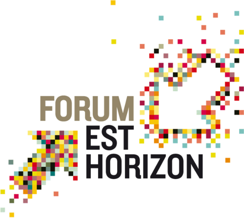
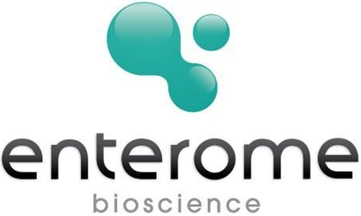
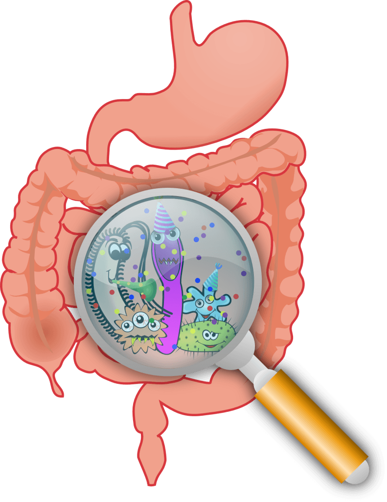
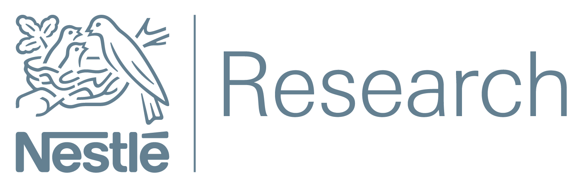
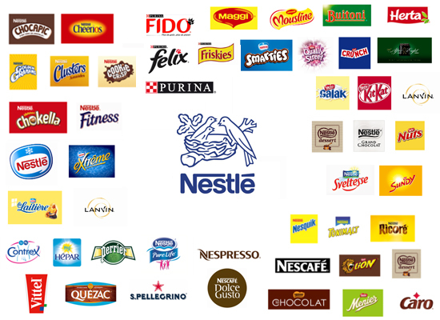
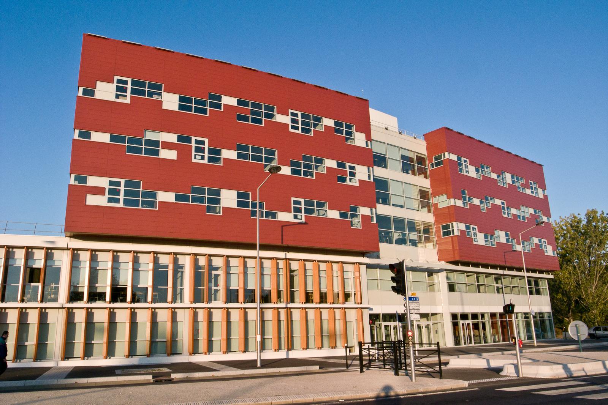
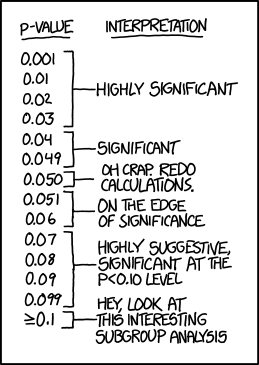
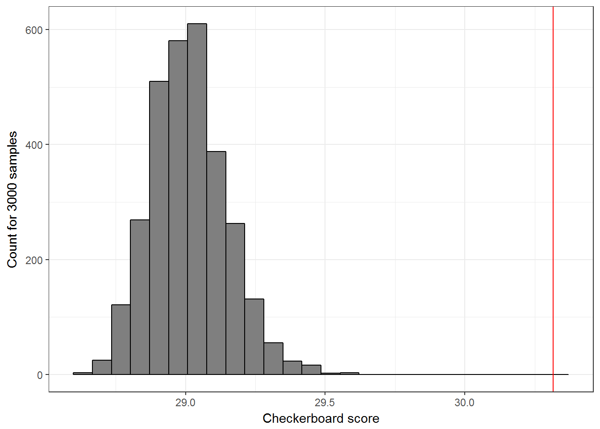

```{r setup, include=FALSE, warning=FALSE}
options(htmltools.dir.version = FALSE, dev = 'pdf')
library(leaflet)
library(ggplot2)
```

# Mini CV

.pull-left[

* Secondaire en région Lyonnaise
 
* MP* et 5/2 au Lycée du Parc

* Intégration en 2014

* IM

* 3A hors école en Biomathématiques

* Thèse en Biostatistique

]

.pull-right[

```{r photoab, fig.align="center", out.width="70%", echo=FALSE}

```
]

---
class: center, middle

# Mines Nancy

```{r logomines, fig.align="center", out.width="30%", echo=FALSE}
knitr::include_graphics("logo_mines_noir.png")
```

---
## Vie à Mines Nancy

<div style = "margin-top: -20px"></div>

* Les assos

<center>
 &nbsp;&nbsp;&nbsp;   &nbsp;&nbsp;&nbsp;   &nbsp;&nbsp;&nbsp;  
</center>

<ul>
<ul>
<li><p>Délégué</p></li>
<li><p>Elève Administrateur</p></li>
</ul>
</ul>

--

* Ingénierie Mathématique

* Mineure Biologie 

* Parcours Recherche

--

* Voeux de 3A hors-école
  
  * _Mathématques de la modélisation_, UPMC 
  
  * _Mathématiques pour les sciences du vivant_, Saclay

---
class: center, middle

# Enterome
```{r logoenterome, fig.align="center", out.width="40%", echo=FALSE}

```


---
## La société

* Laboratoire pharmaceutique

  * spécialisé dans les maladies relatives au microbiote intestinal (maladies inflammatoires, cancers, ulcères, ...)
  
  * développe des médicaments et des biomarqueurs 
  
<br>

* 40 salariés dont 20 sur le site parisien 

  * $\pm$ 6 personnes dans l'équipe bioinfo-biostat

<br>

* Financement par levées de fonds (32 M€ en 2018) et prestations scientifiques


---
## Stage d'assistant ingénieur

* Trouvé sur le site de la <a href="https://www.sfbi.fr" target="_blank">Société Française de BioInformatique</a>

<br>

* Automatisation d'un rapport de contrôle qualité en R

<br>

--

* Apports :

  * Utilisation de R 
  
  * Interaction avec des informaticiens, biologistes, medecins, ...
  
  * Proposition de thèse

---
class: center, middle

# Le microbiote
```{r gutmic, fig.align="center", out.width="30%", echo=FALSE}

```

---
## Qu'est-ce que c'est ?

```{r publi, echo=FALSE}
dfpubli <- 
  data.frame(
    Year = 1990:2017,
    Number = c(727, 748, 844, 782, 918,1030, 1220, 1500, 1900, 2400, 
               2920, 3230, 3940, 4460, 5660, 7100, 8440, 10600, 12600, 15300, 
               18600, 23600, 31200, 39100, 46900, 52300, 52500, 44500)
  )
p <-
  ggplot(dfpubli, aes(Year, Number/1000)) + 
  geom_col(fill = "grey50", color = "black") + 
  theme_minimal() +
  scale_x_continuous(breaks = c(1990, 1995, 2000, 2005, 2010, 2015)) +
  labs(x = "Année de publication", y = "Nombre (milliers)",
       title = "Articles contenant 'Microbiome' ou 'Microbiota'",
       caption = "Source : Google Scholar") +
  # coord_fixed(ratio = 0.3) +
  theme(axis.text = element_text(size = 13), axis.title = element_text(size = 15), 
        plot.title = element_text(size = 17), plot.caption = element_text(size = 13))
```


* Le **microbiote** est l'ensemble des individus présents dans un environnement donné

* Le **métagénome** (**microbiome** en englais) est l'ensemble des génomes du microbiote 

* La **métagénomique** est l'étude du microbiome via séquençage direct

--

<!-- <div style = "margin-top: -30px"></div> -->

```{r plotpubli, echo=FALSE, fig.width=7, fig.height=3, fig.align='center', dpi=300}
print(p)
```

---
## Quelques chiffres

* 100 000 milliards de micro-organismes

* 600 000 gènes (contre 23 000 chez l'homme)

* 200 espèces différentes

* 2 kilos

--

<br>

Un organe à part entière ? 
---
## Interaction hôte-microbiome

* Système immunitaire et allergies

--

* Réponse au stress

--

*  Résistance à l'alcool

--

* Contrôle du fer 

--

* Préférences sexuelles

---
## Comment l'analyser ?

<br>

Présentation  <a href="https://abichat.github.io/Slides/MetagenomicsRGrenoble/MetagenomicsRGrenoble" target="_blank"><i>Metagenomics with R</i></a> à <a href="https://r-in-grenoble.github.io" target="_blank">R Users Grenoble</a>


---
class: center, middle

# UPMC

```{r logoupmc, fig.align="center", out.width="40%", echo=FALSE}
knitr::include_graphics("logo_upmc.png")
```

---
## Une université dans Paris

```{r, out.width='100%', fig.height=6, echo=FALSE, warning=FALSE}
leaflet() %>% addTiles() %>% setView(2.35654, 48.847125, zoom = 15)
```

---
## Quelques chiffres

* 32 000 étudiants 

* 4 500 enseignants-chercheurs et chercheurs

* 125 laboratoires de recherche

* 6 parcours de M2 de mathématiques différents :

 * Mathématiques Fondamentales
 * Probabilités et Modèles Aléatoires
 * Probabilités et Finances
 * __Mathématiques de la Modélisation__
 * Ingénierie Mathématique
 * Statistique
 * Préparation à l'Agrégation
 

---
## Nouvelle identité

* Sorbonne Université depuis le 1er janvier 2018

* 53 400 étudiants

<br>

```{r logosorbonne, fig.align="center", out.width="40%", echo=FALSE}

```

---
## Ma formation

<div style = "margin-top: -30px"></div>

* __Mathématiques pour les Sciences Biologiques et Médicales__

  * Equations aux dérivées partielles
  * Méthodes numériques pour les EDP instationnaires
  * Processus de Markov, application à la dynamique des populations 
  * Calcul stochastique
  
--

<ul>
<ul>
<li>Méthodes mathématiques pour la biologie</li>
<li>Méthodes numériques probabilistes</li>
<li>Statistique et apprentissage</li>
</ul>
</ul>

--

<ul>
<ul>
<li>Méthodes probabilistes en neurosciences</li>
<li>Modélisation de la résistance des bactéries aux antibiotiques</li>
</ul>
</ul>

--

* __Certificat Big Data__

  * Apprentissage statistique
  * Outils pour l'apprentissage statistique distribué
  * Big data et applications

--

<ul>
<ul>
<li>Statistique et apprentissage</li>
<li>Apprentissage en grande dimension</li>
<li>Analyse statistique de graphes</li>
</ul>
</ul>


---
## Ce qui change

* Les effectifs

--

* Les cours à la carte

--

* Les interactions avec les autres élèves

--

* Les interactions avec les enseignants

--

* Les supports pédagogiques

--

* La BU

---
class: center, middle

# Nestlé Research Center
```{r logonestler, fig.align="center", out.width="50%", echo=FALSE}

```

---
## Nestlé

--

.pull-left[
<br>
```{r brands, fig.align="center", out.width="100%", echo=FALSE}

```
]

--

.pull-right[
```{r dfaa, fig.align="center", out.width="100%", echo=FALSE, dpi=300}
dfaa <- data.frame(Entreprise = factor(c("Nestlé", "Unilever", "PepsiCo", "The Coco-Cola Company", "Danone", "Mondelez"), 
                                           levels = c("Nestlé", "Unilever", "PepsiCo", "The Coco-Cola Company", "Danone", "Mondelez")),
                   Pays = c("Suisse", "Royaume-Uni/Pays-Bas", "Etats-Unis", "Etats-Unis", "France", "Etats-Unis"),
                   CA = c(95.6, 66.3, 63.5, 35.4, 30.5, 25.6))
ggplot(dfaa, aes(Entreprise, CA, fill = Pays)) +
  geom_col() +
  geom_label(aes(y = CA/2, label = CA), alpha = 0.3, fill = "white") +
  scale_x_discrete(breaks = c("Nestlé", "Unilever", "PepsiCo", "The Coco-Cola Company", "Danone", "Mondelez")) +
  # scale_fill_manual(values = c("red", "blue", "grey", "purple")) +
  theme_minimal() +
  labs(x = NULL, y = "Chiffre d'affaires (en milliards de $)") +
  theme(axis.text = element_text(size = 13), axis.title = element_text(size = 13),
        plot.title = element_text(size = 17), plot.caption = element_text(size = 10), 
        axis.text.x = element_text(angle = 20, hjust = 1),
        legend.position = "top")
```
]

--


* 335 000 employés dont 5 000 en R&D

* 436 usines dans 86 pays


---
## Le centre de recherche de Vers-Chez-Les-Blancs

* Intitute of Food Safety & Analytical Science

* Intitute of Material Science

* __Intitute of Nutritional Science__

--

  * Department of Cognitive Development
  
  * Department of Dietary Recommendations
  
  * Department of Metabolic Health
  
  * __Department of Gut Ecosystem__
  
--

<ul>
<ul>
<ul>
<li><p>Gatrointestinal Physiology</p></li>
<li><p>Immunology</p></li>
<li><p><b>Host-Microbe Interaction<b></p></li>
</ul>
</ul>
</ul>

---
## Le stage


* Trouvé grâce à un contact d'Enterome

--

* Missions principales :

  * Analyse exploratoire et visualisation de données

  * Nouveau pipeline

  * Influence du régime alimentaire

--

* Apports :

  * Connaissances en microbiote
  
  * Programmation R
  
  * Anglais
  
  * Interaction avec des biologistes, nutritionistes, virologues, ...
  
  
---
## Quelques résultats

<!-- Inclure incfluence CS vs VD -->


---
## La Suisse 🇨🇭


---
class: center, middle

# Thèse CIFRE

```{r logocifre, fig.align="center", out.width="30%", echo=FALSE}

```

---
## Le dispositif


---
## Quelques chiffres


---
class: center, middle

# Enterome, le retour
```{r logoenteromebis, fig.align="center", out.width="40%", echo=FALSE}

```


---
## Ma thèse

> Prise en compte de l’organisation hiérarchique des espèces pour la découverte de signatures métagénomiques multi-échelles.

--

<br>

1. Directeur de thèse (Université d'Évry - LaMME - AgroParisTech)

2. Co-directeur de thèse (INRA)

3. Co-encadrant de thèse (Enterome)

---
## Process Com 

* Modèle de compréhension des personnalités pour développer des stratégies de communication adaptées.

* La manière de dire les choses a autant, et parfois plus, d'importance que ce qui est dit.

--

* Six types de profil :

  * __Empathique__ (chaleureux, sensible, compatissant)

  * __Travaillomane__ (logique, organisé, responsable)
  
  * Persévérant (dévoué, consciencieux, observateur)
  
  * Rêveur (calme, imaginatif, réfléchi)
  
  * Promoteur (adaptable, charmeur, plein de ressources)
  
  * Rebelle (créatif, ludique, spontané)
  
  
---
class: center, middle

# LaMME

```{r logolamme, fig.align="center", out.width="30%", echo=FALSE}

```


---
## Le laboratoire

* Hébergé à l'Institut de Biologie, de Génomique et de BioInformatique 

* 3 équipes de recherche :

  * Analyse et Equations aux Dérivées Partielles
  * Probabilités et Mathématiques Financières
  * __Statistique et Génome__

--

Le premier mercredi du mois : séminaire _Maths for Genomics_ 

--

```{r ibgbi, fig.align="center", out.width="55%", echo=FALSE}

```

---
class: center, middle

# p-valeur
```{r pval, fig.align="center", out.width="40%", echo=FALSE, fig.cap='From <a href="https://xkcd.com" target="_blank">xkcd</a>'}

```

---
## Définition et utilisation

Soit $H_0$ une hypothèse nulle et $X$ une série d'observations.

$$p = \mathbb{P}\left(X\mid H_0\right)$$

--

$p$ mesure la probabilité d'obtenir un résultat "au moins aussi extrême" que celui observé "sachant l'hypothèse nulle".

<br>

--

Extension du raisonnement par l'absurde : on rejette $H_0$ dans le cas où les observations sont hautement improbables $(p<0.05)$.


<br>

--

Sous l'hypothèse nulle, $p\sim\mathcal{U}\left([0,1]\right)$, donc avec un seuil $\alpha = 0.05$, on a 5% de chance de faire une "fausse découverte" (faux positif).


<br>

--

.center[
⚠️ $p \neq \mathbb{P}\left(H_0\mid X\right)$ ⚠️
]

---
## Exemple

La p-valeur peut être obtenue par comparaison avec un score de référence.

```{r mc, echo=FALSE, fig.align='center', dpi=200}

```

---
## Problème des tests multiples

Si l'on teste $m$ hypothèses, quelle est la probabilité de faire au moins une fausse découverte ?

--

Soit $A_i = \left\{H_{0,i}\text{ est vraie}\right\} \bigcap \left\{p_i< \alpha\right\}$. On a $\mathbb{P}\left(A_i\right) = \alpha$.

--

$$\mathbb{P}\left(\bigcup_{i=1}^m A_i\right) = 1- \mathbb{P}\left(\overline{\bigcup_{i=1}^m A_i}\right) = 1- \mathbb{P}\left(\bigcap_{i=1}^m \overline{A_i}\right) \doteq 1- \mathbb{P}\left( \overline{A_i}\right)^m = 1- \left( 1-\alpha\right)^m$$

--

```{r dfpval, echo=FALSE, fig.height=3, fig.align='center', dpi=300}
dfpval <- data.frame(n <- 1:15, p = 1-(1-0.05)^n)
ggplot(dfpval, aes(n,p)) + 
  geom_line(size = 1, alpha = 0.5) +
  geom_point(size = 3) + 
  scale_x_continuous(breaks = seq(2, 15, 2)) +
  scale_y_continuous(limits = c(0, 0.6)) +
  theme_minimal() +
  theme(axis.text = element_text(size = 12), axis.title = element_text(size = 12), 
        plot.title = element_text(size = 17), plot.caption = element_text(size = 10)) +
  labs(x = "Nombre d'hypothèses à tester", y = "Probabilité d'avoir au moins un FP")
```

---
## Correction de Bonferroni

Au lieu de rejeter avec un seuil $\alpha$, on va rejeter à un seuil $\frac{\alpha}{m}$.

$$\mathbb{P}\left(\bigcup_{i=1}^m A_i\right) \leq \sum_{i=1}^m \mathbb{P}\left(A_i\right)=\sum_{i=1}^m \frac{\alpha}{m} = \alpha$$

--


Mais on ne s'autorise qu'une seule erreur, quelque soit le nombre d'hypothèses.

Procédure très conservative 😕

---
## Correction FDR (_False Discovery Rate_)

On s'autorise un certain pourcentage de fausses découvertes parmi nos découvertes : on cherche à contrôler la quantité

$$\mathbb{E}\left[\frac{\text{nombre de fausses découvertes}}{\text{nombre de découvertes}}\right].$$

--

__Procédure__ :

1. Ordonner les p-valeurs $(p_{(1)} \leq p_{(2)} \leq \ldots \leq p_{(m)})$ en notant $p_{(0)}=0$.

2. Poser $\hat{\ell} = \max\left\{\ell \in \{0, 1, \ldots, m\} : p_{(\ell)}\leq \frac{\alpha \ell}{m} \right\}$.

3. Rejeter les $\hat{\ell}$ hypothèses ayant les plus petites p-valeurs.

--

<br>

.center[
<a href="https://roquain.shinyapps.io/FDR_tutorial/" target="_blank">Application Shiny d'Étienne Roquain</a>
]

---
class: center, middle, inverse

# Merci pour votre attention !

#### `r icon::fa("github", size = 1)` <a href="https://github.com/abichat" target="_blank">@abichat</a>
<div style = "margin-top: -20px"></div>
#### `r icon::fa("linkedin-square", size = 1)` <a href="https://www.linkedin.com/in/antoinebichat" target="_blank">antoinebichat</a>
<div style = "margin-top: -20px"></div>
#### `r icon::fa("link", size = 1)` <a href="https://abichat.github.io" target="_blank">abichat.github.io</a>
<div style = "margin-top: -20px"></div>
####`r icon::fa("envelope", size = 1)` <a href="mailto:antoine.bichat@mines-nancy.org?subject=Science%20Communication%20with%20R">antoine.bichat@mines-nancy.org</a>


.footnote[Slides created via the R package <b><a href="https://github.com/yihui/xaringan" target="_blank">xaringan</a></b>.]
