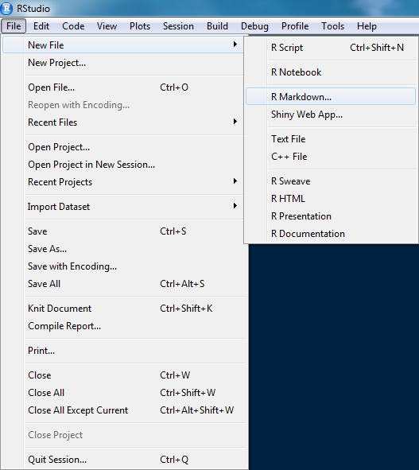
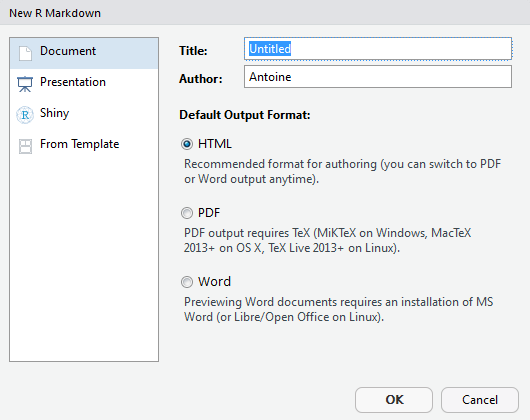
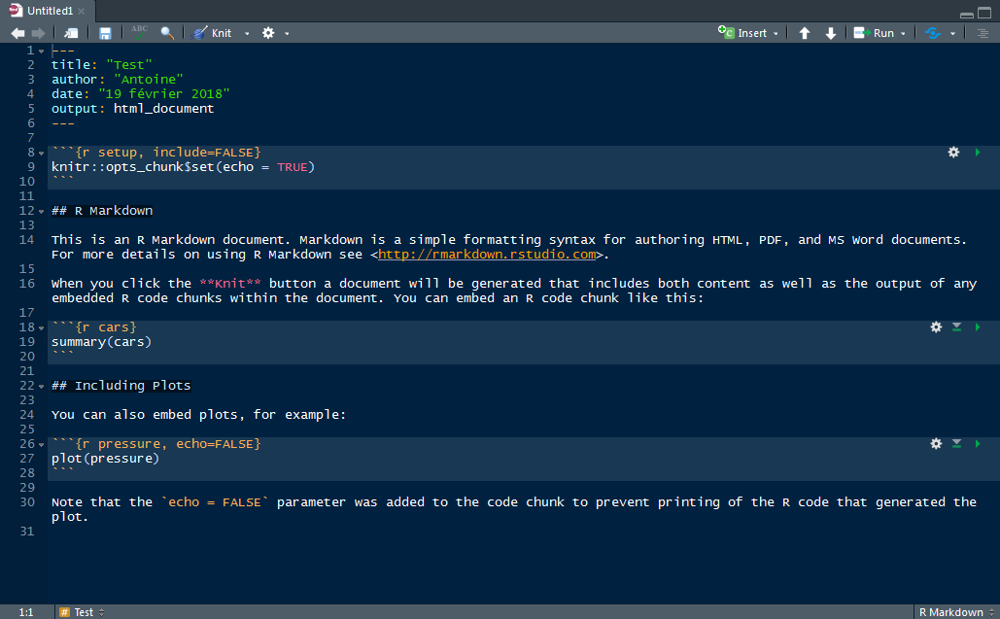

```{r setup, include=FALSE}
options(htmltools.dir.version = FALSE)
knitr::opts_chunk$set(echo = TRUE)
library(tidyverse)
```

class: inverse, center, middle

# Code presentation


---
# Syntax


* Use `<-` for assignation and `=` for arguments

* Leave a space

  * before `(` (except when it's part of a function call)

  * after `)` or `,` 

  * around `=`, `<-`, `+`, `*`, `==`, ...
  
```{r, fig.height=3, fig.align = "center"}
x <- rnorm(n = 100000)^2 + rnorm(n = 100000)^2
hist(x[x < 10], col = "grey", xlab = "", ylab = "Count", 
     main = "Chi-squared empirical distribution")
```


---
# Functions names
 
* When possible, use verbs for function names: `add_row()` or instead of `row_adder()`

--

* A function should do one thing well (it should be called either because it has side-effects or because it returns a value; not both)

--

* Don't hesitate to split your long function in smaller ones

--

* Only use `return()` for early returns

--

* Comment your functions (use the `Ctrl + Maj + C shortcut`)

---
# Pipes

* For long pipes, use one verb per line

* Don't ommit the brackets

```{r eval=FALSE}
# Good
summary_SL <-
  iris %>% 
  drop_na() %>% 
  group_by(Species) %>% 
  summarise(Mean_SL = mean(Sepal.Length))

# Bad
summary_SL <- iris %>% drop_na %>% group_by(Species) %>% 
  summarise(Mean_SL=mean(Sepal.Length))

iris %>% 
  drop_na %>% 
  group_by(Species) %>% 
  summarise(Mean_SL=mean(Sepal.Length)) -> summary_SL
```


---
# Useful help

* The Ctrl + Maj + A shortcut rearranges your code

--

* {styler} package


```{r slyler}
ugly_code <- "a<-function( x){1+1}           "
styler::style_text(ugly_code)
```
---
class: inverse, center, middle

# R Markdown


---
#R Markdown?

* Markdown is a _lightweight markup language_ with plain text formatting syntax that can be converted to HTML. It is completely independent from R. The extention is typically `.md`.

--

* R Markdown is an extension of the markdown syntax that enables R code to be executed. The extention is typically `.Rmd`.

--

* `rmarkdown` is a a library which proceses and converts `.Rmd` files into a number of different formats, including HTML or `.pdf`. The core function is `rmarkdown::render()`.


```{r install, eval=FALSE}
install.packages("rmarkdown")
```

.footnote[[`r icon::fa("stack-overflow", size = 1)` Relationship between R Markdown, Knitr, Pandoc, and Bookdown](https://stackoverflow.com/questions/40563479)]

---
# Create a new `.Rmd`

.pull-left[
.center[
  
]
]

--

.pull-right[
  <div style = "margin-top: 80px"></div> 
  .center[
    
  ]
]

---
# New `.Rmd`

.center[
  
]

---
# Compile `.Rmd`

Use the `Knit` button to produce a HTML file.

.center[
  
]

Shortcut: Ctrl + Maj + K

---
class: center, middle

# Markdown syntax

---
# Titles and text fonts

```
# Big title

## Title

### Small title

_Italic_, *bold*, and `monospace`
```

# Big title

## Title

### Small title

_Italic_, __bold__, and `monospace`


---
# Lists and more

<div style = "margin-top: -30px"></div>

.pull-left[
```
1. This is
2. an ordered
3. list
```
1. This is
2. an ordered
3. list
]

--

.pull-right[
```
 * This is
 * a bullet list
   * with indent
```
* This is
* a bullet list
  * with indent
]

<br>

--

```
> You can insert quotes, $\LaTeX$ expressions and horizontal rule:
```

> You can insert quotes, $\LaTeX$ expressions and horizontal rule:

<br>

--

```
---
```

***

<br>

--

```
$$ \frac{1}{n} \sum_{i=1}^n X_i $$
```

$$ \frac{1}{n} \sum_{i=1}^n X_i $$

---
# Insert links and pictures

```
[My personal page](https://abichat.github.io/)
```

[My personal page](https://abichat.github.io/)

--


```

```


--

It also works directly with HTML syntax:


```
<a href="https://abichat.github.io/">My personal page</a>

```

---
class: middle, center

# Chunks

---
# Basic chunks

```{r comment=NA,echo=FALSE}
cat("```{r}\nx <- 4\nx\n```")
```

Output:

```{r simplechunk}
x <- 4
x
```


---
# Echo

To display the output of a code chunk but not the underlying R code, you specify the `echo=FALSE` option.

```{r comment=NA,echo=FALSE}
cat("```{r chunkecho, echo=FALSE}\nx <- 5\nx\n```")
```

Output:

```{r chunkecho, echo=FALSE}
x <- 5
x
```

---
# Eval

To display R code without evaluating it, you specify the `eval=FALSE` chunk option.

```{r comment=NA,echo=FALSE}
cat("```{r chunkeval, eval=FALSE}\nx <- 5\nx\n```")
```

Output:

```{r chunkeval, eval=FALSE}
x <- 10
```

--

```{r chunktesteval}
x 
```

---
# Fig options

```{r comment=NA,echo=FALSE}
cat('```{r chunkfig, fig.align="center", fig.height=4, fig.width=8}\nplot(iris$Sepal.Length, iris$Sepal.Width)\n```')
```

```{r chunkfig, fig.align="center", fig.height=4, fig.width=8}
plot(iris$Sepal.Length, iris$Sepal.Width)
```

---
# Name your chunks!

* In RStudio you can navigate named chunks fairly easily

--

* The goal of named chunk is clear (or it should be)

--

* Easier to debugging

--

* Caching is more efficient with named chunks (otherwise it uses chunk positions)

.footnote[[`r icon::fa("link", size = 1)` Pets or livestock? Naming your RMarkdown chunks](http://www.masalmon.eu/2017/08/08/chunkpets/)]
---
class: inverse, center, middle

# Xaringan


---
class: middle, center, inverse

# References


---
## Style

* The tidyverse style guide http://style.tidyverse.org

## R Markdown

* Official site https://rmarkdown.rstudio.com

* Cheat Sheet https://www.rstudio.com/wp-content/uploads/2016/03/rmarkdown-cheatsheet-2.0.pdf

## Xaringan

* Documentation  https://slides.yihui.name/xaringan

---
class: center, middle, inverse

# Thanks for your attention!

#### `r icon::fa("github", size = 1)` <a href="https://github.com/abichat">@abichat</a>
<div style = "margin-top: -20px"></div>
####`r icon::fa("envelope", size = 1)` <a href="mailto:antoine.bichat@mines-nancy.org?subject=Science%20Communication%20with%20R">antoine.bichat@mines-nancy.org</a>


.footnote[Slides created via the R package [**xaringan**](https://github.com/yihui/xaringan).]
