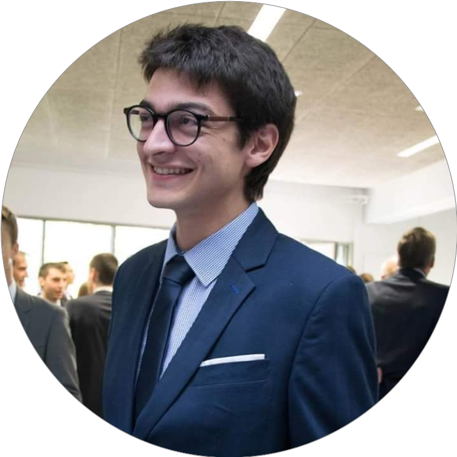

```{r setup, include=FALSE}
knitr::opts_chunk$set(echo = FALSE)

# Learn more about creating websites with Radix at:
# https://rstudio.github.io/radix/website.html

```

<div style="text-align:justify"> 
&emsp; I'm a PhD Student in biostatistics under the supervisation of <a href="http://www.math-evry.cnrs.fr/members/Cambroise/welcome" target="_blank">Christophe Ambroise</a>, <a href="https://mahendra-mariadassou.github.io" target="_blank">Mahendra Mariadassou</a> and Jonathan Plassais at the <a href="http://www.math-evry.cnrs.fr/doku.php" target="_blank">Laboratoire de Mathématiques et Modélisation d'Évry (LaMME)</a> and the pharmaceutical company <a href="http://www.enterome.com" target="_blank">Enterome</a>. My work consists in discovering multi-scale metagenomic signatures through hierarchical organization of species. <br>
&emsp; I studied mathematical engineering at <a href="https://mines-nancy.univ-lorraine.fr" target="_blank">Mines Nancy</a> and biomathematics at <a href="https://www.sorbonne-universite.fr" target="_blank">Sorbonne Université</a>. <br>
&emsp; I'm also a big fan of the `r icon::fa_r_project()` programming language and the <a href="https://www.tidyverse.org" target="_blank">tidyverse</a> 😄
</div>

<aside> 
  
</aside>


<!-- ## Events -->


<p align="center">
  <a href="https://xkcd.com/882/" target="_blank">  
    
  </a>
</p>

<aside>
  <a class="twitter-timeline" data-lang="en" data-height="100%" data-theme="light" href="https://twitter.com/_abichat?ref_src=twsrc%5Etfw">Tweets by _abichat</a> <script async src="https://platform.twitter.com/widgets.js" charset="utf-8"></script>
</aside>