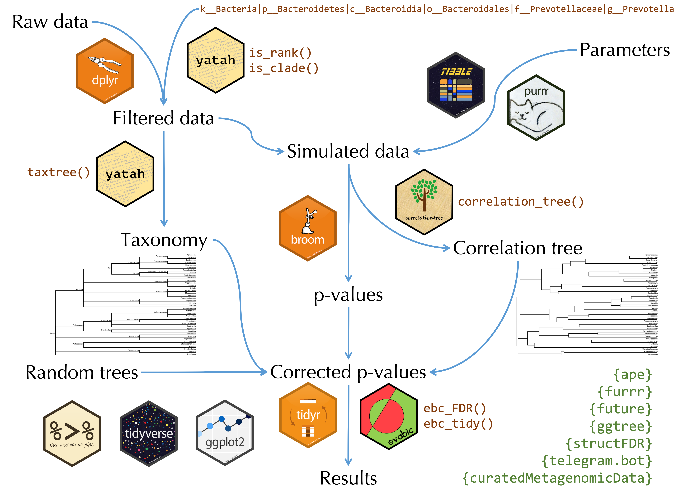
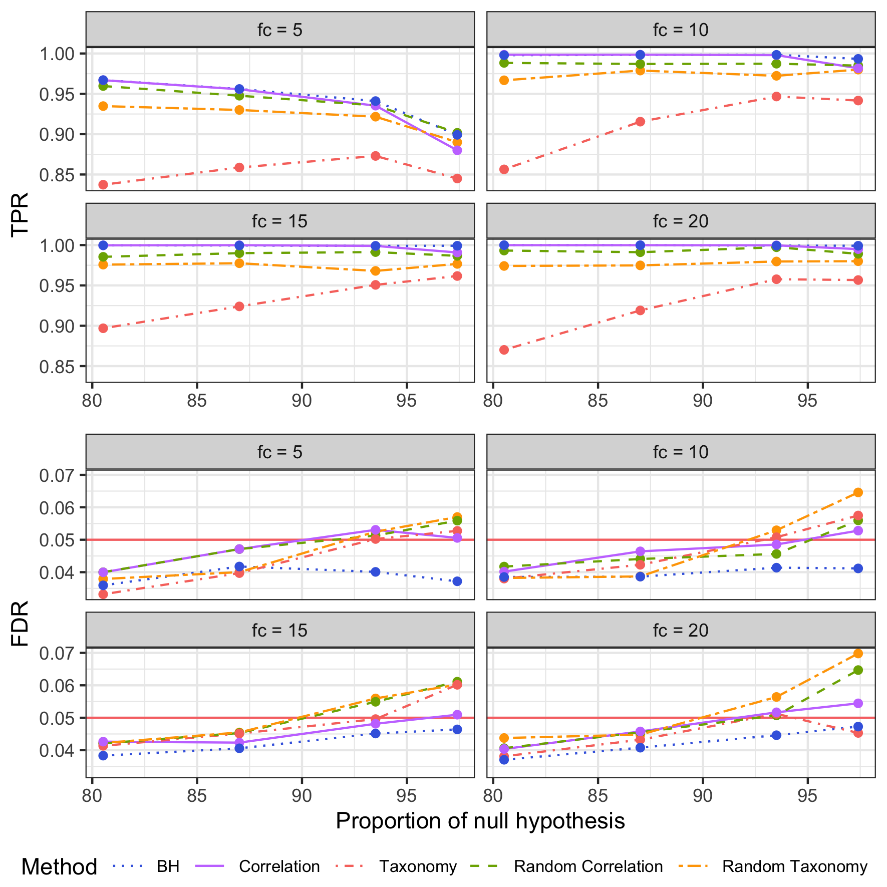

```{r setup, include=FALSE}
options(htmltools.dir.version = FALSE)
knitr::opts_chunk$set(echo = FALSE)
```

```{r package, include=FALSE, message=FALSE}
library(tidyverse)
library(ggtree)
library(yatah)
numprint <- function(x, ...) format(x, big.mark = "&#8239;", scientific = FALSE, ...)
set.seed(42)
```

Microbiota {.block}
================================================================================

- __Ecological community of microorganisms that resides in an environmental niche__
- $10^{14}$ bacteria in the gut among `r numprint(1500)` species 
- Associations with:
    - metabolism (diet, obesity, drug absorption, …)
    - diseases (IBD, allergies, diabete…)
    - behavior (smokers, antibiotics, C-section…)
    - environment (pet, water…)


Data: taxonomy and abundance
================================================================================

```{r abund}
read_csv("data/data_abund.csv", col_types = cols(.default = "d", Taxa = "c")) %>% 
  select(Taxa, S001 = S005, S002 = S006, S003 = S007, S004 = S008, S005 = S009) %>% 
  slice(c(1:7, 10)) %>% 
  mutate(`...` = "...") %>% 
  left_join(read_csv("data/data_tax.csv", col_types = "cccccc", na = "NA"),
            by = c("Taxa" = "Genus")) %>% 
  unique() %>% 
  select(-Kingdom) %>% 
  select(Phylum, Class, Order, Family, Genus = Taxa, everything()) %>% 
  arrange_all() %>% 
  knitr::kable()
```


Objectives {.block}
================================================================================

- Find which bacteria are differentially abundant between two or more groups 
- Use a FDR multiple testing correction to prevent false positives (one test per bacteria)
- Incorporate hierarchical information to increase power
- Which tree?


Workflow
================================================================================

<center>
  
</center>

Hierarchical False Discovery Rate {.block}
================================================================================

The z-scores $\mathbf{z} = \Phi^{-1}(\mathbf{p})$ are smoothed using the following hierarchical model:

$$\mathbf{z} | \mathbb{\mu} \sim \mathcal{N}_n \left( \mathbb{\mu}, \sigma^2 \mathbf{I}_m \right) \qquad \mathbf{\mu} \sim \mathcal{N}_m\left(\gamma \mathbf{1} , \tau^2 \mathbf{C}_{\rho} \right)$$ 

where $\mathbf{C}_{\rho} = \left(\text{exp} (−2\rho \mathbf{D}_{i,j} )\right)$ with $\mathbf{D}$ the patristic distance matrix between taxa from the tree. By applying Bayes's formula:

$$\mathbf{z} \sim \mathcal{N}_m \left(\gamma \mathbf{1},\tau^2 \mathbf{C}_{\rho} + \sigma^2 \mathbf{I}_m\right)$$

$$\mathbb{\mu}^* = \left(\mathbf{I}_m + \frac{\sigma_0^2}{\tau_0^2} \mathbf{C}_{\rho_0}^{-1}\right)^{-1}\left(\frac{\sigma_0^2}{\tau_0^2} \mathbf{C}_{\rho_0}^{-1}\gamma_0 \mathbf{1} + \mathbf{z}\right)$$
Finally, a permutation-based FDR control is applied on $\mathbb{\mu}^*$


Take-home message {data-color=red}
================================================================================

* The tree choice has little impact on detection power

* Benjamini-Hochberg procedure is still the most powerful method and the only one which respects the FDR control

* The ease of creating R packages greatly increases the reproducibility of analysis 

* __tidyverse__ and especially list-columns allow to write elegant and efficient R code when manipulating non-standard structures (trees, statistical model outputs…)


Results {data-color=red}
================================================================================

<center>
  
</center>

<div align="right">
  Poster made with <b>pagedown</b>
</div>


References
================================================================================

`r emo::ji("page_facing_up")` Xiao, Jian, Hongyuan Cao, and Jun Chen. __False discovery rate control incorporating phylogenetic tree increases detection power in microbiome-wide multiple testing.__ Bioinformatics 33.18 (2017): 2873-2881.

`r emo::ji("page_facing_up")` Bokulich, Nicholas A., et al. __Antibiotics, birth mode, and diet shape microbiome maturation during early life.__ Science translational medicine 8.343 (2016): 343ra82-343ra82.

`r emo::ji("page_facing_up")` Opstelten, Jorrit L., et al. __Gut microbial diversity is reduced in smokers with Crohn's disease.__ Inflammatory bowel diseases 22.9 (2016): 2070-2077.


Contact Information 
================================================================================
<br>
<div class="row">
  <div class="column3"><center></center></div>
  <div class="column3"><center>
      `r icon::fa("envelope", size = 1)` abichat@enterome.com
      <br>
      `r icon::fa("link", size = 1)` abichat.github.io 
      <br>
      `r icon::fa("linkedin", size = 1)` antoinebichat 
      <br>
      `r icon::fa("twitter", size = 1)` @_abichat 
      <br>
      `r icon::fa("github", size = 1)` @abichat 
    </center></div>
  <div class="column3"><center></center></div>
</div>


