```{r setup, include=FALSE}
options(htmltools.dir.version = FALSE)
knitr::opts_chunk$set(echo = TRUE, fig.align = "center", 
                      fig.retina = 2, comment = " ")
```

```{r icons-emojis, message=FALSE, echo=FALSE}
# remotes::install_github("ropenscilabs/icon")
# remotes::install_github("hadley/emo")
```


# Configuration `r icon::fa_cog(pull = "right", animate = "spin")`

```{r package, echo=TRUE, message=FALSE, results="hide"}
library(tidyverse)
library(lubridate)
library(tidytuesdayR)

set.seed(42)
theme_set(theme_minimal())
Sys.setlocale("LC_TIME", "C")
```

```{r packageversion, echo=FALSE}
c("dplyr", "ggplot2", "forcats", "lubridate", "stringr", "tidyr", "tidytuesdayR", "gghalves", "ggexpanse") %>% 
enframe(value = "Package", name = NULL) %>% 
  arrange(Package) %>% 
  mutate(Version = map_chr(Package, compose(as.character, packageVersion)))
```


---
# Disclaimer `r icon::fa_exclamation(pull = "right")`

Almost every functions presented in these slides could be replaced by (ugly?) portions of code.

As always, there is a trade-off between simplicity and readability (and consistency for R) on one side, and speed and dependencies to other packages on the other side.

<br>

- lubridate: 
- stringr: 
- forcats: 
- ggplot2: 
- dplyr: 
- tidyr: 
- tidyverse: 


---
class: inverse, center, middle
background-image: url(img/hex_tidytuesday.png)
background-size: 15%
background-position: right 20px bottom 20px

.slide-in-right[
# TidyTuesday
]

---
# A weekly social data project in R

* Every Monday, a dataset is proposed on `r icon::fa_github()`  [rfordatascience/tidytuesday](https://github.com/rfordatascience/tidytuesday).

* Every Tuesday (or after), everyone could post their visualizations on Twitter `r icon::fa_twitter()` with the hashtag `#TidyTuesday`.

* There is a package to download proposed datasets: **tidytuesdayR**.

* And a shiny app to see previous contributions: [tidytuesdayrocks](https://nsgrantham.shinyapps.io/tidytuesdayrocks/).

* It's a great way to learn and discover new possibilities.

<br>


### .center[.cursive[Practice makes perfect.]]


---
class: noslidenumber
# Some submissions 

.scroll-output[
.pull-left[
<blockquote class="twitter-tweet" data-lang="en"><p lang="en" dir="ltr"><a href="https://twitter.com/hashtag/TidyTuesday?src=hash&amp;ref_src=twsrc%5Etfw">#TidyTuesday</a> Week 2019-42 - Updates: More car racing, more fun!<br><br>Here is an animation showing energy efficiency on highways with a starting sequence and start line plus the suggested change of title and axis, thx <a href="https://twitter.com/JonTheGeek?ref_src=twsrc%5Etfw">@JonTheGeek</a>!<a href="https://twitter.com/R4DScommunity?ref_src=twsrc%5Etfw">@R4DScommunity</a> <a href="https://twitter.com/hashtag/ggplot2?src=hash&amp;ref_src=twsrc%5Etfw">#ggplot2</a> <a href="https://twitter.com/hashtag/rstats?src=hash&amp;ref_src=twsrc%5Etfw">#rstats</a> <a href="https://twitter.com/hashtag/dataviz?src=hash&amp;ref_src=twsrc%5Etfw">#dataviz</a> <a href="https://t.co/Hooej9MXnF">pic.twitter.com/Hooej9MXnF</a></p>&mdash; Cédric Scherer (@CedScherer) <a href="https://twitter.com/CedScherer/status/1186335139925757952?ref_src=twsrc%5Etfw">October 21, 2019</a></blockquote> 
]

.pull-right[
<blockquote class="twitter-tweet" data-lang="en"><p lang="en" dir="ltr"><a href="https://twitter.com/hashtag/TidyTuesday?src=hash&amp;ref_src=twsrc%5Etfw">#TidyTuesday</a> contribution for this week required patience and perseverance but I did it 💪🏻🐦<a href="https://twitter.com/hashtag/rstats?src=hash&amp;ref_src=twsrc%5Etfw">#rstats</a> <a href="https://twitter.com/hashtag/tidyverse?src=hash&amp;ref_src=twsrc%5Etfw">#tidyverse</a> <a href="https://twitter.com/hashtag/dataviz?src=hash&amp;ref_src=twsrc%5Etfw">#dataviz</a> <a href="https://twitter.com/hashtag/birds?src=hash&amp;ref_src=twsrc%5Etfw">#birds</a> <a href="https://t.co/8P7Zjgvw0e">pic.twitter.com/8P7Zjgvw0e</a></p>&mdash; Antoine (@_abichat) <a href="https://twitter.com/_abichat/status/1123214724928241665?ref_src=twsrc%5Etfw">April 30, 2019</a></blockquote> 
]
]
---
# Nuclear explosions `r icon::fa_bomb(pull = "right")`

```{r import-nuclear, cache=TRUE, cache.lazy=FALSE}
df_nuclear <- tt_load("2019-08-20")$nuclear_explosions 
df_nuclear
```

---
class: noslidenumber
# Contributions 

.pull-left[

<blockquote class="twitter-tweet" data-lang="en"><p lang="en" dir="ltr">📊 My contribution to this week&#39;s <a href="https://twitter.com/hashtag/TidyTuesday?src=hash&amp;ref_src=twsrc%5Etfw">#TidyTuesday</a> (this time actually on a Tuesday): nuclear explosions since 1945!💥<a href="https://twitter.com/R4DScommunity?ref_src=twsrc%5Etfw">@R4DScommunity</a><br> <a href="https://twitter.com/hashtag/dataviz?src=hash&amp;ref_src=twsrc%5Etfw">#dataviz</a> <a href="https://twitter.com/hashtag/rstats?src=hash&amp;ref_src=twsrc%5Etfw">#rstats</a> <a href="https://twitter.com/hashtag/ggplot2?src=hash&amp;ref_src=twsrc%5Etfw">#ggplot2</a><br><br>(Code below) <a href="https://t.co/GjyUhgoogX">pic.twitter.com/GjyUhgoogX</a></p>&mdash; Gil Henriques 🌹 (@_Gil_Henriques) <a href="https://twitter.com/_Gil_Henriques/status/1163836007743025152?ref_src=twsrc%5Etfw">August 20, 2019</a></blockquote> 
]

.pull-right[
<blockquote class="twitter-tweet" data-lang="en"><p lang="en" dir="ltr"><a href="https://twitter.com/hashtag/TidyTuesday?src=hash&amp;ref_src=twsrc%5Etfw">#TidyTuesday</a> Nuclear explosions. Got some inspiration from the PDF of the original report. Hopefully I will be forgiven for the double axis graph, lol<a href="https://twitter.com/hashtag/r4ds?src=hash&amp;ref_src=twsrc%5Etfw">#r4ds</a> <a href="https://twitter.com/hashtag/rstats?src=hash&amp;ref_src=twsrc%5Etfw">#rstats</a> <a href="https://twitter.com/hashtag/dataviz?src=hash&amp;ref_src=twsrc%5Etfw">#dataviz</a> <a href="https://twitter.com/hashtag/nuclearweapons?src=hash&amp;ref_src=twsrc%5Etfw">#nuclearweapons</a> <a href="https://t.co/vAgydjrCHK">pic.twitter.com/vAgydjrCHK</a></p>&mdash; Harro Cyranka 🔎 (@harrocyranka) <a href="https://twitter.com/harrocyranka/status/1163805331929141248?ref_src=twsrc%5Etfw">August 20, 2019</a></blockquote> 
]


---
# Roman emperors `r icon::fa_crown(pull = "right")` 

```{r import-emperors, cache=TRUE, cache.lazy=FALSE}
df_emperors <- tt_load("2019-08-13")$emperors
df_emperors
```


---
class: noslidenumber
# Contributions

.scroll-output[
.pull-left[
<blockquote class="twitter-tweet" data-lang="en"><p lang="en" dir="ltr">Inspired by the periodic table of elements, I present you the unperiodic table of the Roman emperors for this week’s <a href="https://twitter.com/hashtag/TidyTuesday?src=hash&amp;ref_src=twsrc%5Etfw">#TidyTuesday</a>!<br><br>code: <a href="https://t.co/yYmzriAURg">https://t.co/yYmzriAURg</a><a href="https://twitter.com/hashtag/dataviz?src=hash&amp;ref_src=twsrc%5Etfw">#dataviz</a> <a href="https://twitter.com/hashtag/rstats?src=hash&amp;ref_src=twsrc%5Etfw">#rstats</a> <a href="https://twitter.com/hashtag/ggplot?src=hash&amp;ref_src=twsrc%5Etfw">#ggplot</a> <a href="https://t.co/fNd21Xl4kl">pic.twitter.com/fNd21Xl4kl</a></p>&mdash; Georgios Karamanis (@geokaramanis) <a href="https://twitter.com/geokaramanis/status/1162035459884589057?ref_src=twsrc%5Etfw">August 15, 2019</a></blockquote> 
]

.pull-right[
<blockquote class="twitter-tweet" data-lang="en"><p lang="en" dir="ltr">My <a href="https://twitter.com/hashtag/TidyTuesday?src=hash&amp;ref_src=twsrc%5Etfw">#TidyTuesday</a> contribution. Was fun to work with <a href="https://twitter.com/hashtag/ggforce?src=hash&amp;ref_src=twsrc%5Etfw">#ggforce</a> annotations. <a href="https://t.co/QSZdt8bQMy">pic.twitter.com/QSZdt8bQMy</a></p>&mdash; Philippe Massicotte (@philmassicotte) <a href="https://twitter.com/philmassicotte/status/1161728575734722560?ref_src=twsrc%5Etfw">August 14, 2019</a></blockquote> 
]
]

---
class: inverse, center, middle
background-image: url(img/hex_forcats.png)
background-size: 15%
background-position: right 20px bottom 20px

.slide-in-left[
# Dealing with factors
]

---
# What is a factor?

* To represent categorical variables.

* Fixed and known set of possible values (even not present in the dataset).

* Could be ordered.

* Essential for modeling.

* Stored as integer in their underlying representation (but now strings too, so no more memory advantage).


.footnote[
`r icon::fa_link()` [stringsAsFactors: An unauthorized biography](https://simplystatistics.org/2015/07/24/stringsasfactors-an-unauthorized-biography/)
]


---
# Convert to factor

```{r asfactor}
fruits <- c("banana", "apple", "mango", "apple", "pear", "apple", 
            "banana", "pitaya", "mango", "mango", "apple")
as.factor(fruits) # Use alphabetical order
```

--

```{r asfactor2}
as_factor(fruits) # Use appearance order 
```


Using appearance order increased reproducibility because it's independent from `locale()`.

.footnote[
Everything could be done with base R: `factor(countries, levels = unique(countries))`.
]

---
# Change level names

```{r fct_recode}
fct_recode(fruits, dragonfruit = "pitaya")
```

--

```{r fct_relabel}
fct_relabel(fruits, str_to_title)
```


.footnote[
Note that when converting from strings to factors, `fct_recode()` and `fct_relabel()` use alphabetical order.
]


---
# Reorder levels

You can reorder levels:

* manually with `fct_relevel()`,

* by appearance with `fct_inorder()`,

* by frequency with `fct_infreq()`,

* according to another variable with `fct_reorder()`,

* according to the last value of another variable with `fct_reorder2()`,

* randomly with `fct_shuffle()`,

* by reversing order with `fct_rev()`...

---
# By frequency 

```{r fct_infreq}
fct_count(fruits, sort = TRUE)
fct_infreq(fruits)
```

---
# According to another variable 


.pull-left-60[
```{r levelsiris}
levels(iris$Species)
``` 

```{r irisreorder, eval=FALSE}
iris %>% 
  mutate(Species = fct_reorder(Species, Sepal.Width)) %>%  #<<
  ggplot() +
  aes(x = Species, y = Sepal.Width, fill = Species) +
  geom_boxplot(notch = TRUE, show.legend = FALSE)  
``` 
]

.pull-right-40[
```{r plot-irisreorder, ref.label="irisreorder", echo=FALSE}
```
]

---
# Tidy WorldPhones `r icon::fa_phone(pull = "right")`

```{r worldphones} 
WorldPhones %>% 
  as_tibble(rownames = "Year")
```

---
count: false
# Tidy WorldPhones `r icon::fa_phone(pull = "right")`

```{r worldphonespivot} 
WorldPhones %>% 
  as_tibble(rownames = "Year") %>% 
  pivot_longer(-Year, names_to = "Region", values_to = "Count") #<<
```


---
# According to the last value `r icon::fa_phone(pull = "right")`

.pull-left-60[
```{r worldphonesreorder, eval=FALSE}
WorldPhones %>% 
  as_tibble(rownames = "Year") %>% 
  pivot_longer(-Year, names_to = "Region", values_to = "Count") %>% 
  mutate(Year = as.numeric(Year),
         Region = fct_reorder2(Region, Year, Count)) %>% #<<
  ggplot() +
  aes(x = Year, y = Count, color = Region) +
  geom_line() +
  scale_y_log10()
``` 
]

.pull-right-40[
```{r plot-worldphonesreorder, ref.label="worldphonesreorder", echo=FALSE}
```
]


---
# {tidyr} digression

.pull-left[
```{r anscombe}
anscombe
```
]

--

.pull-right[
```{r tidyanscombe}
anscombe %>% 
  pivot_longer(
    everything(), 
    names_to = c(".value", "group"), #<<
    names_pattern = "(.)(.)") #<<
```
]

---
# Time to practice!

```{r plot-col-nuclear, ref.label="col-nuclear", echo=FALSE, fig.width=12}
```


---
count: false
# Time to practice!

.scroll-output[
```{r col-nuclear, fig.width=12}
df_nuclear %>%  
  count(country, sort = TRUE) %>%
  mutate(country = fct_inorder(country), 
         country = fct_rev(country),
         country = fct_recode(country, France = "FRANCE", China = "CHINA",
                              India = "INDIA", Pakistan = "PAKIST")) %>%
  ggplot() +
  aes(x = country, y = n, fill = country) +
  geom_col(show.legend = FALSE) +
  coord_flip() + 
  labs(x = "Country", y = "Total number of nuclear explosions") +
  scale_fill_viridis_d(option = "E", direction = -1)
```
]

---
# Too many levels?

.scroll-box-16[
```{r tabletypes}
df_nuclear$type <- str_to_title(df_nuclear$type) 
fct_count(df_nuclear$type, sort = TRUE) 
```
]


---
# Lump least common factors


```{r lump-n}
df_nuclear$type %>% # Preserve the most common `n` values
  fct_lump(n = 5) %>% #<<
  table() 
```

--

```{r lump-min}
df_nuclear$type %>% # Preserve the values that appear at least `min` number of times
  fct_lump_min(min = 20) %>% #<<
  table()
```


---
# Manually collapse levels

```{r}
df_nuclear$type %>% 
  fct_collapse(Air = c("Atmosph", "Airdrop", "Balloon", "Rocket"), #<<
               Underground = c("Shaft", "Tunnel", "Shaft/Gr", 
                               "Shaft/Lg", "Ug", "Gallery"),
               Water = c("Barge", "Uw", "Ship", "Water Su", "Watersur"),
               group_other = TRUE) %>% #<<
  fct_count(sort = TRUE)
```

---
# Factors are integers!

```{r vege}
vegetables <- factor(c("carrot", "lettuce", "endive"))
fruits <- as_factor(fruits)
```

--

```{r factorc}
c(fruits, vegetables)
```

--

```{r fct_c}
fct_c(fruits, vegetables)
```

--

.footnote[
```{r numericfactor}
as.numeric(factor(runif(4))) # Don't forget as.character()
```
]

---
# Time to practice!

```{r plot-line-nuclear, ref.label="line-nuclear", echo=FALSE, fig.width=12}
```


---
count: false
# Time to practice!

.scroll-output[
```{r tidy-nuclear}
df_nuclear %>% 
  mutate(country = fct_collapse(country, `PAKISTAN\n& INDIA` = c("INDIA", "PAKIST"))) %>%
  count(year, country) %>% 
  group_by(country) %>% 
  mutate(cum = cumsum(n)) %>% 
  ungroup()
```
]

---
count: false
# Time to practice!

.scroll-output[
```{r line-nuclear, fig.width=12}
df_nuclear %>% 
  mutate(country = fct_collapse(country, `PAKISTAN\n& INDIA` = c("INDIA", "PAKIST"))) %>%
  count(year, country) %>% 
  group_by(country) %>% 
  mutate(cum = cumsum(n)) %>% 
  ungroup() %>% 
  mutate(country = fct_reorder2(country, year, cum)) %>% 
  ggplot() +
  aes(x = year, y = cum, color = country) +
  geom_line(size = 1, key_glyph = "timeseries") + 
  ggexpanse::scale_color_expanse() +
  labs(x = NULL, color = "Country", y = "Cumulative number of nuclear explosions") +
  ggexpanse::theme_expanse() 
```
]

---
class: inverse, center, middle
background-image: url(img/hex_lubridate.png)
background-size: 15%
background-position: right 20px bottom 20px

.slide-in-right[ 
# Dealing with dates 
]
.slide-in-left[
## and hours  
] 


---

# ISO 8601

.pull-left[
Convention for dates:

.Large[.center[.content-box[YYYY-MM-DD]]]

<br>

Convention for time:

.Large[.center[.content-box[HH:MM:SS]]]

]

.pull-right[
.center[

]
]

.footnote[
`r icon::fa_palette()` [XKCD](https://xkcd.com/1179/) 
]

---
# Parse date

6 functions are available to parse dates from **y**ear, **m**onth, and **d**ay components: `ymd()`, `ydm()`, `mdy()`, `myd()`, `dmy()`, `dym()`.

```{r firstlanding}
first_landing <- ymd("1969-07-20")
class(first_landing)
first_landing
```

--

Formatted dates could be very different, as long as the specified order is respected. 

```{r mdy}
mdy(c("7/20 69","July 20, 1969", "First step was on July, the 20th (1969)"))
```

---
# Parse time

Each previous function could be suffixed by `_h`, `_hm` or `_hms` to take into account **h**our, **m**inute, and **s**econd components.

```{r firststep}
first_step <- ymd_hm("1969-07-20 20:17")
class(first_step)
first_step
```


---
# Extract components

.pull-left[
```{r exctract1}
year(first_landing)
month(first_landing)
day(first_landing)
hour(first_step)
```
]

--

.pull-right[
.scroll-output[
```{r exctract2}
month(first_landing, label = TRUE) 
wday(first_landing, label = TRUE, abbr = FALSE)
hour(first_landing) # returns 0
```
]
.footnote[
There is also `yday()`, `quarter()`, `semester()`, `dst()`, `am()`, `pm()`, `tz()`, `leap()`...
]
]

---
# Change and round components

You can change components with a simple assignation.

```{r changesec}
second(first_step) <- 30
first_step
```

--

Rounding (to the nearest, down or up) dates is easy.

```{r rounddate}
round_date(first_step, unit = "hours") # ceiling_date() / floor_date() 
round_date(first_step, unit = "15mins")
```


---
# Time to practice!

```{r plot-calendar-nuclear, ref.label="calendar-nuclear", echo=FALSE, fig.width=12}
```


---
count: false
# Time to practice!

.scroll-output[
```{r tidy-calendar-nuclear}
df_nuclear %>% 
  select(date_long, country) %>% 
  mutate(date_long = ymd(date_long),
         month = month(date_long, label = TRUE),
         wday = wday(date_long, label = TRUE, abbr = FALSE, week_start = 1),
         wday = fct_rev(wday)) 
```
]

---
count: false
# Time to practice!

.scroll-output[
```{r calendar-nuclear, fig.width=12}
df_nuclear %>% 
  select(date_long, country) %>% 
  mutate(date_long = ymd(date_long),
         month = month(date_long, label = TRUE),
         wday = wday(date_long, label = TRUE, abbr = FALSE, week_start = 1),
         wday = fct_rev(wday))  %>% 
  filter(country %in% c("USA", "USSR")) %>% 
  count(month, wday, country) %>%
  ggplot() +
  aes(x = month, y = wday, fill = n) +
  geom_tile() +
  scale_fill_viridis_c(option = "E") +
  facet_grid(~ country) +
  labs(x = NULL, y = NULL, fill = "Number of\nexplosions") +
  theme_minimal() +
  theme(panel.grid = element_blank())
```
]

---
# Current date and time 

```{r todaynow}
today()
now()
```

--

```{r todaynowbase}
today() == Sys.Date()
now() == Sys.time() # would be TRUE if computer processed both at the same instant
```

---
# Intervals

Intervals are objects composed by a starting date and an ending date.


An interval is created by `interval()` or `%--%`.

--

Several functions for intervals:

* `time_length()` computes the length of an time span (unit could be specified),

* `int_start()` and `int_end()` extract start and end dates,

* `int_overlaps()` checks if intervals overlap,

* `int_aligns()` checks if intervals share a boundary,

* `%within%` checks if a date-time falls within an interval,

* `int_diff()` computes intervals between a vector of dates...


---
# Practice intervals

```{r nuke-interval}
df_nuclear %>% 
  select(date_long, country) %>% 
  mutate(date_long = ymd(date_long)) %>% 
  group_by(country) %>% 
  summarise(start = min(date_long),
            end = max(date_long))
```

---
count: false
# Practice intervals

```{r nuke-interval-2}
df_nuclear %>% 
  select(date_long, country) %>% 
  mutate(date_long = ymd(date_long)) %>% 
  group_by(country) %>% 
  summarise(start = min(date_long),
            end = max(date_long)) %>% 
  mutate(interval = interval(start, end))
```

---
count: false
# Practice intervals

```{r nuke-interval-3}
df_nuclear %>% 
  select(date_long, country) %>% 
  mutate(date_long = ymd(date_long)) %>% 
  group_by(country) %>% 
  summarise(start = min(date_long),
            end = max(date_long)) %>% 
  mutate(interval = interval(start, end),
         length = time_length(interval, unit = "years"))
```

---
count: false
# Practice intervals

```{r nuke-interval-4}
df_nuclear %>% 
  select(date_long, country) %>% 
  mutate(date_long = ymd(date_long)) %>% 
  group_by(country) %>% 
  summarise(start = min(date_long),
            end = max(date_long)) %>% 
  mutate(interval = interval(start, end),
         length = time_length(interval, unit = "years"),
         landing = first_landing %within% interval)
```


---
# Periods 

Periods are time spans counted in human-readable units which ignore time line irregularities.

```{r periods}
days(1) # Periods use pluralized unit names 
weeks(1)
months(2)
time_length(years(1), unit = "days")
```


---
# Durations

Durations are time spans counted in seconds which track physical time.

```{r durations}
ddays(1) # Periods use pluralized unit names prefixed by d
dweeks(1)
time_length(dyears(1), unit = "days")
```

.footnote[`dmonths()` doesn't exist.]

---
# Date algebra

```{r addmult, message=FALSE}
2 * days(3) + hours(3) + minutes(65) - 15 * seconds()
```

--

```{r}
seconds_to_period(2 * days(3) + hours(3) + minutes(65) - 15 * seconds())
```

--

```{r addtoday}
now() + weeks(1) + hours(2)
now() + dweeks(1) + dhours(2)
```


---
# Leap years

```{r leap}
today()
today() + years(6)
today() + dyears(6)
leap_year(today() + years(0:6))
```

---
# February 31st

```{r february}
ymd("2020-01-31")
ymd("2020-01-31") + months(1)
ymd("2020-01-31") %m+% months(1) # %m-% exists too 
add_with_rollback(ymd("2020-01-31"), months(1), roll_to_first = TRUE)
```

---
# Time zones

There are `r length(OlsonNames())` different time zones.

```{r olson}
sample(OlsonNames(), 9)
```

--

By default, the time zone is UTC for Universal Coordinated time zone.

```{r withtz}
first_step
tz(first_step)
```

---
# Manipulating time zones

You can change the time zone within which a time is mesured in with `with_tz()`.

```{r}
first_step
with_tz(first_step, "US/Eastern")
```

--

`force_tz()` will coerce the clock time in a new time zone. 

```{r}
force_tz(first_step, "US/Eastern")
```


---
# Nice print with template

```{r stamp, message=FALSE}
st <- stamp("Created on Sunday 1 December 2019")
st(first_landing)
st(today() + months(0:4)) 
```

---
# Time to practice!

```{r plot-cause-death, ref.label="cause-death", echo=FALSE, fig.width=12}
```


---
count: false
# Time to practice!

.scroll-output[
```{r tidy-cause-death, fig.width=12}
df_emperors %>% 
  select(birth, death, cause) %>% 
  filter(birth <= death) %>% 
  mutate(age = time_length(death - birth, unit = "year"),
         cause = fct_lump_min(cause, min = 5),
         cause = fct_reorder(cause, age))
```
]

---
count: false
# Time to practice!

.scroll-output[
```{r cause-death, fig.width=12}
df_emperors %>% 
  select(birth, death, cause) %>% 
  filter(birth <= death) %>% 
  mutate(age = time_length(death - birth, unit = "year"),
         cause = fct_lump_min(cause, min = 5),
         cause = fct_reorder(cause, age)) %>% 
  ggplot() +
  aes(x = cause, y = age, fill = cause, color = cause) +
  gghalves::geom_half_violin(alpha = 0.8) +
  gghalves::geom_half_dotplot(binwidth = 1.5, alpha = 0.8) +
  gghalves::geom_half_boxplot(color = "black", alpha = 0) +
  scale_fill_viridis_d() +
  scale_color_viridis_d() +
  labs(x = "Cause of death", y = "Age at death") +
  theme(legend.position = "none")
```
]


---
class: inverse, center, middle
background-image: url(img/hex_stringr.png)
background-size: 15%
background-position: right 20px bottom 20px

.slide-in-left[
# Dealing with strings
]
.slide-in-right[
## and regular expressions
]  

---
# Fruits and vegetables

```{r frvg}
frvg <- head(sort(c(levels(fruits), levels(vegetables))))
frvg
```

--

<br>

To get the number of characters.fn[1] in a string or a factor, use `str_length()`.

```{r length}
str_length(frvg)
```

`nchar()` does not work on factors.

.footnote[[1] Technically, it's the number of *code points*.]


---
# Convert case

```{r case}
str_to_upper(frvg)
str_to_title(frvg)
```

<br>

`str_to_lower()` and `str_to_sentence()` are also available.


---
# Pattern matching

When you have a string and a pattern, you can do a lot of funny things:

--

* count the number of occurrences of the pattern,

--

* detect if the pattern is present,

--

* extract* the pattern,

.footnote[[*] You can do it on the first occurrence of the pattern or on all occurrences.]

--

* locate* the position of the pattern,

--

* remove\* or replace\* the pattern,

--

* split according to the pattern...

---
# Count

```{r count}
frvg
str_count(string = frvg, pattern = "a")
```

--

<br>

This function and the next ones always take `string` and `pattern` as first arguments, and are vectorized over them.

```{r vect}
str_count(string = frvg, pattern = c("a", "b", "c", "d", "e", "f"))
```


---
# Detect

```{r detect}
str_detect(frvg, "e")
frvg[str_detect(frvg, "e")]
```

---
# Extract

.scroll-output[
```{r extract}
str_extract(frvg, "a")
str_extract_all(frvg, "a")
```
]

---
# Locate

.scroll-output[
```{r locate}
str_locate(frvg, "a")
str_locate_all(frvg, "a")
```
]

---
# Remove or replace

```{r rmvrpl}
str_remove(frvg, "a")
str_remove_all(frvg, "a")
str_replace(frvg, "a", replacement =  "AAA")
str_replace_all(frvg, "a", replacement =  "AAA")
```

---
# Split

```{r split}
str_split(frvg, "n")
```


---
# Regular expressions

A regular expression, or regex, is a sequence of characters that define a search pattern.


.center[
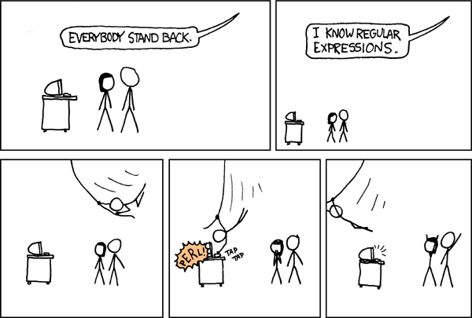
]

.footnote[
`r icon::fa_palette()` [XKCD](https://xkcd.com/208/) 
]

---
# Exact strings

.pull-left[
```{r exact}
str_view_all(frvg, "a")
```
]

--

.pull-right[
```{r exact2}
str_view_all(frvg, "ana")
```
]

.footnote[
When patterns overlap, only the first one is detected.
]

---
# Match any character

The dot `.` matches any character (except a newline).

.pull-left[
```{r dot}
str_view_all(frvg, "a.")
```
]

--

.pull-right[
```{r dot2}
str_view_all(frvg, "e...")
```
]

---
# Repeat a match

.pull-left[
You can specify if a pattern will match 

* 0 or more times with `*`,

* 1 or more with `+`,

* 0 or 1 time with `?`,

* exactly n with `{n}`,

* n or more with `{n,}`,

* at least m with `{,m}`,

* between n and m with `{n,m}`.
]

--

.pull-right[
```{r repeat}
str_view_all(frvg, "a.*n")
```
]

---
count: false
# Repeat a match 

.pull-left[
```{r repeat2}
str_view_all(frvg, "a.+n")
```
]

--

.pull-right[
```{r repeat3}
str_view_all(frvg, "(an){2}") 
```
]

---
# Alternatives

You can use `(a|d)` to match `a` or `d`, and `[a-d]` to match every character between `a` and `d`.

.pull-left[
```{r alternative}
str_view_all(frvg, "(m|an)an")
```
]

--

.pull-right[
```{r alternative2}
str_view_all(frvg, "a[p-z]")
```
]

---
# Anchors

Anchors are useful to match the beginning (`^`) or the end (`$`) of a string.

.pull-left[
```{r anchors}
str_view_all(frvg, "e$")
```
]

--

.pull-right[
```{r anchors2}
str_view_all(frvg, "^(a|e).*")
```
]

---
# Except

Use `[^abc]` if you want to match every character but `a`, `b` or `c`.

.pull-left[
```{r except}
str_view_all(frvg, "^[^e].*")
```
]

--

.pull-right[
```{r except2}
str_view_all(frvg, "[^aeiouy]+")
```
]

---
# Escape special characters

To match a literal `.`, `$`, `(` or any regex meaningful character, you need to escape it with two backslash: `\\.`, `\\$`, `\\(`...

.pull-left[
```{r escape}
str_view_all(c("abc", "a.c"), "a.c")
```
]

--

.pull-right[
```{r escape2}
str_view_all(c("abc", "a.c"), "a\\.c")
```
]

---
# Character classes

Character classes are special pattern that match more that one character.

* `\s` matches any whitespace,

* `\d` or `[:digit:]` matches any digit,

* `[:punct:]` matches any punctuation,

* `[:alpha:]` matches any letters,

* `[:lower:]` matches any lowercase letters,

* `[:upper:]` matches any upperclass letters.

--

You have already created your own character classes like `[a-d]` or `[^abc]`.

---
# Backreferences

Parenthesis can be used to defined groups of patterns than can be referred to with backreferences like `\\1`, `\\2`... 

.pull-left[
```{r back}
str_view_all(frvg, "^(.).*\\1$")
```
]

--

.pull-right[
```{r back2}
str_view_all(frvg, "(.).*(.)\\2.*\\1")
```
]

---
# Regex crossword level 1

.footnote[
`r icon::fa_link()` [Regex Crossword](https://regexcrossword.com)
]

.pull-left[
.center[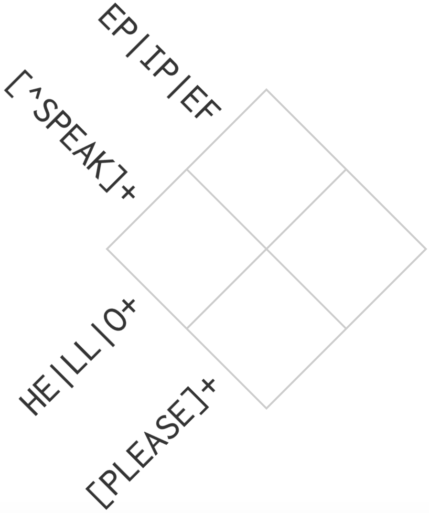]
]

--

.pull-right[
.center[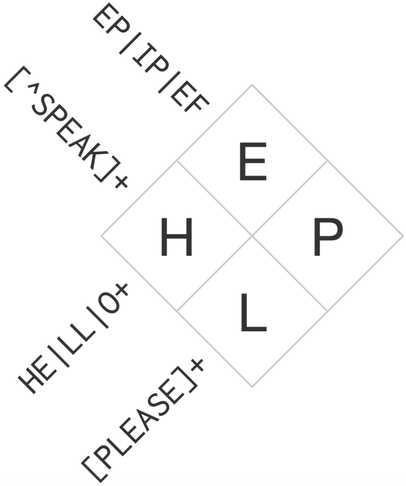]
]

---
# Regex crossword level 2

.pull-left[
.center[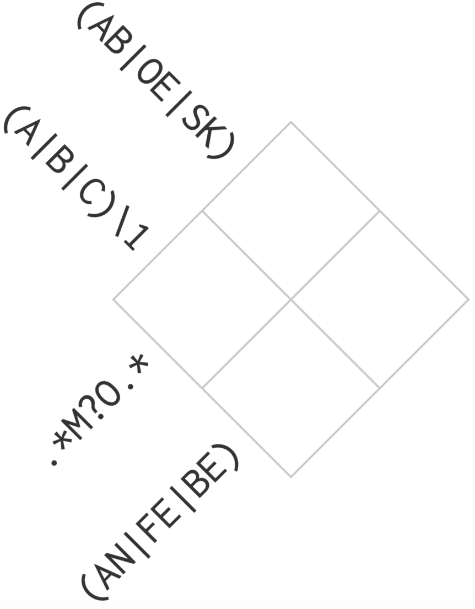]
]

--

.pull-right[
.center[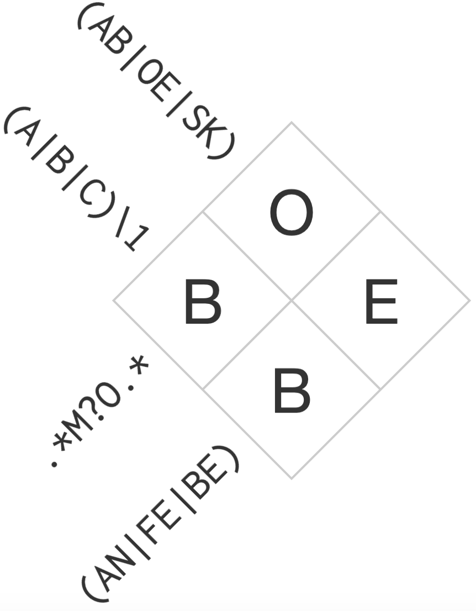]
]

---
# Regex crossword level 3

.pull-left[
.center[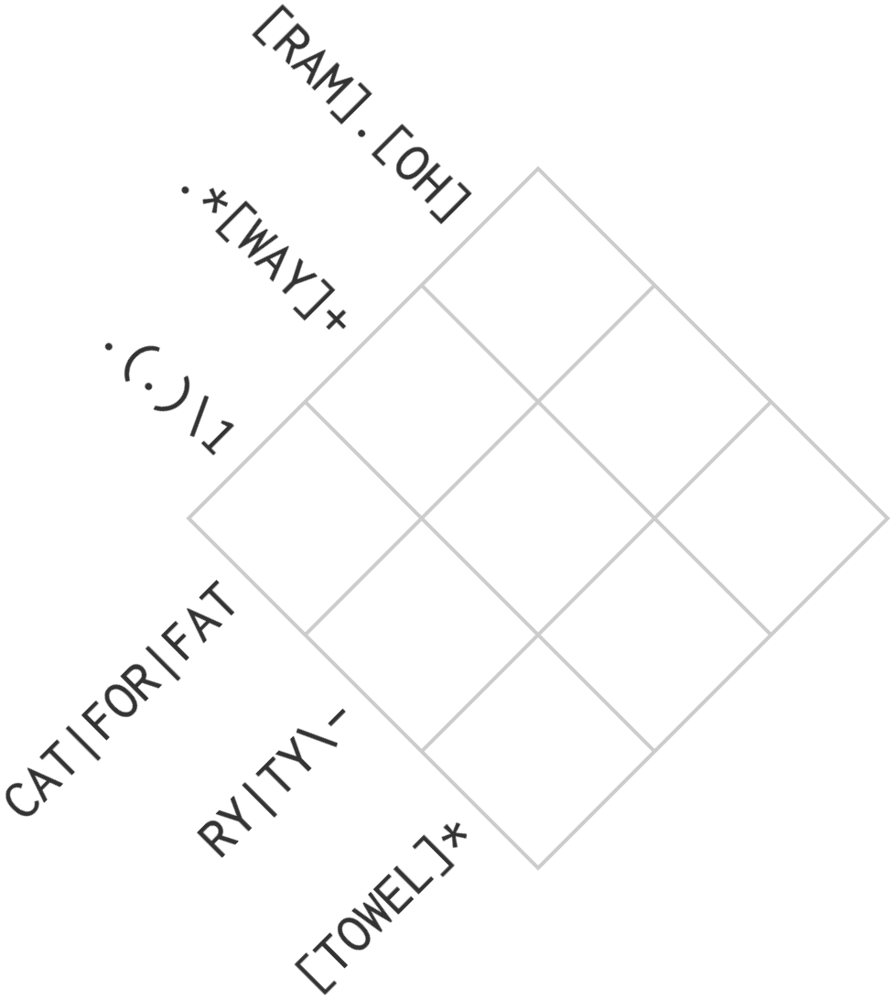]
]

--

.pull-right[
.center[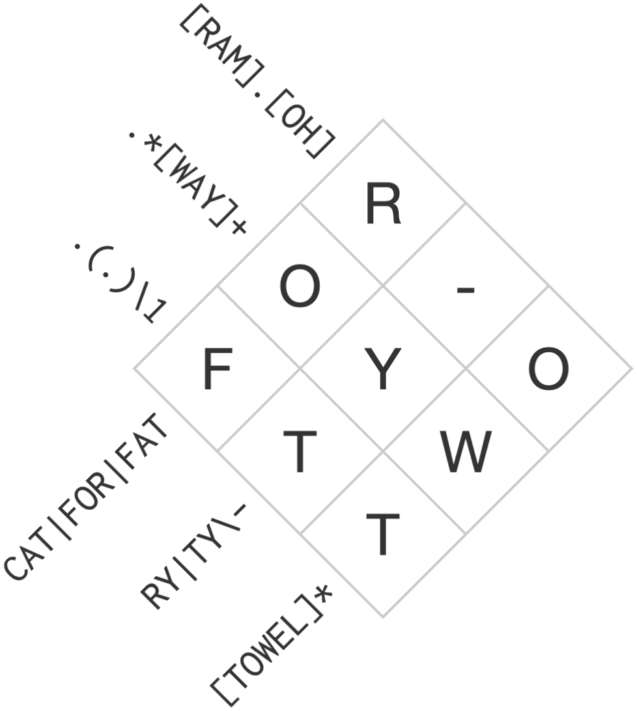]
]

---
# Regex crossword level 4

.pull-left[
.center[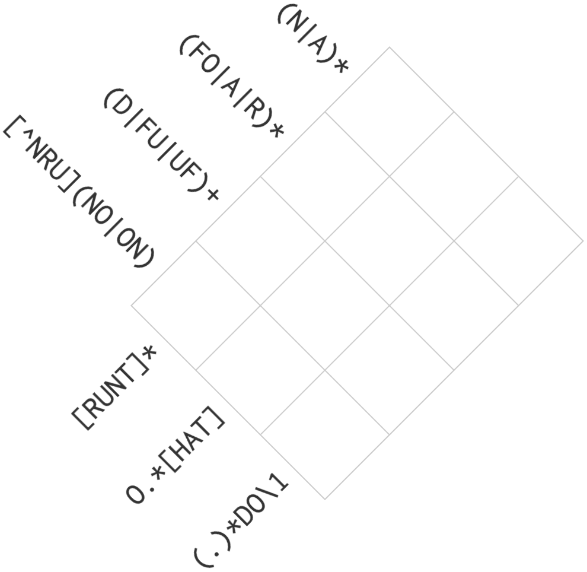]
]

--

.pull-right[
.center[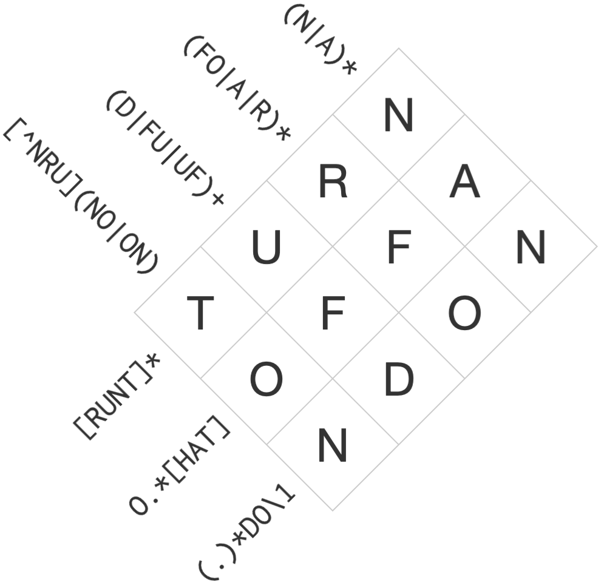]
]

---
# Regex crossword level 5

.pull-left[
.center[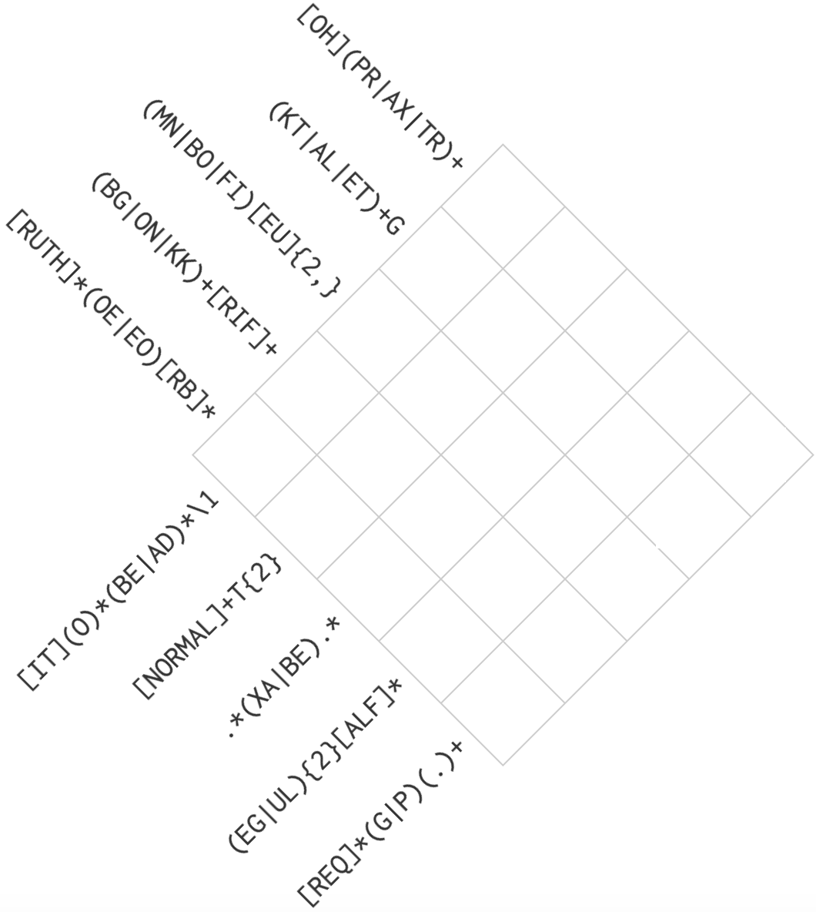]
]

--

.pull-right[
.center[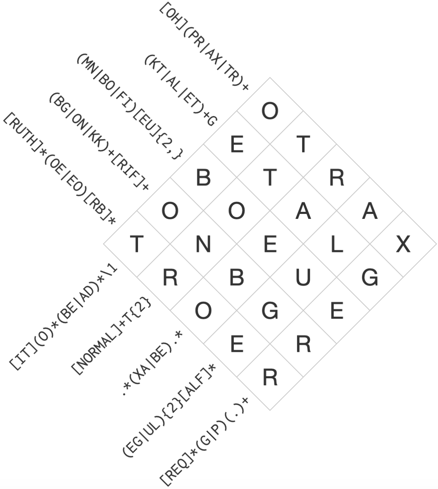]
]

---
# Regex crossword level over 9000

.center[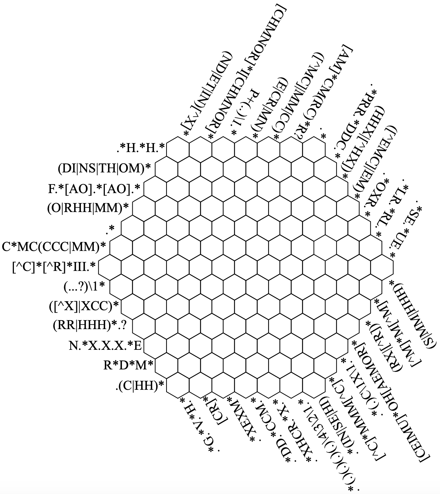] 


---
# References

.pull-left[
<br>

* [forcats.tidyverse.org]()

<br>

* [lubridate.tidyverse.org]()

<br>

* [stringr.tidyverse.org]()
]

.pull-right[
.center[&nbsp;&nbsp;] 
]


---
class: end-slide


# Thanks!


## `r icon::fa_envelope()`  <a href="mailto:antoine.bichat@mines-nancy.org?subject=SOTR">antoine.bichat@mines-nancy.org</a>
## `r icon::fa_link()`  <a href="https://abichat.github.io" target="_blank">abichat.github.io</a>
## `r icon::fa_twitter()` <a href="https://twitter.com/_abichat" target="_blank">@_abichat</a>
## `r icon::fa_github()` <a href="https://github.com/abichat" target="_blank">@abichat</a>


.pull-right[.blue-logo[.pull-down[

]]]
