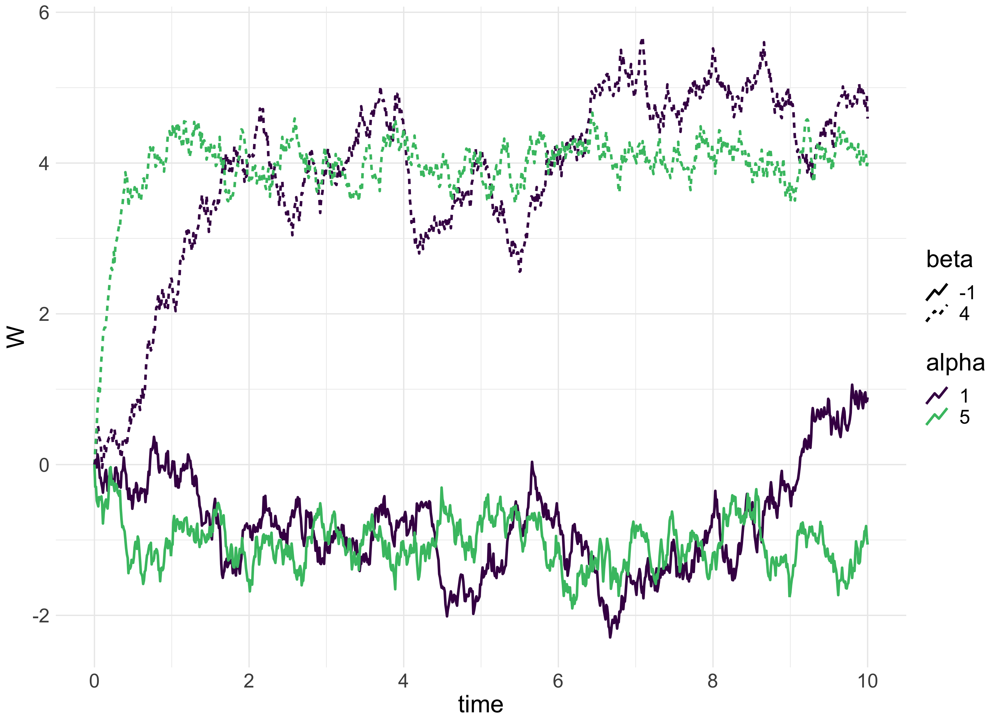
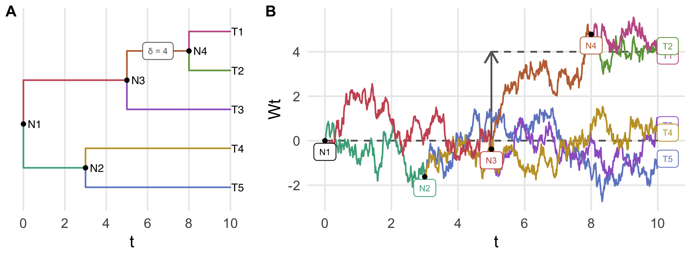
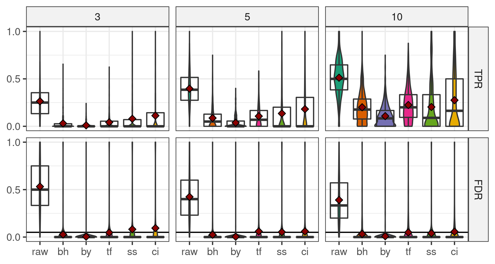

```{r setup, include=FALSE}
options(htmltools.dir.version = FALSE)
```

```{r icons-emojis, message=FALSE, echo=FALSE}
# remotes::install_github("ropenscilabs/icon")
# remotes::install_github("hadley/emo")
```

```{r numprint, message=FALSE, echo=FALSE}
numprint <- function(x, ...) format(x, big.mark = "&#8239;", scientific = FALSE, ...)
```


```{r, load_refs, include=FALSE, cache=FALSE}
library(RefManageR)
BibOptions(check.entries = FALSE,
           bib.style = "authortitle",
           cite.style = "alphabetic",
           style = "markdown",
           hyperlink = FALSE,
           dashed = TRUE, 
           max.names = 2)
bib <- ReadBib("biblio.bib", check = FALSE)
Cite(bib, unname(names(bib)))
```


class: inverse, center, middle

# Context

---
# Microbiota

_Ecological community of microorganisms that reside in an environmental niche._ 

--

.pull-left[

#### Some figures for human gut

.footnote[`r emo::ji("page_facing_up")` `r Citet(bib, c("ley2006ecological", "bokulich2016antibiotics", "opstelten2016gut"))`]

* $10^{\small{14}}$ bacterial cells in one gut...

* ... weighing 2 kg.

* More than `r numprint(1500)` different species.

* More than 10 millions unique genes.
]

--

.pull-right[

#### Associated with

* Inflammatory bowel diseases

* Tobacco

* Diet

* Antibiotics

* Birth mode

]


---
class: bold-last-item

# Data

* Abundance table

  * matrix of size $m \times p$,

  * count or compositional data, with inflation in zero,
  
  * correlation between abundances.
  
--

* Sample informations

  * vector of length $p$, could be continuous (age) or discrete (disease).

--

* Phylogeny

  * tree with $m$ leaves,
  
  * describe evolutionary history of the taxa.


---
# Classical approach

Vector $\pv$ of p-values, computed independently.

Correction with Benjamini-Hochberg procedure to respect an _a priori_ FDR : $\qv^{\text{bh}}$.

--

But it assumes independence between taxa and it is not respected.

--

One can use Benjamini-Yekutieli correction which does not make any assumption about dependence between taxa but 

 * it's too conservative,
 
 * we want to correct explicitly for correlation between taxa.

---
class: inverse, center, middle

# Hierarchical smoothing

---
class: bold-last-item

# Goal

* Correct explicitly for correlation between taxa.

--

* Increase power.

--

* Keep FDR under a desired level.


---
# Rationale

<center>
  
</center>

--

Already used in 

* Hierarchical FDR `r Citep(bib, c("yekutieli2008hierarchical", "sankaran2014structssi"))`,

* TreeFDR `r Citep(bib, "xiao2017false")`.


---
# z-scores

z-scores are defined by

$$\zs = \Phi^{-1}(\pv).$$
<center>
  
</center>

---
# Ornstein-Uhlenbeck process 

An Ornstein-Uhlenbeck (OU) process with an optimal value of $\ou{\optim}$ and a strength of selection $\ou{\alpha}$ is a Gaussian process that satisfies the SDE:

$$\dx{W_t} = -\ou{\alpha} (W_t - \ou{\optim}) \dx{t} + \ou{\sigma}\dx{B_t}.$$


<center>
  
</center>

---
# OU process on a tree with shifts $\shifts$

.footnote[`r emo::ji("page_facing_up")` `r Citet(bib, "bastide2017detection")`]

<center>
  
</center>


--

Denote $T = (\indic_{\{i \in \desc(j)\}})_{ij} \in\{0,1\}^{m \times n}$ the incidence matrix of the tree.

--

The random variables on leaves are Gaussian $\mathcal{N}_m\left(T\shifts, \Sigma \right)$ with 

$$\Sigma_{i, j} = \frac{\ou{\sigma}^2}{2\ou{\alpha}}\left(1 - e^{-2\ou{\alpha} t_{i,j} }\right) \times e^{-\ou{\alpha} d_{i,j}}.$$

---
# First assumption

$\mathfrak{z}$ is the realization of an OU on a tree with shifts $\delta$.

--

Then,

$$
\zs \sim \mathcal{N}_m\left(\mu,\Sigma\right)
$$

with $\mu = T\delta$ and $\Sigma$ depends on $\alpha_{\text{ou}}$ and $\sigma_{\text{ou}}$ by 

$$\Sigma_{i,j} = \frac{\ou{\sigma}^2}{2\ou{\alpha}}\left(e^{-\ou{\alpha} d_{i,j}} - e^{-2\ou{\alpha} h}\right)$$

for an ultrametric tree with total length $h$.

---
# Second assumption

.footnote[`r emo::ji("page_facing_up")` `r Citet(bib, "mclachlan2004finite")`]

For a taxa $i$, 

* if $\mathcal{H}_i \in \mathbb{H}_0$, $\mathfrak{p}_i \sim \mathcal{U}(\mathopen[0,1\mathclose])$ so $\mathfrak{z}_i \sim \mathcal{N}(0,1)$,

* if $\mathcal{H}_i \notin \mathbb{H}_0$, $\mathfrak{p}_i \preccurlyeq \mathcal{U}(\mathopen[0,1\mathclose])$ so $\mathfrak{z}_i \sim \mathcal{N}(\mu_i,1)$ with $\mu_i \lt 0$.

--

Then,

$$\mathfrak{z} \sim \mathcal{N}_m\left(\mu \in \RR_-^m, \Sigma\right).$$


One will find differentially abundant taxa by finding the non-zero elements of $\mu$.

This impose $\Sigma_{i,i} = 1$ so $\ou{\hat{\sigma}}=\frac{2\ou{\hat{\alpha}}}{1 - e^{-2\ou{\hat{\alpha}}h}}$.


---
# Estimation of $\mu$ 

A naive ML estimator gives


$$\hat{\mu} = \argmin_{\mu\in\RR_-^m} \|\mathfrak{z} - \mu\|_{\Sigma^{-1}, 2}^2.$$

--

To take the tree into account, $\hat{\mu} = T\hat{\shifts}$ with

$$\hat{\shifts} = \argmin_{\shifts\in \RR^{n} / T\shifts \in\RR_-^m} \left\|\mathfrak{z} - T\shifts\right\|_{\Sigma^{-1},2}^2.$$

--

To add hierarchically coherent sparsity in our estimate 

$$\hat{\shifts} = \argmin_{\shifts\in \RR^{n} / T\shifts \in\RR_-^m} \left\|\mathfrak{z} - T\shifts\right\|_{\Sigma^{-1},2}^2 + \lambda \|\shifts\|_1.$$

---
# Estimation of $\mu$ (bis)

By Cholesky decomposition, $\Sigma^{-1} = R^TR$

\begin{align*}
\left\|\mathfrak{z} - T\shifts\right\|_{\Sigma^{-1},2}^2 & = \left(\mathfrak{z} - T\shifts\right)^T\Sigma^{-1}\left(\mathfrak{z} - T\shifts\right)  \\
& = \left(\mathfrak{z} - T\shifts\right)^TR^TR\left(\mathfrak{z} - T\shifts\right)   \\
& = \left(R\mathfrak{z} - RT\shifts\right)^T\left(R\mathfrak{z} - RT\shifts\right) \\
& = \left(y - X\shifts\right)^T\left(y - X\shifts\right) = \left\|y - X\shifts\right\|_2^2
\end{align*}

with $y = R\mathfrak{z}$ and $X = RT$.

--

Finally,

$$\hat{\shifts} = \argmin_{\shifts\in \RR^{n} / T\shifts \in\RR_-^m} \left\|y - X\shifts\right\|_2^2 + \lambda \|\shifts\|_1.$$

---
# Numerical resolution

.footnote[`r emo::ji("page_facing_up")` `r Citet(bib, "fu1998penalized")`]

The previous problem could be numerically solved by the shooting algorithm, iterating unidirectional updates form the associated problem:

\begin{equation}
\left\{
  \begin{aligned}
    \argmin_{\param \in \RR} h(\param) & = \frac{1}{2} \|y - z - x\param\|^2_2 + \lambda |\param| \\
    & \text{s.t. } u + v\param \leq 0.
  \end{aligned}
\right.
\end{equation}

--

<br>

But $\Sigma$ and must be known.

---
# Estimation of $\Sigma$ and choice of $\lambda$

$\widehat{\Sigma} = \left(\frac{e^{-\ou{\hat{\alpha}} d_{ij}} - e^{-2\ou{\hat{\alpha}} h }}{1 - e^{-2\ou{\hat{\alpha}} h }}\right)_{i,j}$ is determined by $\ou{\hat{\alpha}}$.

--

<br>

The optimal $\left(\ou{\alpha}, \lambda\right)$, is chosen on a bidimensional grid as the $\argmin$ of the BIC

\begin{equation}
\left\|\zs - T\shifts_{\ou{\alpha}, \lambda}\right\|_{\Sigma(\ou{\alpha})^{-1},2}^2 + \log|\Sigma(\ou{\alpha})| + \|\shifts_{\ou{\alpha}, \lambda}\|_0 \log m.
\end{equation}


---
# Find non zero values

We need confidence intervals on $\hat{\shifts}$ and $\hat{\mu}$.

Estimation from lasso provides biased estimators without confidence intervals.

--

<br>

Use of a debiasing procedure

* **score system `r Citep(bib, "zhang2014confidence")`,**

* column-wise inverse `r Citep(bib, c("javanmard2013confidence", "javanmard2014confidence"))`.


---
# Debiasing procedure

.footnote[`r emo::ji("page_facing_up")` `r Citet(bib, "sun2012scaled")`]

It requires a **initial joined estimator** of $\shifts^{\text{(init)}}$ and its associated standard error $\sigma$.

This can be done with a scaled lasso

$$\left(\hat{\shifts}^{\text{(init)}}, \hat{\sigma}\right) = \argmin_{\shifts, \sigma} \frac{\|y - X\shifts\|_2^2}{2\sigma n} + \frac{\sigma}{2} + \lambda \|\shifts\|_1.$$

--

<br>

It also required the **score system** $S \in \RR^{n\times p}$ associated with $X$ and $y$ where $s_j$ is the residual of the (classical) lasso regression of $y$ against $X_{-j}$:

$$s_j = y - \shifts^{-j}_{\text{lasso}} X_{-j}.$$

---
# Debiasing procedure (bis)


From the initial estimator $\hat{\shifts}_j^{\text{(init)}}$ of the scaled lasso, one can do a **one-step correction**

$$\hat{\shifts}_j = \hat{\shifts}_j^{\text{(init)}} + \frac{\langle s_j,y-X\hat{\shifts}^{(\text{init})}\rangle}{\langle s_j,x_j\rangle}.$$

--

Asymptotically, $\hat{\shifts} \sim \mathcal{N}_n\left(\shifts, V\right)$ with 

$$v_{i,j} = \hat{\sigma} \frac{\langle s_i,s_j \rangle}{\langle s_i,x_i \rangle\langle s_j,x_j \rangle}.$$
--

Then the **bilateral confidence interval** for a shift $\hat{\shifts}_j$ is

$$\left[ \hat{\shifts}_j \pm \phi^{-1}\left(1-\frac{\alpha}{2}\right) \sqrt{v_{j,j}} \right].$$ 

---
# Smoothed p-values

To have the **unilateral hierarchically smoothed p-values** $\pv^\text{h}$, we need to propagate the shifts with the incidence matrix $T$

$$\pv^\text{h}_i = \Phi\left(\frac{t_{i.}^T\hat{\shifts}}{\left(t_{i.}^TVt_{i.}\right)^{1/2}}\right)$$

with $t_{i.}$ the $i^{\text{th}}$ row of $T$.

---
# Multiple testing correction

.footnote[`r emo::ji("page_facing_up")` `r Citet(bib, "javanmard2019false")`]

Correction designed for debiased lasso based on $t$-scores $\ts_i = \frac{t_{i.}^T\hat{\shifts}}{\left(t_{i.}^TVt_{i.}\right)^{1/2}}$.

--

Let $t_{\text{max}} = \sqrt{2 \log m - 2 \log \log m}$ and 

$$t^{\star} = \inf \left\{ 0 \leq t \leq t_{\max} : \frac{2m(1 - \Phi(t))}{R(t) \vee 1} \leq \alpha \right\}$$

with $R(t)= \sum_{i = 1}^m \indic_{\{\ts_i \leq -t\}}$.

--

One reject if $\ts_i \leq -t^{\star}$  and the associated **hierarchical q-values** are 

$$\qv^{\text{h}}_i = \frac{\pv^{\text{h}}_i \alpha}{\Phi(-t^{\star})}.$$


---
class: center, middle, inverse

# Implementation


---
class: bold-last-item

# Simulations

.footnote[`r emo::ji("page_facing_up")` `r Citet(bib, "bichat2020incorporating")`]

.pull-left[
<center>
  
</center>
]

.pull-right[
The choice differentially abundant taxa is done in a hierarchically consistent manner.
]
  

---
# Results

`zazou` increases the TPR but does not always control the FDR.

<center>
  
</center>

---
# Results

zazou has better AUC and ROC curves.

<center>
  
</center>


---
class: center, middle, inverse

# Conclusions

---
# Conclusions

* zazou algorithm improves performances a bit ... 

<br>

* ... but things get worse when the structure is not respected.

<br>

* More theoretical work is required.

<br>

* R package `zazou` is available on [GitHub](https://github.com/abichat/zazou).


---

# References 1

```{r refs1, echo=FALSE, results="asis"}
PrintBibliography(bib, start = 1, end = 4, .opts = list(max.names = Inf))
```

---
count: false

# References 2

```{r refs2, echo=FALSE, results="asis"}
PrintBibliography(bib, start = 5, end = 8, .opts = list(max.names = Inf))
```

---
count: false

# References 3

```{r refs3, echo=FALSE, results="asis"}
PrintBibliography(bib, start = 9, end = 12, .opts = list(max.names = Inf))
```

---
count: false

# References 4

```{r refs4, echo=FALSE, results="asis"}
PrintBibliography(bib, start = 13, end = length(bib), .opts = list(max.names = Inf))
```

---
class: end-slide


# Thanks!


## `r icon::fa_envelope()`  <a href="mailto:antoine.bichat@mines-nancy.org?subject=SOTR">antoine.bichat@mines-nancy.org</a>
## `r icon::fa_link()`  <a href="https://abichat.github.io" target="_blank">abichat.github.io</a>
## `r icon::fa_twitter()` <a href="https://twitter.com/_abichat" target="_blank">@_abichat</a>
## `r icon::fa_github()` <a href="https://github.com/abichat" target="_blank">@abichat</a>

