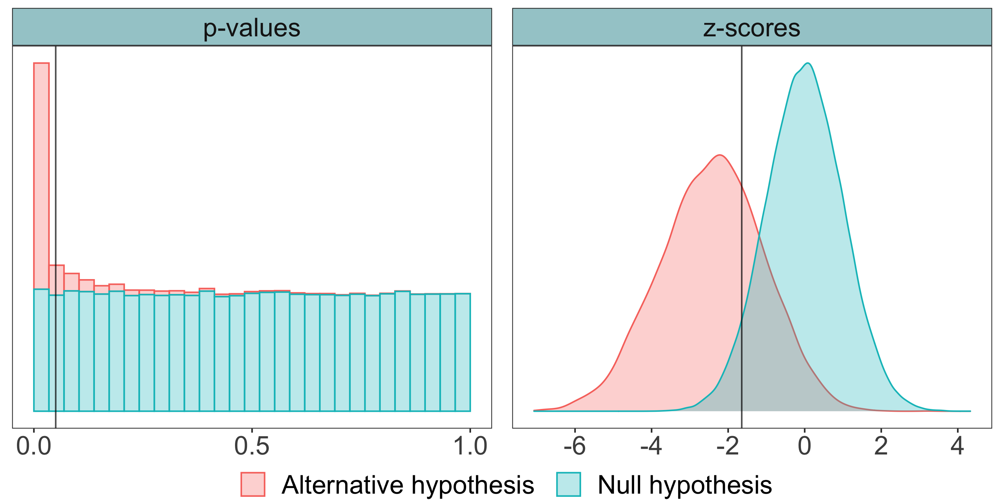
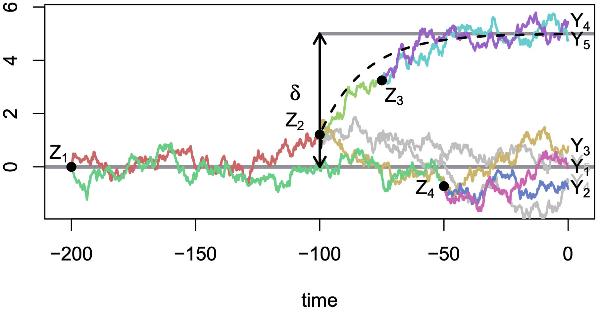
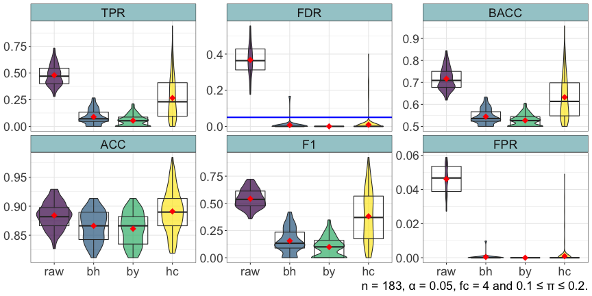

```{r setup, include=FALSE}
options(htmltools.dir.version = FALSE)
```

```{r icons-emojis, message=FALSE, echo=FALSE}
# remotes::install_github("ropenscilabs/icon")
# remotes::install_github("hadley/emo")
```

```{r numprint, message=FALSE, echo=FALSE}
numprint <- function(x, ...) format(x, big.mark = "&#8239;", scientific = FALSE, ...)
```


class: inverse, center, middle

$\DeclareMathOperator*{\argmin}{argmin}$
$\newcommand \dx [2][]{\mathrm{d}^{#1}\mspace{-1mu}\mathord{#2}}$

# Context

---
# Microbiota

_Ecological community of microorganisms that reside in an environmental niche_ 

--

.pull-left[

#### Some figures for human gut

* $10^{\small{14}}$ bacterial cells in one gut...

* ... weighing 2 kg 

* More than `r numprint(1500)` different species 

* More than 10 millions unique genes
]

--

.footnote[
`r emo::ji("page_facing_up")` Opstelten, J. L. et al. (2016) `r emo::ji("page_facing_up")` Bokulich, N. et al. (2016) 
]

.pull-right[

#### Proven associations

* Immune system

* Crohn's disease

* Tobacco

* Diet

* Antibiotics

* Birth mode

]


---
class: bold-last-item

# Data

* Abundance table

  * matrix of size $m \times p$

  * count or compositional data, with inflation in zero
  
  * correlation between abundances
  
--

* Sample informations

  * vector of length $p$, could be continuous (age) or discrete (disease)

--

* Phylogeny

  * tree with $m$ leaves
  
  * describe evolutionary history of the taxa


---
# Classical approach

Vector $\mathfrak{p}$ of p-values, computed independently

Correction with Benjamini-Hochberg procedure to respect an _a priori_ FDR : $\mathfrak{q}^{\text{bh}}$

--

But it assumes independence between taxa and it is not respected

--

One can use Benjamini-Yekutieli correction which does not make any assumption about dependence between taxa but 

 * it's too conservative
 
 * we want to correct explicitly for correlation between taxa

---
class: inverse, center, middle

# Hierarchical smoothing

---
class: bold-last-item

# Goal

* Correct explicitly for correlation between taxa

--

* Increase power

--

* Keep FDR under a desired level


---
# z-scores

z-scores are defined by

$$\mathfrak{z} = \Phi^{-1}(\mathfrak{p})$$
<center>
  
</center>

---
# Framework

For a taxa $i$, 

* if $\mathcal{H}_i$ is a true null hypothesis, $\mathfrak{p}_i \sim \mathcal{U}(\mathopen[0,1\mathclose])$  so  $\mathfrak{z}_i \sim \mathcal{N}(0,1)$

* if $\mathcal{H}_i$ is not a true null hypothesis, $\mathfrak{p}_i \preccurlyeq \mathcal{U}(\mathopen[0,1\mathclose])$ so $\mathfrak{z}_i \sim \mathcal{N}(\mu_i,1)$ with $\mu_i \lt 0$

--

<br>

$$\mathfrak{z} \sim \mathcal{N}_m\left(\mu \in \mathbb{R}_-^m, \Sigma\right)$$

One will find differentially abundant taxa by finding the non-zero elements of $\mu$

---
# Ornstein-Uhlenbeck process 

An Ornstein-Uhlenbeck (OU) process with an optimal value of $\beta_{\text{ou}}$ and a strength of selection $\alpha_{\text{ou}}$ is a Gaussian process that satisfies the SDE:

$$\dx{W_t} = -\alpha_{\text{ou}} (W_t - \beta_{\text{ou}}) \dx{t} + \sigma_{\text{ou}}\dx{B_t}$$


<center>
  
</center>

---
# OU process on a tree with shifts

.footnote[`r emo::ji("page_facing_up")` Bastide, P., Mariadassou, M., & Robin, S. (2017)]

.pull-left[
<center>
  
</center>
]
.pull-right[
<center>
  
</center>
]

--

By denoting $T\in\{0,1\}^{m \times n}$ the incidence matrix of the tree,

$$Y \sim \mathcal{N}\left(T\delta, \Sigma \right)$$

with 
$\Sigma_{i, j} = \frac{\sigma^2}{2\alpha}\left(1 - e^{-2\alpha t_{i,j} }\right) e^{-\alpha d_{i,j}}$

---
# Estimation of $\hat{\mu}$ 

As $\mathfrak{z}$ is the realization of an OU on a tree with negative leaves, the ML estimator gives


$$\hat{\mu} = \argmin_{\mu\in\mathbb{R}_-^m} \|\mathfrak{z} - \mu\|_{\Sigma^{-1}, 2}^2$$

--

To take the tree into account, $\hat{\mu} = T\hat{\beta}$ with

$$\hat{\beta} = \argmin_{\beta\in \mathbb{R}^{n} / T\beta \in\mathbb{R}_-^m} \left\|\mathfrak{z} - T\beta\right\|_{\Sigma^{-1},2}^2$$

--

To add hierarchically coherent sparsity in our estimate 

$$\hat{\beta} = \argmin_{\beta\in \mathbb{R}^{n} / T\beta \in\mathbb{R}_-^m} \left\|\mathfrak{z} - T\beta\right\|_{\Sigma^{-1},2}^2 + \lambda \|\beta\|_1$$

---
# Estimation of $\hat{\mu}$ (bis)

By Cholesky decomposition, $\Sigma^{-1} = R^TR$

\begin{align*}
\left\|\mathfrak{z} - T\beta\right\|_{\Sigma^{-1},2}^2 & = \left(\mathfrak{z} - T\beta\right)^T\Sigma^{-1}\left(\mathfrak{z} - T\beta\right)  \\
& = \left(\mathfrak{z} - T\beta\right)^TR^TR\left(\mathfrak{z} - T\beta\right)   \\
& = \left(R\mathfrak{z} - RT\beta\right)^T\left(R\mathfrak{z} - RT\beta\right) \\
& = \left(y - X\beta\right)^T\left(y - X\beta\right) = \left\|y - X\beta\right\|_2^2
\end{align*}

with $y = R\mathfrak{z}$ and $X = RT$

--

Finally,

$$\hat{\beta} = \argmin_{\beta\in \mathbb{R}^{n} / T\beta \in\mathbb{R}_-^m} \left\|y - X\beta\right\|_2^2 + \lambda \|\beta\|_1$$

---
# Estimation of $\widehat{\Sigma}$

As the tree is ultrametric, we have 
$\widehat{\Sigma}_{i, j} = \frac{\hat{\sigma}^2_{\text{ou}}}{2\hat{\alpha}_{\text{ou}}}\left(e^{-\hat{\alpha}_{\text{ou}} d_{ij}} - e^{-2\hat{\alpha}_{\text{ou}} h }\right)$ 
and 
$\widehat{\Sigma}_{i, i} = \frac{\hat{\sigma}^2_{\text{ou}}}{2\hat{\alpha}_{\text{ou}}}\left(1 - e^{-2\hat{\alpha}_{\text{ou}} h }\right)$ 

To ensure that $\mathfrak{z}_i \sim \mathcal{N}\left(0, 1\right)$ for true null hypothesis,  $\hat{\sigma}_{\text{ou}}$ is imposed by $h$ and $\hat{\alpha}_{\text{ou}}$

--


Finally, $\hat{\alpha}_{\text{ou}}$ is chosen as the $\alpha$ on a grid that minimize the BIC criterion 

$$- 2 \log f^{\hat{\mu}, \widehat{\Sigma}}_m(\mathfrak{z}) + \|\hat{\beta}\|_0 \log m$$ 

--

<br>

The regularization hyperparameter $\lambda$ in the lasso is chosen with a same way


---
# Find non zero values

We need confidence intervals on $\hat{\beta}$ and $\hat{\mu}$ 

Estimation from lasso provides biased estimators without confidence intervals

--

Use of a debiasing procedure :

* **score system (Zhang & Zhang, 2014)**

* column-wise inverse (Javanmard & Montanari, 2014)


---
# Debiasing procedure

.footnote[`r emo::ji("page_facing_up")` Zhang, C. H., & Zhang, S. S. (2014)]

It requires a **initial joined estimator** of $\beta^{\text{(init)}}$ and its associated standard error $\sigma$ 

This can be done with a scaled lasso

$$\left(\hat{\beta}^{\text{(init)}}, \hat{\sigma}\right) = \argmin_{\beta, \sigma} \frac{\|y - X\beta\|_2^2}{2\sigma n} + \frac{\sigma}{2} + \lambda \|\beta\|_1$$

--

<br>

It also required the **score system** $S \in \mathbb{R}^{n\times p}$ associated with $X$ and $y$ : $s_j$ is the residual of the (classical) lasso regression of $y$ against $X_{-j}$ :

$$s_j = y - \beta^{-j}_{\text{lasso}} X_{-j}$$

---
# Debiasing procedure (bis)


From the initial estimator $\hat{\beta}_j^{\text{(init)}}$ of the scaled lasso, one can do a **one-step correction**

$$\hat{\beta}_j = \hat{\beta}_j^{\text{(init)}} + \frac{\langle s_j,y-X\hat{\beta}^{(\text{init})}\rangle}{\langle s_j,x_j\rangle}$$

--

Asymptotically, $\hat{\beta} \sim \mathcal{N}\left(\beta, V\right)$ with 

$$v_{i,j} = \hat{\sigma} \frac{\langle s_i,s_j \rangle}{\langle s_i,x_i \rangle\langle s_j,x_j \rangle}$$
--

Then the **bilateral confidence interval** for a shift $\hat{\beta}_j$ is

$$\left[ \hat{\beta}_j \pm \phi^{-1}\left(1-\frac{\alpha}{2}\right) \sqrt{v_{j,j}} \right]$$ 

---
# Corrected p-values

To have the **unilateral hierarchically corrected p-values** $\mathfrak{q}^{\text{hc}}$, we need to propagate the shifts with the incidence matrix $T$

$$\mathfrak{q}_j^{\text{hc}} = \Phi\left(\frac{a\hat{\beta}}{\left(a^TVa\right)^{1/2}}\right)$$

with $a$ the $j^{\text{th}}$ row of $T$ : $\mathfrak{z}_j = a\beta$

---
class: center, middle, inverse

# Implementation

---
# Package

These methods have been implemented in the R package `zazou`

For now, only on a private repo on GitHub

Will be publicly available soon

On CRAN one day? 

---
class: bold-last-item

# Simulations

.footnote[`r emo::ji("page_facing_up")` Bichat, A., Plassais, J., Ambroise, C., & Mariadassou, M. (2020)]
.pull-left[
<center>
  
</center>
]

.pull-right[
The choice differentially abundant taxa is done in a hierarchically consistent manner
]
  

---
# Results

Hierarchical correction increases the TPR while keeping the FDR under 0.05

<center>
  
</center>


---
class: end-slide


# Thanks!


## `r icon::fa_envelope()`  <a href="mailto:antoine.bichat@mines-nancy.org?subject=SOTR">antoine.bichat@mines-nancy.org</a>
## `r icon::fa_link()`  <a href="https://abichat.github.io" target="_blank">abichat.github.io</a>
## `r icon::fa_twitter()` <a href="https://twitter.com/_abichat" target="_blank">@_abichat</a>
## `r icon::fa_github()` <a href="https://github.com/abichat" target="_blank">@abichat</a>

