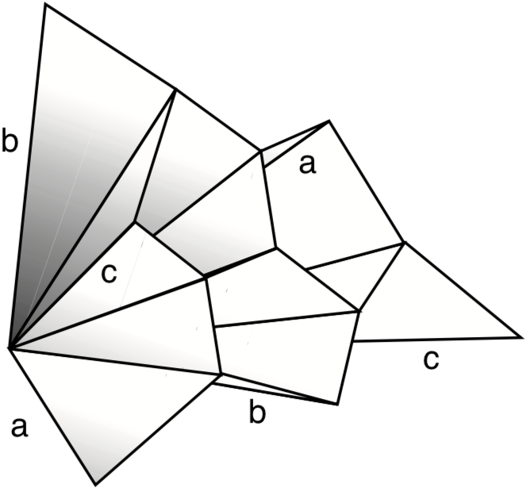
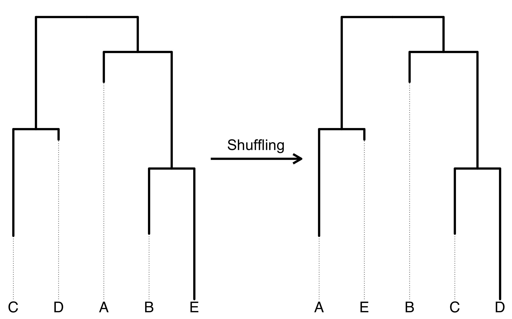
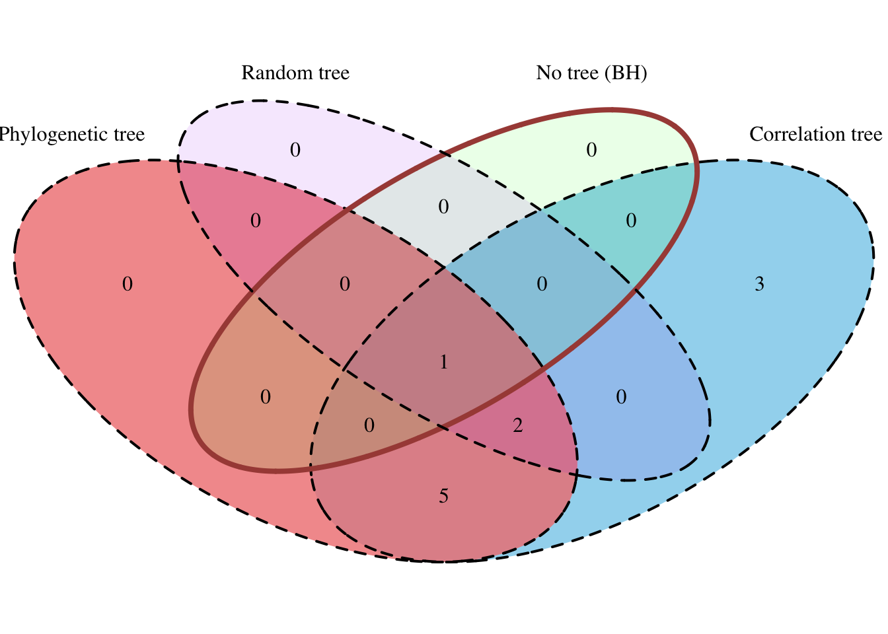
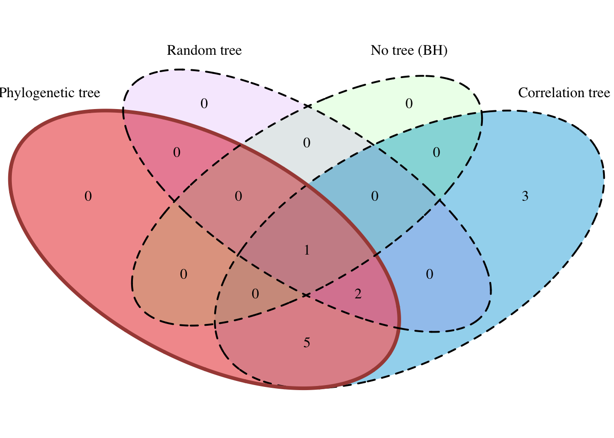
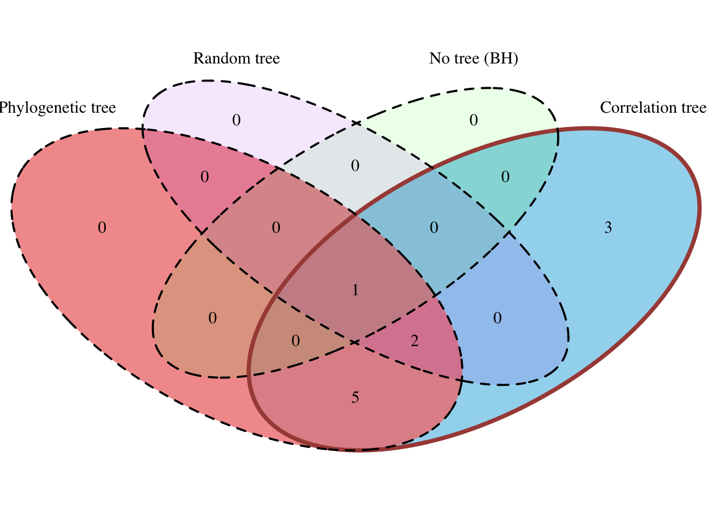
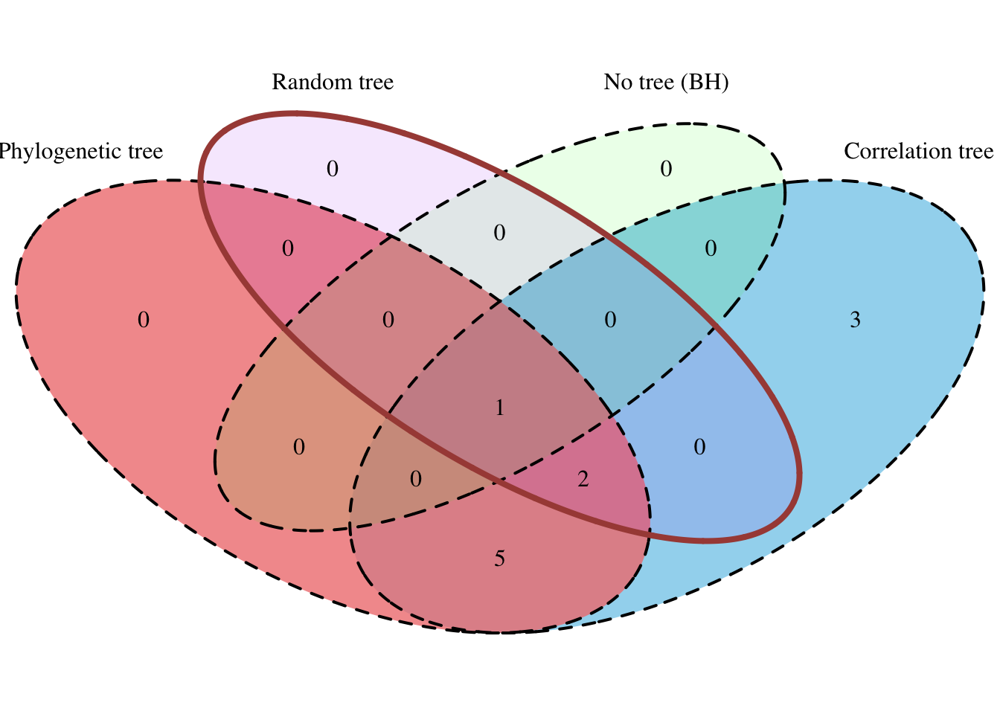
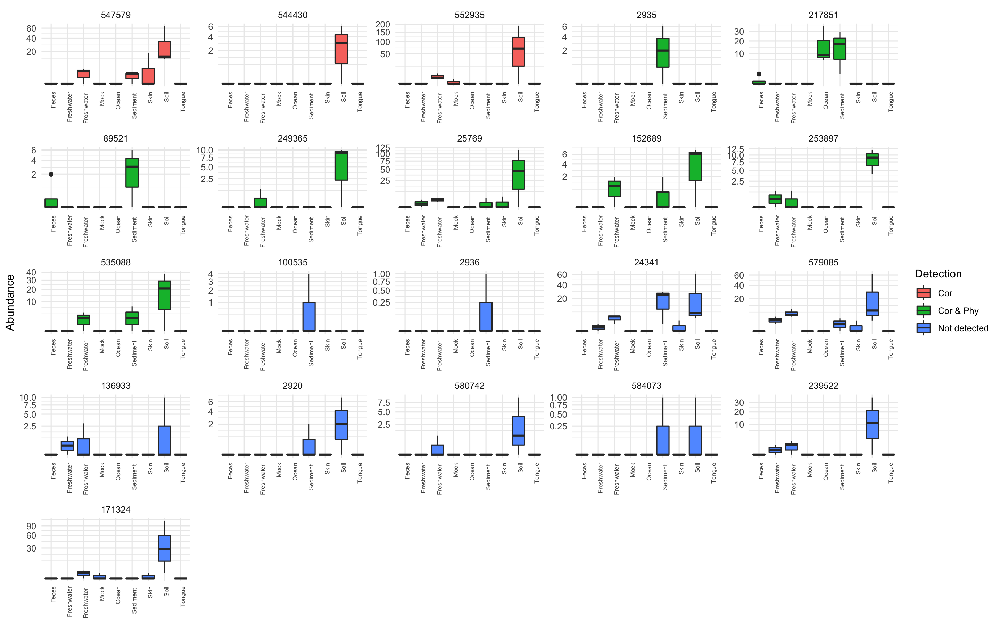

class: title-slide, center, middle
count: false

```{r setup, include=FALSE}
options(htmltools.dir.version = FALSE)
knitr::opts_chunk$set(echo = TRUE, fig.align = "center", fig.width = 8,
                      fig.retina = 2, comment = " ")
```

```{r package, include=FALSE, message=FALSE}
library(tidyverse)
numprint <- function(x, ...) format(x, big.mark = "&#8239;", scientific = FALSE, ...)
set.seed(42)
```


.band[
# Impact of tree choice in metagenomics differential abundance studies

### Antoine Bichat
<div style = "margin-top: -30px"></div>
### January 14, 2019 - AgroParisTech

Work in progress - In collaboration with C. Ambroise (LaMME), <br>
M. Mariadassou (MaIAGE) & J. Plassais (Enterome)
]

---
class: center, middle, inverse

# Context


---
## Microbiota


_Ecological community of microorganisms that reside in an environmental niche_

--

.footnote[`r icon::fa('book')` Gut: The Inside Story of Our Body's Most Underrated Organ (Giulia Enders) <br> &emsp;]

.pull-left[

#### Some figures for human gut

* $10^{\small{15}}$ bacterial cells in one gut...

* ... weighing 2 kg 

* More than `r numprint(1500)` different species 

* More than 10 millions unique genes


```{r citations, echo=FALSE, fig.width=4, fig.height=3}
dfpubli <- 
  data.frame(
    Year = 1990:2017,
    Number = c(727, 748, 844, 782, 918,1030, 1220, 1500, 1900, 2400, 
               2920, 3230, 3940, 4460, 5660, 7100, 8440, 10600, 12600, 15300, 
               18600, 23600, 31200, 39100, 46900, 55400, 66600, 63300)
  )
ggplot(dfpubli, aes(Year, Number/1000)) + 
  geom_col(fill = "grey50", color = "black") + 
  theme_minimal() +
  scale_x_continuous(breaks = c(1990, 1995, 2000, 2005, 2010, 2015)) +
  labs(x = "Year of publication", y = bquote("Number ("~10^3*")"),
       title = "Articles containing 'Microbiome' or 'Microbiota'",
       caption = "Source: Google Scholar") +
  theme_minimal() +
  theme(axis.text = element_text(size = 8), axis.title = element_text(size = 10), 
        plot.title = element_text(size = 11), plot.caption = element_text(size = 9))
```

]

--
.footnote[`r icon::fa('book')` Gut: The Inside Story of Our Body's Most Underrated Organ  (Giulia Enders) <br> `r icon::fa('file-alt')` Opstelten et al. (2016), Bokulich et al. (2016), Blander et al. (2017)]

.pull-right[

#### Proven associations

* Immune system

* Crohn's disease

* Vaginosis

* Diabete

* Tobacco

* Diet

* Antibiotics

* Birth mode

]

---
## Data collection

.footnote[`r icon::fa('file-alt')` Quince et al. (2017)]

.center[]

---
count: false
## Data collection

.footnote[`r icon::fa('file-alt')` Quince et al. (2017)]

.center[]

---
## Data - abundances of taxa

.footnote[`r icon::fa('file-alt')` Ravel et al. (2011)]

```{r echo=FALSE}
read_csv("data/data_abund.csv", col_types = cols(.default = "d", Taxa = "c")) %>% 
  print(n_extra = 0, width = 70)
```

--

* Count data (or compositional) data

* Zero-inflated data

* __Correlation between species__

* Counts spanning several orders of magnitude: $1 \rightarrow 10^{\small{8}}$

---
## Data - samples information

.footnote[`r icon::fa('file-alt')` Ravel et al. (2011)]

```{r echo=FALSE, warning=FALSE}
read_csv("data/data_sample.csv", col_types = "ccddcc") %>% 
  print()
```

---
## Data - taxonomy

.footnote[`r icon::fa('file-alt')` Ravel et al. (2011)]

```{r echo=FALSE}
read_csv("data/data_tax.csv", col_types = "cccccc", na = "NA") %>% 
  drop_na() %>% 
  select(-Kingdom) %>% 
  print(n = 5)
```


---
class: nologo
count: false
## Data - taxonomy

```{r echo=FALSE}
read_csv("data/data_tax.csv", col_types = "cccccc", na = "NA") %>% 
  drop_na() %>% 
  select(-Kingdom) %>% 
  print(n = 5)
```

.center[]

---
class: center, middle, inverse

# Differential abundance studies

---
## Statistical issue

.center[
#### Healthy VS Diseased
<div style = "margin-top: -25px"></div>
.center[]
]

Is any bacteria more abundant in one group? 

--

.pull-left[
#### Goals
* Biomarker

* Companion Diagnostics 

* Potential targets for drugs
]

--

.pull-right[
#### Methods
* ANOVA / GLM

* Wilcoxon rank sum test

* Mixed model effects

* ...
]


---
## Multiple testing problem

Usual design:

* 1500 species in the gut, up to hundreds in studies

* Tens or hundreds of patients

Need for a controling procedure!

--

* Bonferroni (FWER)


---
count: false

## Multiple testing problem

Usual design:

* 1500 species in the gut, up to hundreds in studies

* Tens or hundreds of patients

Need for a controling procedure!


* ~~Bonferroni (FWER)~~ $\rightarrow$ too conservative

--

* Benjamini-Hochberg (FDR)

--

But BH requires independance and there is lot of dependancies between species...

.center[

]


---
## Hierarchical FDR

.footnote[`r icon::fa('file-alt')` Yekutieli (2008)]

.pull-left[

$\mathcal{T}_t = \left\{H_i \mid \text{Par}(i) = t\right\}$, $L$ levels

Descending method:

* Test the family $\mathcal{T}_0$

* If node $t$ is rejected, test $\mathcal{T}_t$
]

.pull-right[

]

--

How to test a family $\mathcal{T}_t$ (simple BH procedure at level $q$ within it):

1. Let $P^t_{(1)}\leq \dots\leq P^t_{(m_t)}$ denote the set of ordered p-values corresponding to the hypotheses in $\mathcal{T}_t$

2. Let $r_t = \max\left\{i\mid P^t_{(i)} \leq i \frac{q}{m_t}\right\}$ 

3. Reject the $r_t$ hypothesis with the smaller p-value

--

.center[
__The procedure controls the FDR at level $\mathbf{2.88 \times q \times L}$__
]

---
count: false
## Hierarchical FDR

.footnote[`r icon::fa('file-alt')` Yekutieli (2008)]

.pull-left[

$\mathcal{T}_t = \left\{H_i \mid \text{Par}(i) = t\right\}$, $L$ levels

Descending method:

* Test the family $\mathcal{T}_0$

* If node $t$ is rejected, test $\mathcal{T}_t$
]

.pull-right[

]

How to test a family $\mathcal{T}_t$ (simple BH procedure at level $q$ within it):

1. Let $P^t_{(1)}\leq \dots\leq P^t_{(m_t)}$ denote the set of ordered p-values corresponding to the hypotheses in $\mathcal{T}_t$

2. Let $r_t = \max\left\{i\mid P^t_{(i)} \leq i \frac{q}{m_t}\right\}$ 

3. Reject the $r_t$ hypothesis with the smaller p-value

.center[
__The procedure controls the FDR at level $\mathbf{2.88 \times q \times L}$__
]

---
count: false
## Hierarchical FDR

.footnote[`r icon::fa('file-alt')` Yekutieli (2008)]

.pull-left[

$\mathcal{T}_t = \left\{H_i \mid \text{Par}(i) = t\right\}$, $L$ levels

Descending method:

* Test the family $\mathcal{T}_0$

* If node $t$ is rejected, test $\mathcal{T}_t$
]

.pull-right[

]

How to test a family $\mathcal{T}_t$ (simple BH procedure at level $q$ within it):

1. Let $P^t_{(1)}\leq \dots\leq P^t_{(m_t)}$ denote the set of ordered p-values corresponding to the hypotheses in $\mathcal{T}_t$

2. Let $r_t = \max\left\{i\mid P^t_{(i)} \leq i \frac{q}{m_t}\right\}$ 

3. Reject the $r_t$ hypothesis with the smaller p-value

.center[
__The procedure controls the FDR at level $\mathbf{2.88 \times q \times L}$__
]

---
count: false
## Hierarchical FDR

.footnote[`r icon::fa('file-alt')` Yekutieli (2008)]

.pull-left[

$\mathcal{T}_t = \left\{H_i \mid \text{Par}(i) = t\right\}$, $L$ levels

Descending method:

* Test the family $\mathcal{T}_0$

* If node $t$ is rejected, test $\mathcal{T}_t$
]

.pull-right[

]

How to test a family $\mathcal{T}_t$ (simple BH procedure at level $q$ within it):

1. Let $P^t_{(1)}\leq \dots\leq P^t_{(m_t)}$ denote the set of ordered p-values corresponding to the hypotheses in $\mathcal{T}_t$

2. Let $r_t = \max\left\{i\mid P^t_{(i)} \leq i \frac{q}{m_t}\right\}$ 

3. Reject the $r_t$ hypothesis with the smaller p-value

.center[
__The procedure controls the FDR at level $\mathbf{2.88 \times q \times L}$__
]

---
## Which tree?

.pull-left[Taxonomic tree?

 
]

--

.pull-right[Correlation tree?

 ]

--

<br>

.center[__Are they similar for the procedure?__]

---
class: center, middle, inverse

# Comparison of trees

---
## Correlation tree


* Pairwise correlation matrix `C` is computed from Spearman correlation after removing shared zeros between two species

```{r eval=FALSE}
cor(x[x+y > 0], y[x+y > 0], method = "spearman")
```
--

* Dissimilarity matrix `D` is obtained after a transformation of `C`

```{r eval=FALSE}
D <- 1 - C
```
--

* Hierarchical clustering is used to create the correlation tree `tree_cor` from `D` 

```{r eval=FALSE}
tree_cor <- hclust(D)
```


--

<br>

.center[__Conditionally to abundances, the construction of the correlation tree is independant of samples covariables__]

---
## Billera-Holmes-Vogtamnn distance

.footnote[`r icon::fa('file-alt')` Billera, Holmes & Vogtmann (2001)]

The BHV distance between two trees is the total length of intern branch that one needs to contract or extend to transform one tree into the other

--

.pull-left[
  .center[

  ]
]

--

.pull-right[
  .center[
    
  ]
]

---
count: false

## Billera-Holmes-Vogtamnn distance

.footnote[`r icon::fa('file-alt')` Billera, Holmes & Vogtmann (2001)]

The BHV distance between two trees is the total length of intern branch that one needs to contract or extend to transform one tree into the other

.pull-left[
  .center[

  ]
]

--

.pull-right[
  .center[
    
  ]
]

--

<br>

.center[__There exists a distance on the space of trees__]


---
## Quantifying distance between trees


* __trees of primary interest__

  * correlation tree on original data
  
  * taxonomic tree
  
--

* __what is the confident region for the correlation tree?__

--

  * $N_B$ correlation trees on boostrapped data

--

* __are trees significantly closer than two random trees?__

--

  * $N_{R_1}$ trees created by random shuffling of correlation tree tip labels
  
  * $N_{R_2}$ trees created by random shuffling of taxonomic tree tip labels

--

<br>

We compute all pairwise distances between these trees

---
## Random shuffling

.center[]

---
## Dataset

.footnote[`r icon::fa('file-alt')` Ravel et al. (2011)]

* Vaginal microbiome of non pregnant women sequenced by 16S

* 40 different genus after filtering (~&#8239;30&#8239;%)

* 394 women with various Nugent score

<br>

.pull-left[]

.pull-right[]

---
## Distance to the correlation tree

.center[]

---
## Principal Coordinates Analysis

.center[]

---
class: center, middle, inverse

# Application

---
## Dataset

.footnote[`r icon::fa('file-alt')` Caporaso et al. (2011), Sankaran & Holmes (2014)]

* Small subset of the `GlobalPatterns` dataset narrowed to Chlamydiae phylum

* Sequenced by 454

* 21 different species

* 26 samples representing 7 environments: soil, ocean, feces, skin...

* Find which bacteria are differentially abundant bewtween environments

* Association using Fisher statistic


---
## Detected species with different corrections

.center[]

---
count: false
## Detected species with different corrections

.center[]

---
count: false
## Detected species with different corrections

.center[]

---
count: false
## Detected species with different corrections

.center[]

---
count: false
## Detected species with different corrections

.center[]


---
## Back to abundances

.center[]


---
## Representation of evidences on trees

.center[]


---
class: center, middle, inverse

# Reproductibility

---
## `r icon::fa("r-project", size = 1)`  package `{correlationtree}`

<br>

Available (soon) on my `r icon::fa("github", size = 1)` GitHub account: <a href="https://github.com/abichat" target="_blank">@abichat</a>

<br>

```{r eval=FALSE}
devtools::install_github("abichat/correlationtree")
```

<br>

* Computation of correlation trees

* Comparison of tree distances

* Shiny application

---
## Shiny app

.footnote[`r icon::fa('file-alt')` Pasolli et al. (2017)]

Allow to interactively 

* Select data from standardized datasets available in package `{curatedMetagenomicData}` and filter it

--

* Visualize abundances by categorical variables

--

* Compute tree distances using Billera-Holmes-Vogtman, Robinson-Foulds and Cophenetic distances

--

.pull-left[]
.pull-right[]


---
class: center, middle, inverse

# Perspectives


---
## Perspectives

<br>

* Work with other hierarchical correction methods (bayesian smoothing)

--

<br>

* Test the correlation tree on simulated data

--

<br>

* Release the package

--

<br>

* Publish the article


---
class: center, middle, inverse
count: false

<br>

# Thanks for you attention!

<br>

#### `r icon::fa("github", size = 1)` <a href="https://github.com/abichat" target="_blank">@abichat</a>
<div style = "margin-top: -10px"></div>
#### `r icon::fa("twitter", size = 1)` <a href="https://twitter.com/_abichat" target="_blank">@_abichat</a>
<div style = "margin-top: -10px"></div>
#### `r icon::fa("linkedin", size = 1)` <a href="https://www.linkedin.com/in/antoinebichat" target="_blank">antoinebichat</a>
<div style = "margin-top: -10px"></div>
#### `r icon::fa("link", size = 1)` <a href="https://abichat.github.io" target="_blank">abichat.github.io</a>
<div style = "margin-top: -10px"></div>
####`r icon::fa("envelope", size = 1)` <a href="mailto:abichat@enterome.com?subject=Presentation">abichat@enterome.com</a>


