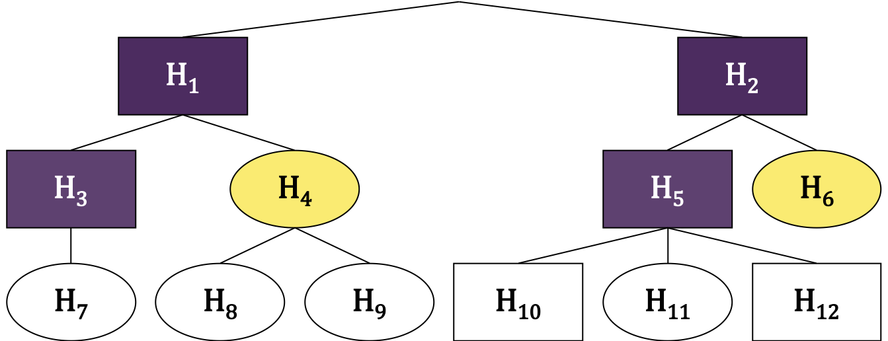
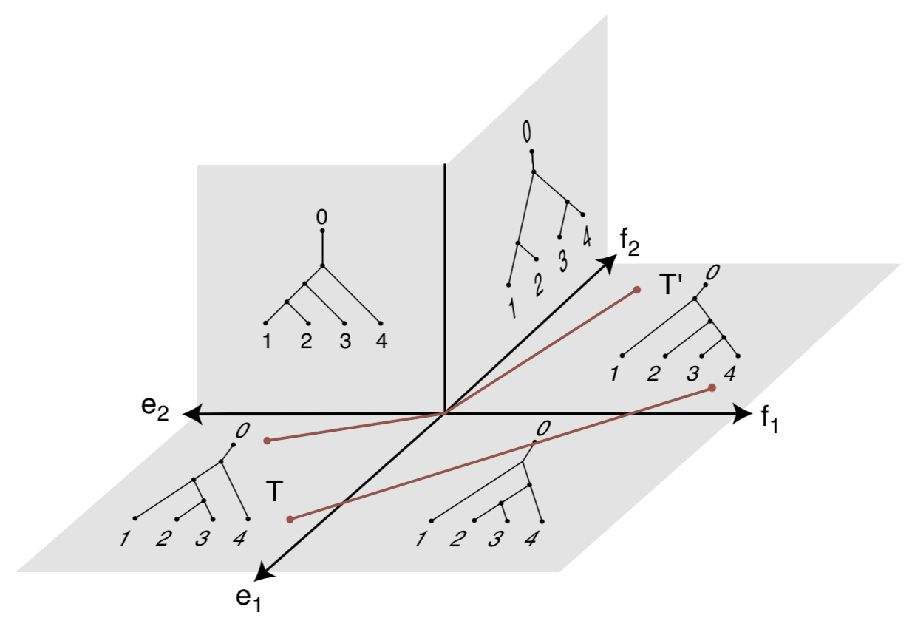

class: title-slide, center, middle
count: false

```{r setup, include=FALSE}
options(htmltools.dir.version = FALSE)
knitr::opts_chunk$set(echo = TRUE, fig.align = "center", fig.width = 8,
                      fig.retina = 2, comment = " ")
```

```{r package, include=FALSE, message=FALSE}
library(tidyverse)
numprint <- function(x, ...) format(x, big.mark = "&#8239;", scientific = FALSE, ...)
set.seed(42)
```


<br>


# Influence du choix de l’arbre dans les études d’abondance différentielle

<br>

## Antoine Bichat
<div style = "margin-top: -30px"></div>
<!-- ### `r icon::ii_social_twitter()` @_abichat -->

### 6 juin 2019 - Journées de Statistique - Nancy

<br>

#### En collaboration avec C. Ambroise (LaMME), M. Mariadassou (MaIAGE) & J. Plassais (Enterome)


---
class: center, middle, inverse

# Context


---
## Microbiota


_Ecological community of microorganisms that reside in an environmental niche_ 

--

.footnote[`r emo::ji("blue_book")` Gut: The Inside Story of Our Body's Most Underrated Organ  (Giulia Enders) <br> `r emo::ji("page_facing_up")` Opstelten et al. (2016), Bokulich et al. (2016), Blander et al. (2017)]

.pull-left[

#### Some figures for human gut

* $10^{\small{14}}$ bacterial cells in one gut...

* ... weighing 2 kg 

* More than `r numprint(1500)` different species 

* More than 10 millions unique genes


```{r citations, echo=FALSE, fig.width=4, fig.height=3}
dfpubli <- 
  data.frame(
    Year = 1990:2017,
    Number = c(727, 748, 844, 782, 918,1030, 1220, 1500, 1900, 2400, 
               2920, 3230, 3940, 4460, 5660, 7100, 8440, 10600, 12600, 15300, 
               18600, 23600, 31200, 39100, 46900, 55400, 66600, 63300)
  )
ggplot(dfpubli, aes(Year, Number/1000)) + 
  geom_col(fill = "grey50", color = "black") + 
  theme_minimal() +
  scale_x_continuous(breaks = c(1990, 1995, 2000, 2005, 2010, 2015)) +
  labs(x = "Year of publication", y = bquote("Number ("~10^3*")"),
       title = "Articles containing 'Microbiome' or 'Microbiota'",
       caption = "Source: Google Scholar") +
  theme_minimal() +
  theme(axis.text = element_text(size = 8), axis.title = element_text(size = 10), 
        plot.title = element_text(size = 11), plot.caption = element_text(size = 9))
```

]

--


.pull-right[

#### Proven associations

* Immune system

* Crohn's disease

* Vaginosis

* Diabete

* Tobacco

* Diet

* Antibiotics

* Birth mode

]


---
## Data - abundances of taxa

.footnote[`r emo::ji("page_facing_up")` Ravel et al. (2011)]

```{r echo=FALSE}
read_csv("data/data_abund.csv", col_types = cols(.default = "d", Taxa = "c")) %>% 
  print(n_extra = 0, width = 70)
```

--

* Count data (or compositional) data

* Zero-inflated data

* Correlation between species

* Counts spanning several orders of magnitude: $1 \rightarrow 10^{\small{8}}$


---
## Data - taxonomy

.footnote[`r emo::ji("page_facing_up")` Ravel et al. (2011)]

```{r echo=FALSE}
read_csv("data/data_tax.csv", col_types = "cccccc", na = "NA") %>% 
  drop_na() %>% 
  select(-Kingdom) %>% 
  print(n = 5)
```


---
class: nologo
count: false
## Data - taxonomy

```{r echo=FALSE}
read_csv("data/data_tax.csv", col_types = "cccccc", na = "NA") %>% 
  drop_na() %>% 
  select(-Kingdom) %>% 
  print(n = 5)
```

.center[]

---
class: center, middle, inverse

# Differential abundance studies

---
## Statistical issue

Univariate tests on hundred of taxa

Need for a multiple testing controling procedure!

--

.footnote[`r emo::ji("page_facing_up")` Philippot et al. (2010)]

<br>

.pull-left[
A hierarchy is available


]

.pull-right[
Can we use it to do it better?
]

---
count: false
## Statistical issue

.footnote[`r emo::ji("page_facing_up")` Philippot et al. (2010)]

Univariate tests on hundred of taxa

Need for a multiple testing controling procedure!


<br>

.pull-left[
A hierarchy is available


]

.pull-right[

Can we use it to do it better?

<br> 

* Hierarchical FDR

* z-scores smoothing
]


---
## Hierarchical FDR

.footnote[`r emo::ji("page_facing_up")` Yekutieli (2008)]

$\mathcal{T}_t = \left\{H_i \mid \text{Par}(i) = t\right\}$

Descending method:

* Test the family $\mathcal{T}_0$

* If node $t$ is rejected, test $\mathcal{T}_t$ with a classical BH procedure at level $q$

<br>

.center[
  
]

---
count: false
## Hierarchical FDR

.footnote[`r emo::ji("page_facing_up")` Yekutieli (2008)]

$\mathcal{T}_t = \left\{H_i \mid \text{Par}(i) = t\right\}$

Descending method:

* Test the family $\mathcal{T}_0$

* If node $t$ is rejected, test $\mathcal{T}_t$ with a classical BH procedure at level $q$

<br>

.center[
  
]

---
count: false

## Hierarchical FDR

.footnote[`r emo::ji("page_facing_up")` Yekutieli (2008)]

$\mathcal{T}_t = \left\{H_i \mid \text{Par}(i) = t\right\}$

Descending method:

* Test the family $\mathcal{T}_0$

* If node $t$ is rejected, test $\mathcal{T}_t$ with a classical BH procedure at level $q$

<br>


.center[
  
]

---
count: false
## Hierarchical FDR

.footnote[`r emo::ji("page_facing_up")` Yekutieli (2008)]

$\mathcal{T}_t = \left\{H_i \mid \text{Par}(i) = t\right\}$

Descending method:

* Test the family $\mathcal{T}_0$

* If node $t$ is rejected, test $\mathcal{T}_t$ with a classical BH procedure at level $q$

<br>

.center[
  
]

--

<br>

.center[
__This procedure controls the FDR at level__ 

$\large{1.44 \times q \times \frac{\#\text{discoveries } +\text{ } \#\text{families tested}}{\#\text{discoveries } +\text{ } 1}}$
]


---
## z-scores smoothing

.footnote[`r emo::ji("page_facing_up")` Xiao et al. (2017)]

Denote by $\mathbf{z}$ the vector of observed z-values and $\mathbf{\mu}$ the vector of "true" z-values

--

<br>

Assume that 
$\mathbf{z} | \mathbb{\mu} \sim \mathcal{N}_n \left( \mathbb{\mu}, \sigma^2 \mathbf{I}_m \right)$ and $\mathbf{\mu} \sim \mathcal{N}_m\left(\gamma \mathbf{1} , \tau^2 \mathbf{C}_{\rho} \right)$ 

--

then 
$$\mathbf{z} \sim \mathcal{N}_m \left(\gamma \mathbf{1},\tau^2 \mathbf{C}_{\rho} + \sigma^2 \mathbf{I}_m\right)$$

and Bayes formula gives 
 
$$\mathbb{\mu}^* = \left(\mathbf{I}_m + \frac{\sigma_0^2}{\tau_0^2} \mathbf{C}_{\rho_0}^{-1}\right)^{-1}\left(\frac{\sigma_0^2}{\tau_0^2} \mathbf{C}_{\rho_0}^{-1}\gamma_0 \mathbf{1} + \mathbf{z}\right)$$

with $\sigma_0$, $\tau_0$, $\rho_0$ and $\gamma_0$ hypermarameters

--

<br>

After smoothing, a multiple testing correction could be done on smoothed values


---
## Which tree?


#### Taxonomy? Phylogeny?

* Proxy for correlations at high-level niches

* Not so much for low-level niches?

* Not available everytime


---
class: nologo
count: false
## Which tree?


#### Taxonomy? Phylogeny?

* Proxy for correlations at high-level niches

* Not so much for low-level niches?

* Not available everytime

#### Correlation tree?

* Actual correlation between taxa

* Computed from data using pairwise correlation


.center[

]

---
class: center, middle, inverse

# Comparison of trees

---
## Billera-Holmes-Vogtamnn distance

.footnote[`r emo::ji("page_facing_up")` Billera, Holmes & Vogtmann (2001)]

The BHV distance is the length of the unique shortest path between the trees on treespace

.pull-left[
  .center[

  ]
]

.pull-right[
  .center[
    
  ]
]


---
## Quantifying distance between trees


* __trees of primary interest__

  * <span style="color:#C77CFF">correlation tree on original data</span>
  
  * <span style="color:#F8766D">taxonomy</span>
  
--

* __what is the confident region for the correlation tree?__

--

  * <span style="color:#00BFC4">correlation trees on boostrapped data (resampling on samples)</span>

--

* __are trees significantly closer than two random trees?__

--

  * <span style="color:#7CAE00">trees created by random shuffling of correlation tree tip labels</span>
  
  * <span style="color:#FFA500">trees created by random shuffling of taxonomy tip labels</span>

--

<br>

We compute all pairwise distances between these trees

---
## Random shuffling

.center[]

---
## Dataset

.footnote[`r emo::ji("page_facing_up")` Ravel et al. (2011)]

* Vaginal microbiome of non pregnant women sequenced by 16S

* 40 different genera after filtering (~&#8239;30&#8239;%)

<br>

.pull-left[ 
  
  .center[Taxonomy]
]

.pull-right[
  
  .center[Correlation tree] 
]

---
## Pairwise distances

.pull-left[
.center[]
]

--

.pull-right[
.center[]
]

--

<br>

`r emo::ji("grinning_face")` The <span style="color:#C77CFF">correlation tree</span> is different from the <span style="color:#F8766D">taxonomy</span>


---
class: center, middle, inverse

# Evaluation of hFDR

---
## Dataset

.footnote[`r emo::ji("page_facing_up")` Caporaso et al. (2011), Sankaran & Holmes (2014)]

* Small subset of the `GlobalPatterns` dataset narrowed to Chlamydiae phylum

* 21 different OTUs

* 26 samples representing 9 very different environments: soil, ocean, feces, skin...

--

## Method

* Find which bacteria are differentially abundant between environments

* Association using Fisher statistic (ANOVA)

* Correction with hierarchical FDR

---
## Abundances of detected species

.center[]


---
## Representation of evidences on trees

.center[]

---
## But...

$\alpha = 0.05$ is only the family-level FDR.

The _a posteriori_ global FDR is:

* $\alpha' = 0.32$ for phylogenetic correction

* $\alpha' = 0.324$ for correlation correction


--

A BH procedure at the same global FDR level leads to 15 discoveries (+5)

--

<br>

`r emo::ji("grinning_face")` Using correlation tree instead of taxonomy yields more results


`r emo::ji("frowning_face")` Vanilla FDR beats hFDR for a given level


---
class: center, middle, inverse

# Evaluation of z-scores smoothing


---
## Dataset

.footnote[`r emo::ji("page_facing_up")` Zeller et al. (2014)]

* Dataset from cancer study

* 119 different genera (after filtering)

* 199 samples: 42 adenoma, 91 carcinoma and 66 control

--

## Method

* Find which bacteria are differentially abundant between diseases

* Association using Kruskal-Wallis test

* Correction with hierarchical p-value smoothing


---
## Impact of the tree

.center[]

--

`r emo::ji("blush")` z-scores smoothing is slightly better than vanilla FDR

`r emo::ji("frowning_face")` All hierachies give highly similar results

---
class: center, middle, inverse

# Simulations

---
## Workflow

.footnote[`r emo::ji("page_facing_up")` Brito et al. (2016)]

* Simulate DA taxa starting from an homogeneous dataset

* Correction with BH and hierarchical p-value smoothing


.center[]

---
## Evaluation

.center[]

--

`r emo::ji("grinning_face")` Using correlation tree instead of taxonomy yields more results

`r emo::ji("frowning_face")` Vanilla BH is better 

`r emo::ji("thinking")` Taxonomy is worst than random trees 


---
class: center, middle, inverse

# Conclusions

---

## Conclusions 


`r emo::ji("grinning_face")` Correlation tree and taxonomy are very different

`r emo::ji("grinning_face")` Replacing taxonomy with correlationn increases the TPR

--

<br>

`r emo::ji("frowning_face")` Vanilla BH is more powerful than hFDR

`r emo::ji("frowning_face")` Bayesian smoothing does not really depend on the tree for z-scores smoothing

--

<br>


`r emo::ji("package")` `correlationtree`

`r emo::ji("package")` `yatah` `r icon::fa('github')`

`r emo::ji("package")` `evabic` `r icon::fa('github')`


---
class: title-slide, center, middle
count: false

<br>

# Merci pour votre attention !

<br>

# Des questions ?


<br>

#### `r icon::fa("link", size = 1)` <a href="https://abichat.github.io" target="_blank">abichat.github.io</a> &emsp; `r icon::fa("github", size = 1)`  <a href="https://github.com/abichat" target="_blank">@abichat</a> &emsp; `r icon::fa("twitter", size = 1)` <a href="https://twitter.com/_abichat" target="_blank">@_abichat</a>


