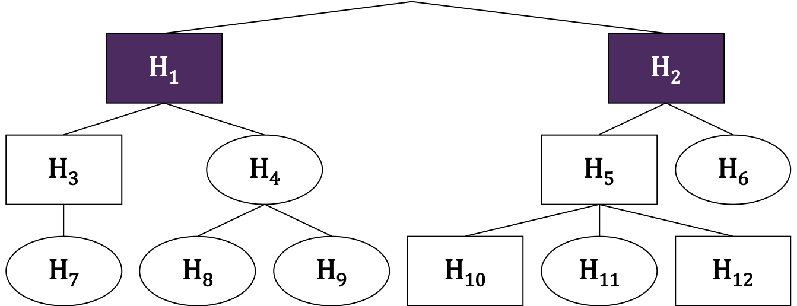
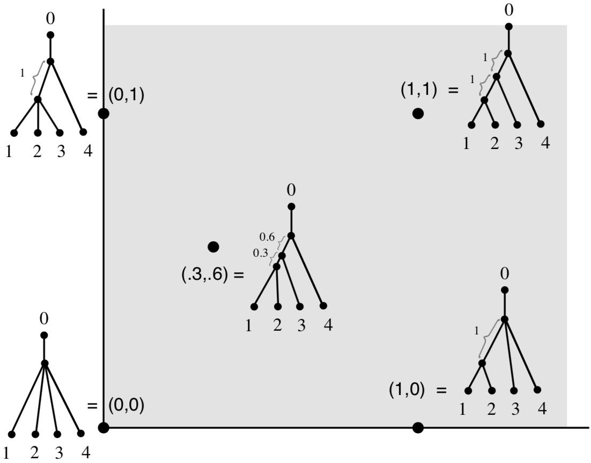
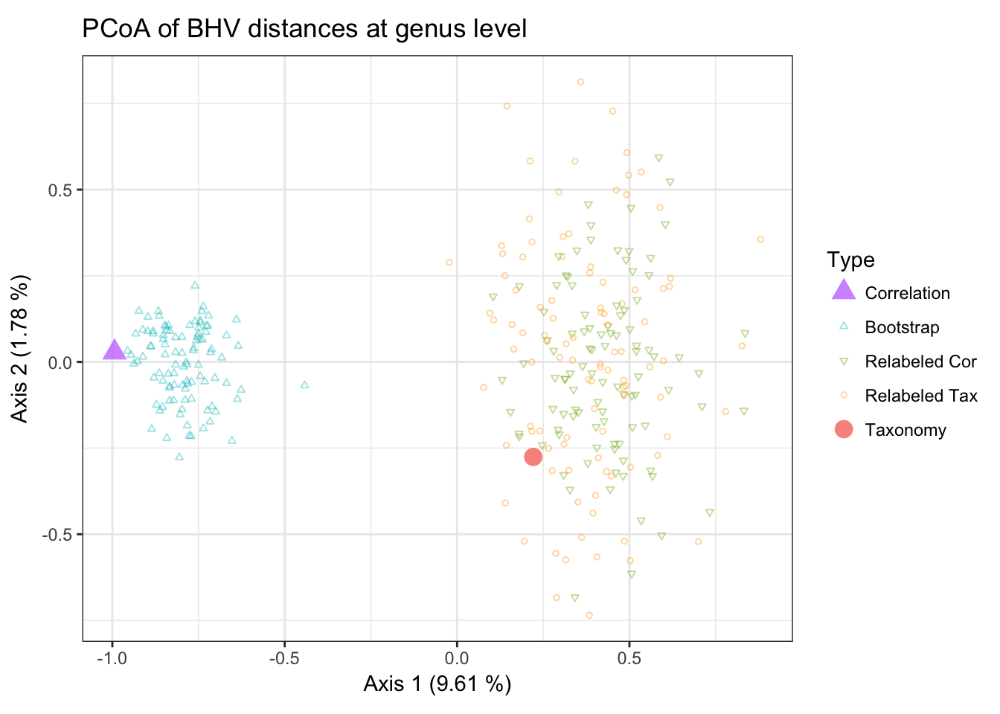
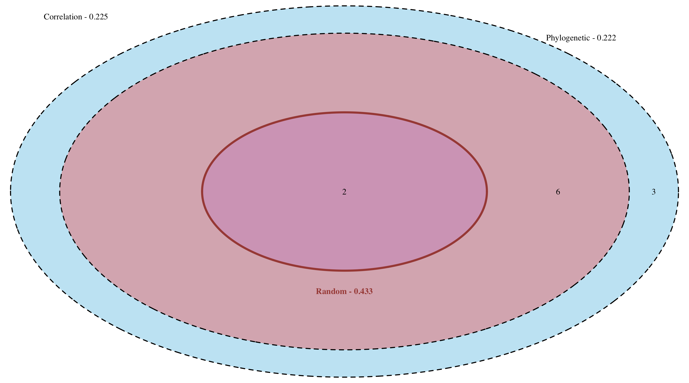
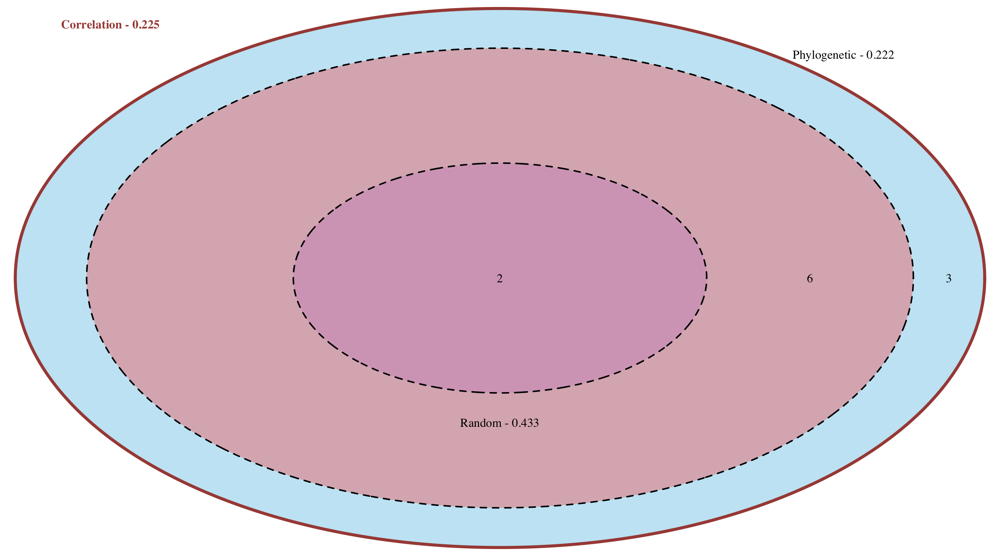
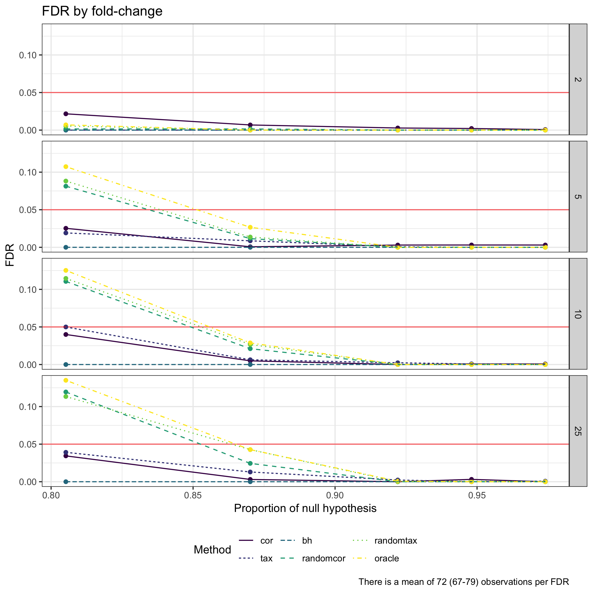

class: title-slide, center, middle
count: false

```{r setup, include=FALSE}
options(htmltools.dir.version = FALSE)
knitr::opts_chunk$set(echo = TRUE, fig.align = "center", fig.width = 8,
                      fig.retina = 2, comment = " ")
```

```{r package, include=FALSE, message=FALSE}
library(tidyverse)
numprint <- function(x, ...) format(x, big.mark = "&#8239;", scientific = FALSE, ...)
set.seed(42)
```


.band[
# Impact of tree choice in metagenomics differential abundance studies

### Antoine Bichat
<div style = "margin-top: -30px"></div>
### March 11, 2019 - StatInfOmics

Work in progress - In collaboration with C. Ambroise (LaMME), <br>
M. Mariadassou (MaIAGE) & J. Plassais (Enterome)
]

---
class: center, middle, inverse

# Context


---
## Microbiota


_Ecological community of microorganisms that reside in an environmental niche_

--

.footnote[`r icon::fa('book')` Gut: The Inside Story of Our Body's Most Underrated Organ (Giulia Enders) <br> &emsp;]

.pull-left[

#### Some figures for human gut

* $10^{\small{14}}$ bacterial cells in one gut...

* ... weighing 2 kg 

* More than `r numprint(1500)` different species 

* More than 10 millions unique genes


```{r citations, echo=FALSE, fig.width=4, fig.height=3}
dfpubli <- 
  data.frame(
    Year = 1990:2017,
    Number = c(727, 748, 844, 782, 918,1030, 1220, 1500, 1900, 2400, 
               2920, 3230, 3940, 4460, 5660, 7100, 8440, 10600, 12600, 15300, 
               18600, 23600, 31200, 39100, 46900, 55400, 66600, 63300)
  )
ggplot(dfpubli, aes(Year, Number/1000)) + 
  geom_col(fill = "grey50", color = "black") + 
  theme_minimal() +
  scale_x_continuous(breaks = c(1990, 1995, 2000, 2005, 2010, 2015)) +
  labs(x = "Year of publication", y = bquote("Number ("~10^3*")"),
       title = "Articles containing 'Microbiome' or 'Microbiota'",
       caption = "Source: Google Scholar") +
  theme_minimal() +
  theme(axis.text = element_text(size = 8), axis.title = element_text(size = 10), 
        plot.title = element_text(size = 11), plot.caption = element_text(size = 9))
```

]

--
.footnote[`r icon::fa('book')` Gut: The Inside Story of Our Body's Most Underrated Organ  (Giulia Enders) <br> `r icon::fa('file-alt')` Opstelten et al. (2016), Bokulich et al. (2016), Blander et al. (2017)]

.pull-right[

#### Proven associations

* Immune system

* Crohn's disease

* Vaginosis

* Diabete

* Tobacco

* Diet

* Antibiotics

* Birth mode

]

---
## Data collection

.footnote[`r icon::fa('file-alt')` Quince et al. (2017)]

.center[]

---
count: false
## Data collection

.footnote[`r icon::fa('file-alt')` Quince et al. (2017)]

.center[]

---
## Data - abundances of taxa

.footnote[`r icon::fa('file-alt')` Ravel et al. (2011)]

```{r echo=FALSE}
read_csv("data/data_abund.csv", col_types = cols(.default = "d", Taxa = "c")) %>% 
  print(n_extra = 0, width = 70)
```

--

* Count data (or compositional) data

* Zero-inflated data

* __Correlation between species__

* Counts spanning several orders of magnitude: $1 \rightarrow 10^{\small{8}}$

---
## Data - samples information

.footnote[`r icon::fa('file-alt')` Ravel et al. (2011)]

```{r echo=FALSE, warning=FALSE}
read_csv("data/data_sample.csv", col_types = "ccddcc") %>% 
  print()
```

---
## Data - taxonomy

.footnote[`r icon::fa('file-alt')` Ravel et al. (2011)]

```{r echo=FALSE}
read_csv("data/data_tax.csv", col_types = "cccccc", na = "NA") %>% 
  drop_na() %>% 
  select(-Kingdom) %>% 
  print(n = 5)
```


---
class: nologo
count: false
## Data - taxonomy

```{r echo=FALSE}
read_csv("data/data_tax.csv", col_types = "cccccc", na = "NA") %>% 
  drop_na() %>% 
  select(-Kingdom) %>% 
  print(n = 5)
```

.center[]

---
class: center, middle, inverse

# Differential abundance studies

---
## Statistical issue

.center[
#### Healthy VS Diseased
<div style = "margin-top: -25px"></div>
.center[]
]

Is any bacteria more abundant in one group? 

--

.pull-left[
#### Goals
* Biomarker

* Companion Diagnostics 

* Potential targets for drugs
]

--

.pull-right[
#### Methods
* ANOVA / GLM

* Wilcoxon rank sum test

* Mixed model effects

* ...
]


---
## Multiple testing problem

Usual design:

* `r numprint(1500)` species in the gut

* Up to hundreds in a single study

Need for a controling procedure!

<br>

--

* Bonferroni (FWER)

---
count: false

## Multiple testing problem

Usual design:

* `r numprint(1500)` species in the gut

* Up to hundreds in a single study

Need for a controling procedure!

<br>

* ~~Bonferroni (FWER)~~ $\rightarrow$ too conservative

--

* Benjamini-Hochberg (FDR)


---
## Benjamini-Hochberg

.footnote[`r icon::fa('file-alt')` Benjamini et al. (1995, 2001)]

The False Discovery Rate is defined as 

$$\text{FDR} =\mathbb{E}\left[\frac{V}{R \vee  1}\right]$$

--

<br>

Benjamini-Hochberg procedure:

* Order the p-values as $p_{(1)} \leq p_{(2)} \leq \ldots \leq p_{(m)}$ and let $p_{(0)}=0$

* Consider the rank $\hat{\ell} = \text{max}\left\{\ell \in \{0, 1, \ldots, m\} \mid p_{(\ell)} \leq \frac{\alpha\ell}{m} \right\}$

* Reject the $\hat{\ell}$ hypothesis corresponding to the smallest p-values

--

<br>

This procedure controls the FDR at level $\frac{m_{0}}{m}\alpha \leq \alpha$ and holds when the test statistics are independent or PRDS


---
## Incorporate taxonomy in the analysis?

.footnote[`r icon::fa('file-alt')` Philippot et al. (2010), Koeppel & Wu (2012)]

* Taxonomy is a proxy for the structure of the data


* Coherent with ecological niches


* Independant from count data and metadata

<br>

.center[
  
]

---
## Hierarchical FDR

.footnote[`r icon::fa('file-alt')` Yekutieli (2008)]

$\mathcal{T}_t = \left\{H_i \mid \text{Par}(i) = t\right\}$

Descending method:

* Test the family $\mathcal{T}_0$

* If node $t$ is rejected, test $\mathcal{T}_t$ with a classical BH procedure at level $q$

<br>

.center[
  
]

---
count: false
## Hierarchical FDR

.footnote[`r icon::fa('file-alt')` Yekutieli (2008)]

$\mathcal{T}_t = \left\{H_i \mid \text{Par}(i) = t\right\}$

Descending method:

* Test the family $\mathcal{T}_0$

* If node $t$ is rejected, test $\mathcal{T}_t$ with a classical BH procedure at level $q$

<br>

.center[
  
]

---
count: false

## Hierarchical FDR

.footnote[`r icon::fa('file-alt')` Yekutieli (2008)]

$\mathcal{T}_t = \left\{H_i \mid \text{Par}(i) = t\right\}$

Descending method:

* Test the family $\mathcal{T}_0$

* If node $t$ is rejected, test $\mathcal{T}_t$ with a classical BH procedure at level $q$

<br>


.center[
  
]

---
count: false
## Hierarchical FDR

.footnote[`r icon::fa('file-alt')` Yekutieli (2008)]

$\mathcal{T}_t = \left\{H_i \mid \text{Par}(i) = t\right\}$

Descending method:

* Test the family $\mathcal{T}_0$

* If node $t$ is rejected, test $\mathcal{T}_t$ with a classical BH procedure at level $q$

<br>

.center[
  
]

--

<br>

.center[
__This procedure controls the FDR at level__ 

$\large{1.44 \times q \times \frac{\#\text{discoveries } +\text{ } \#\text{families tested}}{\#\text{discoveries } +\text{ } 1}}$
]

---
## Bayesian smoothing

.footnote[`r icon::fa('file-alt')` Xiao et al. (2017)]

Denote by $\mathbf{z}$ the vector of observed z-values and $\mathbf{\mu}$ the vector of "true" z-values

--

<br>

Assume that 
$\mathbf{z} | \mathbb{\mu} \sim \mathcal{N}_n \left( \mathbb{\mu}, \sigma^2 \mathbf{I}_m \right)$ and $\mathbf{\mu} \sim \mathcal{N}_m\left(\gamma \mathbf{1} , \tau^2 \mathbf{C}_{\rho} \right)$ 

--

then 
$$\mathbf{z} \sim \mathcal{N}_m \left(\gamma \mathbf{1},\tau^2 \mathbf{C}_{\rho} + \sigma^2 \mathbf{I}_m\right)$$

and Bayes formula gives 
 
$$\mathbb{\mu}^* = \left(\mathbf{I}_m + \frac{\sigma_0^2}{\tau_0^2} \mathbf{C}_{\rho_0}^{-1}\right)^{-1}\left(\frac{\sigma_0^2}{\tau_0^2} \mathbf{C}_{\rho_0}^{-1}\gamma_0 \mathbf{1} + \mathbf{z}\right)$$

with $\sigma_0$, $\tau_0$, $\rho_0$ and $\gamma_0$ hypermarameters

--

<br>

After smoothing, a multiple testing correction could be done on smoothed values


---
## Which tree?


#### Taxonomic tree?

* Proxy for correlations at high-level niches

* Not so much for subtle niches?

* Non available everytime


---
class: nologo
count: false
## Which tree?


#### Taxonomic tree?

* Proxy for correlations at high-level niches

* Not so much for subtel niches?

* Non available everytime

#### Correlation tree?

* Actual correlation between taxa

* Computed from data using pairwise correlation


.center[

]

---
class: center, middle, inverse

# Comparison of trees

---
## Billera-Holmes-Vogtmann distance on treespace

.footnote[`r icon::fa('file-alt')` Billera, Holmes & Vogtmann (2001)]

.pull-left[
  .center[
    
  ]
]

--

.pull-right[
* The treespace is a CAT(0) space so there is a unique shortest path connecting any two trees 

* The BHV distance is the length of the unique shortest path between the trees on treespace

* Solution of a max flow min cut algorithm in $O(n_{\text{leaf}}^{\small{4}})$ 

* Other distances exist like Robison-Foulds (for topology) or Cophenetic (by vectorisation) distances
]

---
count: false
## Billera-Holmes-Vogtmann distance on treespace

.footnote[`r icon::fa('file-alt')` Billera, Holmes & Vogtmann (2001)]

.pull-left[
  .center[
    
  ]
]

.pull-right[
* The treespace is a CAT(0) space so there is a unique shortest path connecting any two trees 

* The BHV distance is the length of the unique shortest path between the trees on treespace

* Solution of a max flow min cut algorithm in $O(n_{\text{leaf}}^{\small{4}})$ 

* Other distances exist like Robison-Foulds (for topology) or Cophenetic (by vectorisation) distances
]

---
count: false
## Billera-Holmes-Vogtmann distance on treespace

.footnote[`r icon::fa('file-alt')` Billera, Holmes & Vogtmann (2001)]

.pull-left[
  .center[
    
  ]
]

.pull-right[
* The treespace is a CAT(0) space so there is a unique shortest path connecting any two trees 

* The BHV distance is the length of the unique shortest path between the trees on treespace

* Solution of a max flow min cut algorithm in $O(n_{\text{leaf}}^{\small{4}})$ 

* Other distances exist like Robison-Foulds (for topology) or Cophenetic (by vectorisation) distances
]

---
count: false
## Billera-Holmes-Vogtmann distance on treespace

.footnote[`r icon::fa('file-alt')` Billera, Holmes & Vogtmann (2001)]

.pull-left[
  .center[
    
  ]
]

.pull-right[
* The treespace is a CAT(0) space so there is a unique shortest path connecting any two trees 

* The BHV distance is the length of the unique shortest path between the trees on treespace

* Solution of a max flow min cut algorithm in $O(n_{\text{leaf}}^{\small{4}})$ 

* Other distances exist like Robison-Foulds (for topology) or Cophenetic (by vectorisation) distances
]


---
## Quantifying distance between trees


* __trees of primary interest__

  * correlation tree on original data
  
  * taxonomic tree
  
--

* __what is the confident region for the correlation tree?__

--

  * $N_B$ correlation trees on boostrapped data (resampling on samples)

--

* __are trees significantly closer than two random trees?__

--

  * $N_{R_1}$ trees created by random shuffling of correlation tree tip labels
  
  * $N_{R_2}$ trees created by random shuffling of taxonomic tree tip labels

--

<br>

We compute all pairwise distances between these trees

---
## Random shuffling

.center[]

---
## Dataset

.footnote[`r icon::fa('file-alt')` Ravel et al. (2011)]

* Vaginal microbiome of non pregnant women sequenced by 16S

* 40 different genera after filtering (~&#8239;30&#8239;%)

* 394 women with various Nugent score

<br>

.pull-left[ 
  
  .center[Taxonomic tree]
]

.pull-right[
  
  .center[Correlation tree] 
]

---
## Pairwise distances

.pull-left[
#### Distances to the correlation tree
.center[]
]

--

.pull-right[
#### Principal Coordinates Analysis
.center[]
]

--

.center[
__The correlation tree is different from the taxonomic tree__
]


---
class: center, middle, inverse

# Application

---
## Dataset

.footnote[`r icon::fa('file-alt')` Caporaso et al. (2011), Sankaran & Holmes (2014)]

* Small subset of the `GlobalPatterns` dataset narrowed to Chlamydiae phylum

* Sequenced by 454

* 21 different species

* 26 samples representing 7 very different environments: soil, ocean, feces, skin...

* Find which bacteria are differentially abundant between environments

* Association using Fisher statistic


---
## Correlations

.center[]


---
## Detected species with different corrections

.center[]

---
count: false
## Detected species with different corrections

.center[]

---
count: false
## Detected species with different corrections

.center[]

---
count: false
## Detected species with different corrections

.center[]


---
## Back to abundances

.center[]


---
## Representation of evidences on trees

.center[]

---
class: center, middle, inverse

# Simulations

---
## Differentially abundant dataset

* Take a homogeneous dataset

--

<br>

* Arbitrarly assign a group (A or B) to each sample

--

<br>

* Select taxa that will be differentially abundant

--

<br>

* Apply a fold change on these taxa only in one group


---
## Analysis

.footnote[`r icon::fa('file-alt')` Brito et al. (2016), Pasolli et al. (2017)]

* Stool from healthy patients dataset came from Curated Metagenomics Data

--

<br>

* 5 trees are used:

  * correlation tree
  
  * taxonomy
  
  * random correlation tree
  
  * random taxonomy
  
  * oracle tree


---
class: nologo
## Results: FDR


.center[

]


---
class: nologo
## Results: TPR

.center[

]


---
class: center, middle, inverse
count: false

<br>

# Thanks for you attention!

<br>

#### `r icon::fa("github", size = 1)` <a href="https://github.com/abichat" target="_blank">@abichat</a>
<div style = "margin-top: -10px"></div>
#### `r icon::fa("twitter", size = 1)` <a href="https://twitter.com/_abichat" target="_blank">@_abichat</a>
<div style = "margin-top: -10px"></div>
#### `r icon::fa("linkedin", size = 1)` <a href="https://www.linkedin.com/in/antoinebichat" target="_blank">antoinebichat</a>
<div style = "margin-top: -10px"></div>
#### `r icon::fa("link", size = 1)` <a href="https://abichat.github.io" target="_blank">abichat.github.io</a>
<div style = "margin-top: -10px"></div>
####`r icon::fa("envelope", size = 1)` <a href="mailto:abichat@enterome.com?subject=Presentation">abichat@enterome.com</a>


