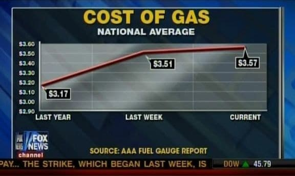
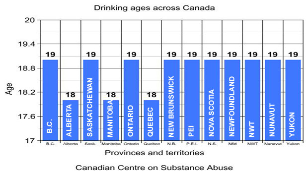
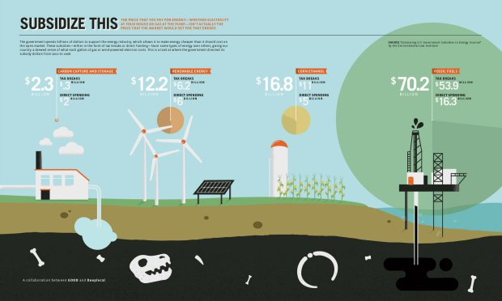
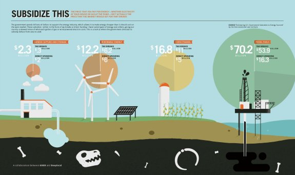
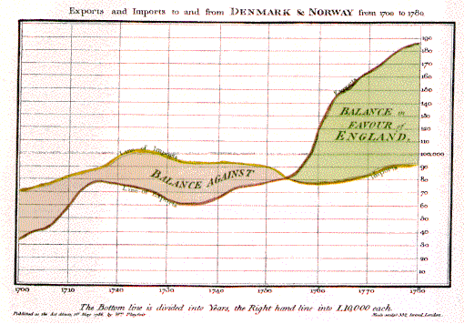
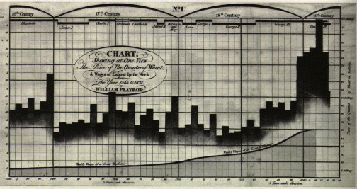
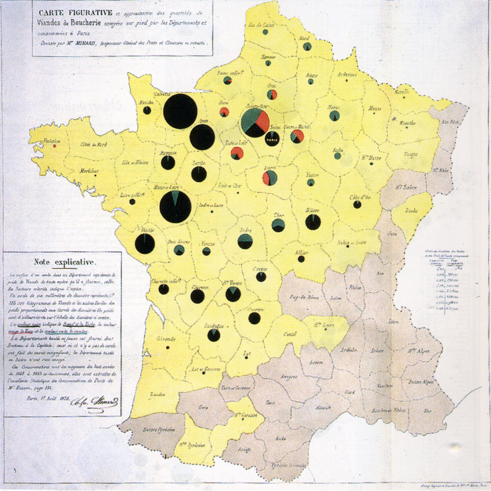
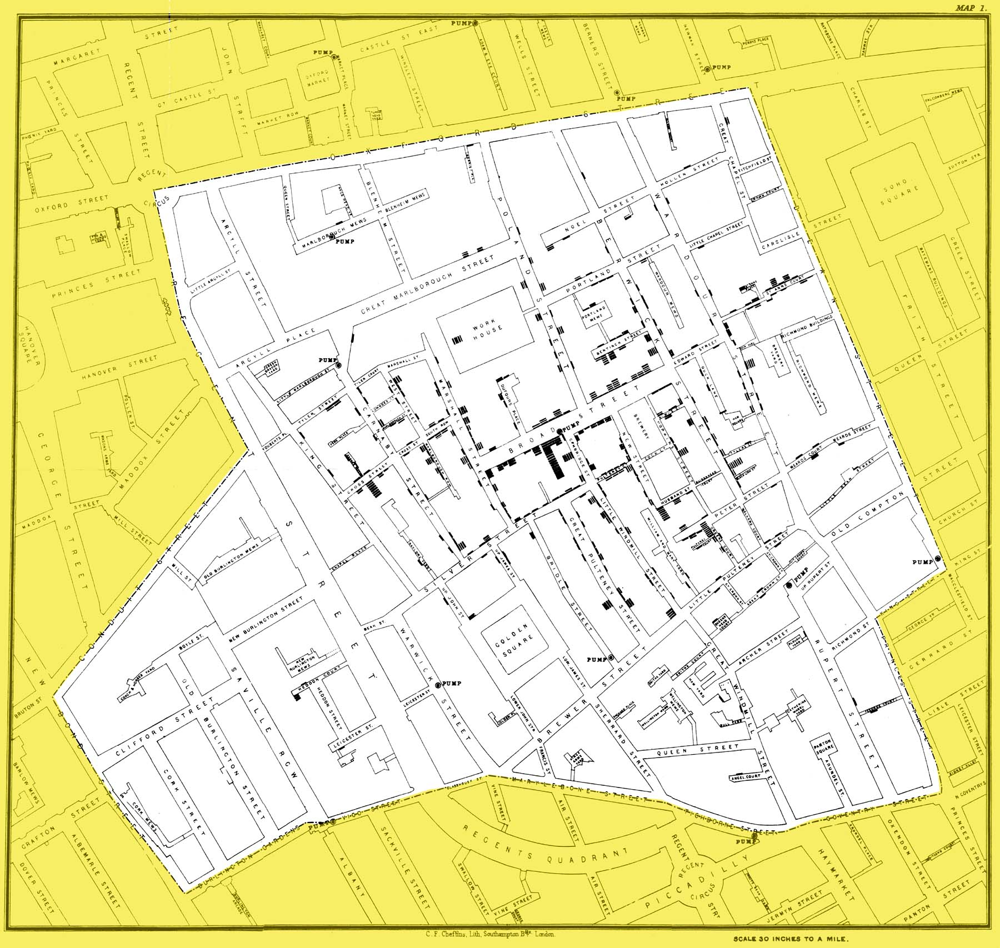
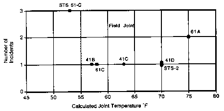

```{r Knitr_Global_Options, include=FALSE}
library("knitr")
opts_chunk$set(
  warning = FALSE, message = FALSE,
  cache = TRUE, autodep = TRUE, tidy = FALSE
)
```

```{r Tidyverse}
library("tidyverse")
```

# Visualization issues

## Anscombe quartet

```{r Anscombe_Data}
anscombeL <- anscombe %>%
  rownames_to_column() %>%
  gather(key, value, -rowname) %>%
  separate(key, c("key", "example"), sep = 1) %>%
  spread(key, value)
```

```{r Anscombe_Table}
ggplot() +
  annotation_custom(gridExtra::tableGrob(anscombe %>%
    select(
      x1, y1, x2, y2,
      x3, y3, x4, y4
    ))) +
  theme_minimal() +
  labs(title = "Anscombe Quartet")
```

```{r Anscombe_Lm_Points}
ggplot(data = anscombeL, aes(x = x, y = y)) +
  geom_point() +
  geom_smooth(method = "lm", fullrange = TRUE) +
  facet_wrap(~ example, ncol = 2) +
  labs(
    title = "Anscombe Quartet",
    subtitle = "Linear regression with confidence bar"
  )
```

```{r Anscombe_Lm}
ggplot(data = anscombeL, aes(x = x, y = y)) +
  geom_smooth(method = "lm", fullrange = TRUE) +
  facet_wrap(~ example, ncol = 2) +
  labs(
    title = "Anscombe Quartet",
    subtitle = "Linear regression with confidence bar and points"
  )
```

## Bad pie

```{r Pie_Fox_Original, echo = FALSE, fig.align='center', out.width = "80%"}

```


```{r Pie_Ggforce_function}
library(rlang)
pie_stats <- function(df, x0, y0, r0, r1, amount, explode, label_perc) {
  x0 <- enquo(x0)
  y0 <- enquo(y0)
  r0 <- enquo(r0)
  r1 <- enquo(r1)
  amount <- enquo(amount)
  explode <- enquo(explode)

  df %>%
    mutate(
      `x0` = !! x0,
      `y0` = !! y0,
      `r0` = !! r0,
      `r1` = !! r1,
      `explode` = !! explode
    ) %>%
    group_by(x0, y0) %>%
    mutate(end = cumsum(!! amount) / sum(!! amount) * 2 * pi) %>%
    mutate(start = lag(end, default = 0)) %>%
    ungroup() %>%
    mutate(
      x_lab = (!! x0) +
        ((!! r0) + label_perc * ((!! r1) - (!! r0)) + (!! explode)) *
          sin((end + start) / 2),
      y_lab = (!! y0) +
        ((!! r0) + label_perc * ((!! r1) - (!! r0)) + (!! explode)) *
          cos((end + start) / 2)
    )
}
```

```{r Pie_Fox_Data}
data_pie_fox <- tribble(
  ~ candidate, ~ percent,
  "Palin", 70,
  "Romney", 60,
  "Huckabee", 63
)

data_pie_fox_pie <- data_pie_fox %>%
  pie_stats(0, 0, 0, 1, percent, FALSE, .55)
```

```{r Pie_Fox_Bad}
ggplot(data_pie_fox_pie) +
  ggforce::geom_arc_bar(aes(
    x0 = x0, y0 = y0,
    r0 = r0, r = r1,
    start = start, end = end,
    fill = candidate
  )) +
  geom_text(
    aes(
      x = x_lab, y = y_lab,
      label = glue::glue("Backs {candidate}\n{scales::percent(percent/100)}")
    ),
    size = 6
  ) +
  guides(fill = "none") +
  scale_fill_hue() +
  theme_void() + coord_equal() +
  labs(
    title = "Fox Bad Pie",
    subtitle = "2012 Presidential Run"
  )
```

```{r Pie_Fox_Good_Bar}
ggplot(data = data_pie_fox) +
  geom_col(aes(
    x = candidate, y = percent,
    fill = candidate
  )) +
  geom_text(
    aes(
      x = candidate, y = percent,
      label = glue::glue("Backs {candidate}\n{scales::percent(percent/100)}")
    ),
    size = 4,
    vjust = 1.5
  ) +
  guides(fill = "none") +
  theme_void() +
  labs(
    title = "Bar Plot",
    subtitle = "2012 Presidential Run"
  )
```

## Scale issue

```{r Gas_Original, echo = FALSE, fig.align='center', out.width = "80%"}

```


```{r Gas_Data}
fox_gas <- tribble(
  ~date, ~price, ~in_fox,
  "08/02/2012", 3.57, TRUE,
  "01/02/2012", 3.51, TRUE,
  "01/02/2011", 3.17, TRUE,
  "01/01/2012", 3.34, FALSE,
  "01/12/2011", 3.30, FALSE,
  "01/11/2011", 3.36, FALSE,
  "01/10/2011", 3.43, FALSE,
  "01/09/2011", 3.56, FALSE,
  "01/08/2011", 3.57, FALSE,
  "01/07/2011", 3.58, FALSE,
  "01/06/2011", 3.60, FALSE,
  "01/05/2011", 3.92, FALSE,
  "01/04/2011", 3.78, FALSE,
  "01/03/2011", 3.54, FALSE
) %>%
  mutate(date = lubridate::dmy(date))
```

```{r Gas_Fox}
ggplot(fox_gas %>% filter(in_fox)) +
  geom_line(aes(
    x = as.factor(date),
    y = price,
    group = 1
  )) +
  scale_x_discrete(labels = c(
    "Last Year", "Last Week",
    "Current"
  )) +
  labs(
    x = NULL,
    y = "Price",
    title = "Cost of Gas",
    subtitle = "Fox"
  )
```

```{r Gas_Fox_Good_Scale}
ggplot(fox_gas %>% filter(in_fox)) +
  geom_line(aes(
    x = date,
    y = price
  )) +
  scale_x_date(
    breaks = sort({
      fox_gas %>%
        filter(in_fox) %>%
        .[["date"]]
    }),
    labels = c(
      "Last Year", "Last Week",
      "Current"
    )
  ) +
  scale_y_continuous(limits = c(0, NA)) +
  theme(axis.text.x = element_text(
    angle = 45,
    hjust = 1
  )) +
  labs(
    x = NULL,
    y = "Price",
    title = "Cost of Gas",
    subtitle = "Scale corrected"
  )
```

```{r Gas_Fox_Good_Scale_Missing}
ggplot(fox_gas) +
  geom_line(aes(
    x = date,
    y = price
  )) +
  scale_x_date(
    breaks = sort({
      fox_gas %>%
        filter(in_fox) %>%
        .[["date"]]
    }),
    labels = c(
      "Last Year", "Last Week",
      "Current"
    )
  ) +
  scale_y_continuous(limits = c(0, NA)) +
  theme(axis.text.x = element_text(
    angle = 45,
    hjust = 1
  )) +
  labs(
    x = NULL,
    y = "Price",
    title = "Cost of Gas",
    subtitle = "Scale and missing data corrected"
  )
```

## Truncated axis

```{r Venezuela_Original, echo = FALSE, fig.align='center', out.width = "80%"}
include_graphics("Figures/venezuela-bar.png")
```


```{r Venezuela_Data}
election_venezuela <- tribble(
  ~ candidate, ~ percent,
  "Nicolas Maduro Moros", 50.66,
  "Henrique Capriles Radonski", 49.07
) %>%
  mutate(candidate = as_factor(candidate))
```

```{r Venezuela_Bad_Bar}
ggplot(data = election_venezuela) +
  geom_col(aes(
    x = candidate, y = percent,
    fill = candidate
  )) +
  geom_text(
    aes(
      x = candidate, y = percent,
      label = scales::percent(percent / 100)
    ),
    vjust = 1.5
  ) +
  scale_y_continuous(breaks = NULL) +
  coord_cartesian(ylim = c(49.05, 51)) +
  guides(fill = "none") +
  labs(
    x = NULL, y = NULL,
    title = "2013 Venezuelian presidential election",
    subtitle = "Venezolana Television"
  )
```

```{r Venezuela_Good_Bar}
ggplot(data = election_venezuela) +
  geom_col(aes(
    x = candidate, y = percent,
    fill = candidate
  )) +
  geom_text(
    aes(
      x = candidate, y = percent,
      label = scales::percent(percent / 100)
    ),
    vjust = 1.5
  ) +
  scale_y_continuous(breaks = NULL) +
  guides(fill = "none") +
  labs(
    x = NULL, y = NULL,
    title = "2013 Venezuelian presidential election",
    subtitle = "Truncated axis corrected"
  )
```

## Scale and selection issue

```{r Temperature_Original, echo = FALSE, fig.align='center', out.width = "80%"}
include_graphics("Figures/1-8-13-CC-2012-warmest-bargraph-CONUS.jpg")
```


```{r Temperature_Data}
temperature <- read_csv(
  "Temperature-1895-2017.csv",
  skip = 4,
  col_types = cols(Date = col_character())
) %>%
  mutate(Date = str_sub(Date, end = -3L))

year_selected <- c("1921", "1999", "1934", "2006", "1998", "2012")

temperature <- temperature %>%
  mutate(is_selected = Date %in% year_selected)
```

```{r Temperature_Bad_Top}
ggplot(data = temperature %>%
  filter(is_selected) %>%
  mutate(Date = fct_reorder(
    Date,
    Value
  ))) +
  geom_col(aes(x = Date, y = Value)) +
  coord_cartesian(ylim = c(53, 55.5)) +
  labs(
    x = "Year",
    y = "Average temperature",
    title = "Warmest year",
    subtitle = "5 warmest year before 2012"
  )
```

```{r Temperature_Good_Top}
ggplot(
  data = temperature %>%
    filter(as.integer(Date) <= 2012),
  aes(
    x = as.integer(Date),
    y = Value
  )
) +
  geom_line() +
  geom_point(
    data = temperature %>% filter(is_selected),
    color = "red",
    size = 2
  ) +
  labs(
    x = "Year",
    y = "Average temperature",
    title = "Warmest year",
    subtitle = "5 warmest year before 2012 in context"
  )
```

```{r Temperature_Good_Top_2016}
ggplot(
  data = temperature,
  aes(
    x = as.integer(Date),
    y = Value
  )
) +
  geom_line() +
  geom_point(
    data = temperature %>% filter(rank(desc(Value)) <= 5),
    color = "red",
    size = 2
  ) +
  labs(
    x = "Year",
    y = "Average temperature",
    title = "Warmest year",
    subtitle = "5 warmest year before 2016 in context"
  )
```

## Clutter issue

```{r Clutter_Original, echo = FALSE, fig.align='center', out.width = "80%"}

```


```{r Clutter_Data}
canada <- tribble(
  ~state, ~age,
  "B.C.", 19,
  "Alberta", 18,
  "Saskatchewan", 19,
  "Manitoba", 18,
  "Ontario", 19,
  "Quebec", 18,
  "New Brunswick", 19,
  "PEI", 19,
  "Nova Scotia", 19,
  "Newfoundland", 19,
  "NWT", 19,
  "Nunavut", 19,
  "Yukon", 19
) %>%
  mutate(state = as_factor(state))
```

```{r Clutter}
ggplot(
  data = canada,
  aes(x = state, y = age)
) +
  geom_col(fill = "grey60") +
  coord_cartesian(ylim = c(17.5, 19.5)) +
  geom_text(
    aes(label = state), angle = 90,
    hjust = 1, nudge_y = -.1
  ) +
  geom_text(aes(label = age), nudge_y = .1) +
  labs(
    x = "Province and territories",
    y = "Age",
    title = "Drinking ages across Canada",
    subtitle = "Clutter issue"
  )
```

```{r Clutter_OK}
ggplot(
  data = canada,
  aes(x = state, y = age)
) +
  geom_col(fill = "grey60") +
  coord_cartesian(ylim = c(17.5, 19.5)) +
  geom_text(
    aes(label = state), angle = 90,
    hjust = 1, nudge_y = -.1
  ) +
  geom_text(aes(label = age), nudge_y = .1) +
  theme_void() +
  labs(
    x = "Province and territories",
    y = "Age",
    title = "Drinking ages across Canada",
    subtitle = "Less clutter issue?"
  )
```

```{r Clutter_OK2}
ggplot(
  data = canada,
  aes(
    x = fct_rev(fct_reorder(state, age)),
    y = age
  )
) +
  geom_col(fill = "grey60") +
  coord_cartesian(xlim = c(17.5, 19.5)) +
  geom_text(
    aes(label = state), angle = 0,
    hjust = 1, nudge_y = -.1
  ) +
  geom_text(aes(label = age), nudge_y = .1) +
  coord_flip(ylim = c(17.5, 19.5)) +
  theme_void() +
  labs(
    x = "Province and territories",
    y = "Age",
    title = "Drinking ages across Canada",
    subtitle = "Less clutter issue?"
  )
```

## Radius vs area issue


```{r Energy_Original, echo = FALSE, fig.align='center', out.width = "80%"}

```


```{r Energy_Data}
energy <- tribble(
  ~energy_source, ~amount,
  "Carbon capture and storage", 2.3,
  "Renewable energy", 12.2,
  "Corn ethanol", 16.8,
  "Fossil oils", 70.2
) %>%
  mutate(energy_source = as_factor(energy_source))
```

```{r Energy_Radius}
ggplot(data = energy, aes(x = energy_source, y = "")) +
  geom_point(aes(size = amount)) +
  geom_text(
    aes(label = amount),
    nudge_y = c(.075, .1, .1, .2)
  ) +
  scale_radius(
    range = c(0, 30),
    limits = c(0, NA)
  ) +
  scale_y_discrete(breaks = NULL) +
  labs(
    x = "Energy source",
    y = NULL,
    size = "Amount spent in million of $",
    title = "Subsidize this",
    subtitle = "Scale issue"
  )
```

```{r Energy_Original_Corrected, echo = FALSE, fig.align='center', out.width = "80%"}

```

```{r Energy_Area}
ggplot(data = energy, aes(x = energy_source, y = "")) +
  geom_point(aes(size = amount)) +
  geom_text(
    aes(label = amount),
    nudge_y = c(.075, .1, .1, .17)
  ) +
  scale_size_area(max_size = 30) +
  scale_y_discrete(breaks = NULL) +
  labs(
    x = "Energy source",
    y = NULL,
    size = "Amount spent in million of $",
    title = "Subsidize this",
    subtitle = "Scale issue corrected"
  )
```


```{r GDP_Original, echo = FALSE, fig.align='center', out.width = "80%"}

```


```{r GDP_Data}
GDP <- tribble(
  ~country, ~GDP,
  "United States", 14.6,
  "China", 5.7,
  "Japan", 5.3,
  "Germany", 3.3,
  "France", 2.5
) %>%
  mutate(country = as_factor(country))
```

```{r GDP_Radius}
ggplot(GDP, aes(x = "", y = fct_rev(country))) +
  geom_point(aes(size = GDP)) +
  geom_text(
    aes(label = country), nudge_x = -.1,
    hjust = 1
  ) +
  geom_text(
    aes(label = glue::glue("{GDP} trillion")),
    nudge_x = .05,
    hjust = -.5
  ) +
  scale_radius(
    range = c(0, 30),
    limits = c(0, NA)
  ) +
  guides(size = "none") +
  theme_void() +
  labs(
    title = "GDP 2012",
    subtitle = "Size issue"
  )
```

```{r GDP_Area}
ggplot(GDP, aes(x = "", y = fct_rev(country))) +
  geom_point(aes(size = GDP)) +
  geom_text(
    aes(label = country), nudge_x = -.1,
    hjust = 1
  ) +
  geom_text(
    aes(label = glue::glue("{GDP} trillion")),
    nudge_x = .05,
    hjust = -.5
  ) +
  scale_size_area(max_size = 30) +
  guides(size = "none") +
  theme_void() +
  labs(
    title = "GDP 2012",
    subtitle = "Size issue corrected"
  )
```

## Unconventional axis issue

```{r Ethanol_Data}
data(ethanol, package = "SemiPar")
```

```{r Ethanol_Unusual}
ggplot(data = ethanol) +
  geom_point(aes(x = NOx, y = E)) +
  labs(
    x = "NOx concentration",
    y = "Equivalence ratio",
    title = "A single-cylinder engine study of efficiency and exhaust emissions",
    subtitle = "Equivalence ratio at which the engine was run (a measure of the richness of the air/ethanol mix)\n in function of the NOx concentration"
  )
```

```{r Ethanol_Usual}
ggplot(data = ethanol) +
  geom_point(aes(x = E, y = NOx)) +
  labs(
    x = "Equivalence ratio",
    y = "NOx concentration",
    title = "A single-cylinder engine study of efficiency and exhaust emissions",
    subtitle = "NOx concentration  in function of the equivalence ratio at which the engine was run (a measure of the richness \n of the air/ethanol mix)"
  )
```


# Historical visualization


## Playfair

```{r Playfair_Balance_Original, echo = FALSE, fig.align='center', out.width = "80%"}

```


```{r Playfair_Balance_Data}
playfair_balance <- tibble::tribble(
  ~year, ~exports, ~imports,
  1700L,     31.3,     70.7,
  1701L,     35.2,     71.3,
  1702L,     37.9,     72.1,
  1703L,     39.7,     73.1,
  1704L,       41,     74.2,
  1705L,     42.3,     75.5,
  1706L,     44.1,     76.7,
  1707L,     47.1,     77.8,
  1708L,     51.3,       79,
  1709L,     56.2,     80.5,
  1710L,     61.3,     82.3,
  1711L,       66,     83.8,
  1712L,     70.2,     84.8,
  1713L,     73.7,     85.9,
  1714L,     76.3,     87.3,
  1715L,     77.9,     88.6,
  1716L,     78.4,     89.6,
  1717L,     78.3,     90.7,
  1718L,     77.5,     92.4,
  1719L,     76.5,     94.6,
  1720L,     75.4,     96.9,
  1721L,     74.3,       99,
  1722L,     73.5,    100.5,
  1723L,     72.9,    101.4,
  1724L,     72.3,    101.7,
  1725L,     71.8,    101.5,
  1726L,       71,    100.8,
  1727L,     69.9,     99.8,
  1728L,     68.2,     98.7,
  1729L,     66.1,     97.5,
  1730L,     63.8,     96.3,
  1731L,     61.8,     95.2,
  1732L,     60.5,     94.3,
  1733L,     60.1,     93.9,
  1734L,     60.3,     93.8,
  1735L,     60.6,     93.7,
  1736L,     60.9,     93.5,
  1737L,     61.6,     93.1,
  1738L,     62.6,     92.9,
  1739L,     64.2,     92.8,
  1740L,     66.1,     92.9,
  1741L,     68.2,     92.9,
  1742L,     70.2,     92.9,
  1743L,     72.1,     92.6,
  1744L,     73.8,     91.8,
  1745L,     75.1,     90.7,
  1746L,       76,       90,
  1747L,     76.5,     89.8,
  1748L,     76.7,       90,
  1749L,     76.9,     89.9,
  1750L,     77.4,     89.1,
  1751L,     78.1,     87.5,
  1752L,     79.1,     85.5,
  1753L,     80.6,     83.5,
  1754L,     82.5,     81.1,
  1755L,       85,     78.7,
  1756L,       88,     77.5,
  1757L,     91.8,     77.4,
  1758L,     97.4,     77.4,
  1759L,    105.9,     77.4,
  1760L,    117.9,     77.3,
  1761L,    129.6,     77.5,
  1762L,    138.5,       78,
  1763L,    144.6,     78.6,
  1764L,    148.9,     79.3,
  1765L,    151.8,       80,
  1766L,    153.9,     80.7,
  1767L,    155.8,     81.4,
  1768L,    158.1,     82.2,
  1769L,    160.7,     83.2,
  1770L,    163.6,     84.4,
  1771L,    166.9,     85.8,
  1772L,    170.3,     87.4,
  1773L,    173.9,     88.8,
  1774L,    177.3,     90.1,
  1775L,    180.4,       91,
  1776L,      183,     91.5,
  1777L,      185,     91.8,
  1778L,    186.1,     91.8,
  1779L,    186.3,     91.4,
  1780L,    185.3,     90.8
  )
```

```{r Playfair_Balance}
ggplot(
  data = playfair_balance %>%
    gather("imports/exports", "amount", -year),
  aes(
    x = year, y = amount,
    color = `imports/exports`
  )
) +
  geom_line() +
  labs(
    x = "Year", y = "Amount in L10,000",
    color = "Imports/Exports",
    title = "Playfair Line Chart",
    subtitle = "Commercial balance between England, and Danemark and Norway",
    caption = "Values estimated from the original graph"
  )
```

```{r Playfair_Balance_DirectLegend}
ggplot(
  data = playfair_balance %>%
    gather("imports/exports", "amount", -year),
  aes(
    x = year, y = amount,
    color = `imports/exports`
  )
) +
  geom_line(show.legend = FALSE) +
  directlabels::geom_dl(
    aes(label = `imports/exports`),
    color = "black",
    method = list(
      box.color = NA,
      fill = NA,
      "angled.boxes"
    )
  ) +
  labs(
    x = "Year", y = "Amount in L10,000",
    color = "Imports/Exports",
    title = "Playfair Line Chart",
    subtitle = "Commercial balance between England, and Danemark and Norway",
    caption = "Values estimated from the original graph"
  )
```

```{r Playfair_Balance_Ribbon}
ggplot(
  data = playfair_balance %>%
    gather("imports/exports", "amount", -year),
  aes(x = year)
) +
  geom_ribbon(
    data = playfair_balance,
    aes(
      ymin = imports,
      ymax = exports,
      fill = exports >= imports
    ),
    alpha = .3
  ) +
  geom_line(aes(y = amount, color = `imports/exports`)) +
  directlabels::geom_dl(
    aes(
      y = amount,
      label = `imports/exports`
    ),
    color = "black",
    method = list(
      box.color = NA,
      fill = NA,
      "angled.boxes"
    )
  ) +
  guides(fill = "none", color = "none") +
  labs(
    x = "Year", y = "Amount in L10,000",
    color = "Imports/Exports",
    title = "Playfair Line Chart",
    subtitle = "Commercial balance between England, and Danemark and Norway",
    caption = "Values estimated from the original graph"
  )
```
```{r Playfair_Balance_Balance}
ggplot(data = playfair_balance, aes(x = year)) +
  geom_line(aes(y = exports - imports)) +
  geom_hline(yintercept = 0, linetype = "dashed") +
  labs(
    x = "Year", y = "Balance in favor of England in L10,000",
    title = "Playfair Line Chart",
    subtitle = "Commercial balance between England, and Danemark and Norway",
    caption = "Values estimated from the original graph"
  )
```

```{r Playfair_Balance_Balance_Ribbon}
ggplot(data = playfair_balance, aes(x = year)) +
  geom_ribbon(
    aes(
      ymin = 0,
      ymax = exports - imports,
      fill = exports >= imports
    ),
    alpha = .3
  ) +
  geom_line(aes(y = exports - imports)) +
  geom_hline(yintercept = 0, linetype = "dashed") +
  guides(fill = "none") +
  labs(
    x = "Year", y = "Balance in favor of England in L10,000",
    title = "Playfair Line Chart",
    subtitle = "Commercial balance between England, and Danemark and Norway",
    caption = "Values estimated from the original graph"
  )
```

```{r Playfair_Wheat_Original, echo = FALSE, fig.align='center', out.width = "80%"}

```

```{r Playfair_Wheat_Data}
library("HistData")
```

```{r Playfair_Wheat_Playfair}
ggplot(
  data = gather(Wheat, variable, value, -Year),
  aes(x = Year, y = value, color = variable)
) +
  geom_step() +
  labs(
    x = "Year",
    y = "Price of wheat or wages",
    color = NULL,
    title = "Evolution of the price of wheat and of the wages of a good mechanic",
    subtitle = "Playfair"
  )
```

```{r Playfair_Wheat_Ratio}
ggplot(data = Wheat, aes(x = Year)) +
  geom_step(aes(y = Wheat / Wages)) +
  labs(
    x = "Year",
    y = "Ratio between the price of wheat and the wages",
    title = "Evolution of the price of wheat and of the wages of a good mechanic",
    subtitle = "Playfair"
  )
```

```{r Playfair_Wheat_Ratio_Axis}
ggplot(data = Wheat, aes(x = Year)) +
  geom_step(aes(y = Wheat / Wages)) +
  scale_y_continuous(limits = c(0, NA)) +
  labs(
    x = "Year",
    y = "Ratio between the price of wheat and the wages",
    title = "Evolution of the price of Wheat and of the wages of a good mechanic",
    subtitle = "Playfair"
  )
```

## Minard

```{r Minard_Napoleon_Original, echo = FALSE, fig.align='center', out.width = "80%"}
include_graphics("Figures/Minard.png")
```


```{r Minard_Napoleon_Data}
library(HistData)
```

```{r Minard_Napoleon}
ggplot(data = Minard.troops, aes(x = long, y = lat)) +
  geom_path(aes(
    group = group, size = survivors,
    color = direction
  ), lineend = "round") +
  coord_quickmap() +
  geom_text(data = Minard.cities, aes(label = city)) +
  scale_size(
    range = c(1, 10),
    labels = scales::comma_format()
  ) +
  scale_color_manual(values = c("grey50", "red")) +
  labs(
    x = "Longitude",
    y = "Latitude",
    size = "Surivors",
    color = "Direction",
    title = "Napoleon's march to Russia",
    subtitle = "Minard"
  )
```

```{r Minard_Map_Original, echo = FALSE, fig.align='center', out.width = "80%"}

```


```{r Minard_Map_Data}
library(sf)

dpt_ori <- sf::read_sf("departements/departements-20140306-100m.shp") %>%
  select(code_insee, nom, geometry) %>%
  filter(code_insee != "2A", code_insee != "2B",
         !str_detect(code_insee, "97.+"))

dpt_seine <- tibble(code_insee = "78",
                    nom = "Seine")
st_geometry(dpt_seine) <- dpt_ori %>% filter(
  code_insee %in% c("78", "91", "92", "93", "94", "95")
) %>% st_union() %>% st_cast("MULTIPOLYGON")
  
dpt <- rbind(dpt_ori %>% 
                   filter(
                     !(code_insee %in% c("78", "91", "92", "93", "94", "95")
                     )),
                 dpt_seine)
 
dpt_centroids <- dpt %>% st_centroid() %>%
  st_coordinates() %>% as_data_frame() %>%
  bind_cols(code_insee = dpt[["code_insee"]])

dpt_production <- tribble(
  ~code_insee, ~noir, ~rouge, ~vert,
  "02", 1, 0, 4,
  "03", 10, 0, 0,
  "08", 2, 0, 0,
  "10", 0, 0, 10,
  "14", 120, 0, 0,
  "15", 1, 0, 0,
  "16", 60, 0, 0,
  "17", 44, 0, 2,
  "18", 20, 0, 29,
  "19", 50, 0, 0,
  "21", 10, 0, 5,
  "22", 0, 0, .5,
  "23", 13, 0, 3,
  "24", 47, 0, 5,
  "25", 1, 0, 0,
  "27", 2.5, 20, 1.5,
  "28", 2.5, 30, 2.5, 
  "29", 0, 4, 0,
  "31", 3, 0, 0,
  "33", 3, 0, 0,
  "35", 0, 0, .5,
  "36", 26, 0, 25,
  "37", 5, 0, 0,
  "40", 1, 0, 0,
  "41", 3, 0, 0,
  "43", 3, 0, 0,
  "44", 7, 0, 0,
  "45", 2, 18, 22,
  "46", 3, 0, 0,
  "47", 3, 0, 0,
  "49", 100, 0, 20,
  "50", 9, 0, 1,
  "51", 4, 0, 15,
  "52", 5, 0, 0,
  "53", 30, 0, 2,
  "54", 2, 0, 0,
  "55", 2, 0, 0,
  "56", 0, 2, 0,
  "57", 3, 0, 0,
  "58", 50, 0, 2,
  "59", 5, 0, 20,
  "60", 2, 14, 10,
  "61", 60, 0, 0,
  "62", 2, 0, 10,
  "65", 1, 0, 0,
  "71", 4, 0, 0,
  "72", 31, 0, 1,
  "75", 22.5, 0, 2.5,
  "76", 8, 0, 24,
  "77", 7, 20, 10,
  "78", 25, 30, 45,
  "79", 38, 0, 14,
  "80", 2, 0, 10,
  "85", 77, 0, 3,
  "86", 17, 0, 18,
  "87", 50, 0, 10,
  "88", 1, 0, 0,
  "89", 5, 0, 15
)  %>%
  mutate(prod_tot = noir + rouge + vert)

dpt_join <- dpt_production %>%
  gather("prod_type", "prod", -code_insee, -prod_tot) %>%
  left_join(dpt_centroids)

plot_pie <- function(df) {
  pie_df <- df %>% select(-prod_tot) %>%
    gather("prod_type", "prod") %>%
    pie_stats(0,0,0,1, prod, FALSE, 0.8)
  
  p <- ggplot(data = pie_df) +
    ggforce::geom_arc_bar(data = pie_df,
                          aes(x0 = x0, y0 =y0,
                              r0 = r0, r = r1,
                              start = start, end = end,
                              fill = prod_type)) + 
    guides(fill = "none") +
    scale_fill_manual(values = c("noir" = "black",
                                 "vert" = "green",
                                 "rouge" = "red")) +
    
    theme_void() +
    coord_equal()
  
  tibble(plot = list(p), scale = sqrt(df[["prod_tot"]]), prod_tot = df[["prod_tot"]])
}

dpt_production_plot <- dpt_production %>%
  nest(-code_insee)  %>%
  mutate(data = map(data, plot_pie)) %>% unnest() %>% 
   left_join(dpt_centroids) %>%
   mutate(X = if_else(code_insee == "78", X - .15, X),
          Y = if_else(code_insee == "78", Y + .1, Y))
```

```{r Minard_Map_Nosfyet}
dpt_df <- dpt %>% as_data_frame() %>%
  select(-geometry) %>% mutate(id = row_number())

dpt_old <- dpt

dpt <- dpt %>% st_coordinates() %>% 
  as_data_frame() %>%
  mutate(L3 = as_integer(L3))

dpt <- dpt %>% left_join(dpt_df, by = c("L3" = "id"))
```


```{r Minard_Map}
ggplot(data = dpt %>% left_join(dpt_production)) +
  #geom_sf(aes(fill = !is.na(prod_tot))) +
  geom_polygon( aes(x = X, y = Y, group = interaction(L1,L2,L3), fill = !is.na(prod_tot)),
                color = "grey20") +
  ggimage::geom_subview(data = dpt_production_plot %>%
                          mutate(scale = .09 * scale),
                        aes(x = X, y = Y,
                            subview = plot,
                            width = scale,
                            height = scale)) +
  #coord_sf(datum = NA) +
  coord_quickmap() +
  guides(fill = "none") +
  scale_fill_manual(values = c("TRUE" = "lemonchiffon",
                               "FALSE" = "grey70")) +
  
  theme_void() +
  labs(title = "Paris Meat Provenance",
       subtitle = "Minard",
       caption = "approximate dataset!")
```


## Nightingale

```{r Nightingale_Original, echo = FALSE, fig.align='center', out.width = "80%"}
include_graphics("Figures/nightingale.png")
```

```{r Nightingale_Data}
Nightingale2 <- Nightingale %>%
  select(Date, Disease, Wounds, Other) %>%
  gather("variable", "value", Disease, Wounds, Other) %>%
  group_by(Date) %>%
  arrange(desc(variable)) %>%
  mutate(value2 = cumsum(value)) %>%
  mutate(value3 = sqrt(value2) - sqrt(lag(value2, default = 0))) %>%
  ungroup()
```

```{r Nightingale_Rose_Chart}
ggplot(
  data = filter(
    Nightingale2,
    Date <= "1855-03-02"
  ),
  aes(x = as.factor(Date))
) +
  geom_col(
    aes(y = value3, fill = variable),
    color = "black", width = 1
  ) +
  geom_text(
    data = filter(
      Nightingale2,
      Date <= "1855-03-02"
    ) %>%
      group_by(Date) %>%
      summarize(value3 = max(sqrt(value2))) %>%
      mutate(value3 = max(value3)),
    aes(y = value3 * (1.1), label = Date),
    size = 4
  ) +
  coord_polar(start = -pi / 2, direction = 1) +
  scale_y_continuous(breaks = NULL) +
  scale_fill_manual(values = c(
    "gray70", "gray40",
    "lightpink")) +
  theme(axis.text.x = element_blank()) +
  labs(
    title = "Nightingale Rose Chart",
    x = NULL,
    y = NULL,
    fill = "Reason of death"
  )

ggplot(
  data = filter(
    Nightingale2,
    Date > "1855-03-02"
  ),
  aes(x = as.factor(Date))
) +
  geom_col(
    aes(y = value3, fill = variable),
    color = "black", width = 1
  ) +
  geom_text(
    data = filter(
      Nightingale2,
      Date > "1855-03-02"
    ) %>%
      group_by(Date) %>%
      summarize(value3 = max(sqrt(value2))) %>%
      mutate(value3 = max(value3)),
    aes(y = value3 * (1.1), label = Date),
    size = 4
  ) +
  coord_polar(start = -pi / 2, direction = 1) +
  scale_y_continuous(breaks = NULL) +
  scale_fill_manual(values = c(
    "gray70", "gray40",
    "lightpink")) +
  theme(axis.text.x = element_blank()) +
  labs(
    title = "Nightingale Rose Chart",
    x = NULL,
    y = NULL,
    fill = "Reason of death"
  )
```

```{r Nightingale_Rose_Chart_Radius_Issue}
ggplot(
  data = filter(
    Nightingale2,
    Date <= "1855-03-02"
  ),
  aes(x = as.factor(Date))
) +
  geom_col(
    aes(y = value, fill = variable),
    color = "black", width = 1
  ) +
  geom_text(
    data = filter(
      Nightingale2,
      Date <= "1855-03-02"
    ) %>%
      group_by(Date) %>%
      summarize(value = max(value2)) %>%
      mutate(value = max(value)),
    aes(y = value * (1.1), label = Date),
    size = 4
  ) +
  coord_polar(start = -pi / 2, direction = 1) +
  scale_y_continuous(breaks = NULL) +
  scale_fill_manual(values = c(
    "gray70", "gray40",
    "lightpink")) +
  theme(axis.text.x = element_blank()) +
  labs(
    title = "Nightingale Rose Chart",
    subtitle = "without scale correction",
    x = NULL,
    y = NULL,
    fill = "Reason of death"
  )

ggplot(
  data = filter(
    Nightingale2,
    Date > "1855-03-02"
  ),
  aes(x = as.factor(Date))
) +
  geom_col(
    aes(y = value, fill = variable),
    color = "black", width = 1
  ) +
  geom_text(
    data = filter(
      Nightingale2,
      Date > "1855-03-02"
    ) %>%
      group_by(Date) %>%
      summarize(value = max(value2)) %>%
      mutate(value = max(value)),
    aes(y = value * (1.1), label = Date),
    size = 4
  ) +
  coord_polar(start = -pi / 2, direction = 1) +
  scale_y_continuous(breaks = NULL) +
  scale_fill_manual(values = c(
    "gray70", "gray40",
    "lightpink")) +
  theme(axis.text.x = element_blank()) +
  labs(
    title = "Nightingale Rose Chart",
    subtitle = "without scale correction",
    x = NULL,
    y = NULL,
    fill = "Reason of death"
  )
```

```{r Nightingale_Bar_Plot}
ggplot(
  data = filter(Nightingale2, Date <= "1855-03-02"),
  aes(x = as.factor(Date))
) +
  geom_col(
    aes(y = value, fill = variable),
    color = "black", width = 1
  ) +
  scale_fill_manual(values = c(
    "gray70", "gray40",
    "lightpink")) +
  theme(axis.text.x = element_text(
    angle = 45,
    hjust = 1
  )) +
  labs(
    title = "Nightingale Bar Chart",
    x = "Date",
    y = "Number of deaths",
    fill = "Reason of death"
  )

ggplot(Nightingale2, aes(x = as.factor(Date))) +
  geom_col(
    aes(y = value, fill = variable),
    color = "black", width = 1
  ) +
  scale_fill_manual(values = c(
    "gray70", "gray40",
    "lightpink")) +
  theme(axis.text.x = element_text(
    angle = 45,
    hjust = 1
  )) +
  labs(
    title = "Nightingale Bar Chart",
    x = "Date",
    y = "Number of deaths",
    fill = "Reason of death"
  )
```

```{r Nightingale_Summary_Bar_Plot}
ggplot(
  data = summarise(
    Nightingale2 %>% group_by(variable),
    value = sum(value)
  ),
  aes(x = variable, y = value, fill = variable)
) +
  geom_col() +
  scale_fill_manual(values = c(
    "gray70", "gray40",
    "lightpink")) +
  labs(
    title = "Nightingale Bar Chart",
    x = "Reason of death",
    y = "Number of deaths"
  )
```

## Snow

```{r Snow_Original, echo = FALSE, fig.align='center', out.width = "80%"}

```


```{r Snow_Data}
library(HistData)
```

```{r Snow_Map}
ggplot(data = Snow.deaths2, aes(x = x, y = y)) +
  geom_path(data = Snow.streets, aes(group = street)) +
  geom_point(aes(color = "Cholera death")) +
  geom_point(data = Snow.pumps, aes(color = "Pump"), size = 3) +
  scale_color_manual(values = c(
    "Cholera death" = "black",
    "Pump" = "red"
  )) +
  guides(color = guide_legend(
    title = NULL,
    override.aes = list(size = c(1, 3))
  )) +
  theme(
    axis.text = element_blank(),
    axis.title = element_blank(),
    panel.background = element_blank(),
    panel.grid.major = element_blank(),
    panel.grid.minor = element_blank(),
    axis.ticks.length = unit(0, "cm"),
    legend.key = element_rect(fill = NA, colour = NA)
  ) +
  ggtitle("John Snow cholera map")
```

```{r Snow_Map_Density}
ggplot(data = Snow.deaths2, aes(x = x, y = y)) +
  geom_path(data = Snow.streets, aes(group = street)) +
  stat_density_2d(
    aes(fill = ..level..), geom = "polygon",
    alpha = .5, color = NA
  ) +
  geom_point(aes(color = "Cholera death")) +
  geom_point(data = Snow.pumps, aes(color = "Pump"), size = 3) +
  scale_color_manual(values = c(
    "Cholera death" = "black",
    "Pump" = "red"
  )) +
  viridis::scale_fill_viridis() +
  guides(color = guide_legend(
    title = NULL,
    override.aes = list(size = c(1, 3))
  )) +
  theme(
    axis.text = element_blank(),
    axis.title = element_blank(),
    panel.background = element_blank(),
    panel.grid.major = element_blank(),
    panel.grid.minor = element_blank(),
    axis.ticks.length = unit(0, "cm"),
    legend.key = element_rect(fill = NA, colour = NA)
  ) +
  ggtitle("John Snow cholera map", subtitle = " with density")
```

```{r Snow_Deaths_Data}
SnowDeath <- Snow.dates %>%
  mutate(week = lubridate::ymd("1854-09-08") +
    lubridate::dweeks(floor((date - lubridate::ymd("1854-09-08"))
    / lubridate::dweeks(1))))
```

```{r Snow_Deaths_Week}
ggplot(data = SnowDeath, aes(x = week, y = deaths)) +
  geom_col() +
  geom_segment(
    x = as.numeric(lubridate::ymd("1854-09-08")) - 3.5,
    xend = as.numeric(lubridate::ymd("1854-09-08")) - 3.5,
    y = -Inf, yend = Inf, color = "red"
  ) +
  scale_x_date(
    breaks = unique(SnowDeath$week) - 3,
    labels = unique(SnowDeath$week)
  ) +
  labs(
    x = "Date",
    y = "Number of deaths",
    title = "John Snow cholera bar plot",
    subtitle = "by week"
  )
```

```{r Snow_Deaths_Day}
ggplot(data = SnowDeath, aes(x = date, y = deaths)) +
  geom_col() +
  geom_segment(
    x = as.numeric(lubridate::ymd("1854-09-08")) - .5,
    xend = as.numeric(lubridate::ymd("1854-09-08")) - .5,
    y = -Inf, yend = Inf, color = "red"
  ) +
  scale_x_date(breaks = unique(SnowDeath$week)) +
  labs(
    x = "Date",
    y = "Number of deaths",
    title = "John Snow cholera bar plot",
    subtitle = "by day"
  )
```


## Challenger

```{r Challenger_Original, echo = FALSE, fig.align='center', out.width = "80%"}

```

```{r Challenger_data}
data(challeng, package = "alr3")
```

```{r Challenger_Bad}
ggplot(
  data = filter(challeng, Fail > 0),
  aes(x = Temp, y = Fail)
) +
  geom_point(size = 5) +
  labs(
    x = "Temperature",
    y = "Nb of issues",
    title = "Challenger prelauch investigation",
    subtitle = "only with flights with incident"
  )
```

```{r Challenger_Bad_Lm}
ggplot(
  data = filter(challeng, Fail > 0),
  aes(x = Temp, y = Fail)
) +
  geom_point(size = 5) +
  geom_smooth(
    method = "lm",
    formula = y ~ poly(x, 2)
  ) +
  labs(
    x = "Temperature",
    y = "Nb of issues",
    title = "Challenger prelauch investigation",
    subtitle = "only with flights with incident"
  )
```

```{r Challenger_Good}
ggplot(data = challeng, aes(x = Temp, y = Fail)) +
  geom_point(size = 5) +
  labs(
    x = "Temperature",
    y = "Nb of issues",
    title = "Challenger prelauch investigation",
    subtitle = "with all flights included"
  )
```

```{r Challenger_Good_Lm}
ggplot(data = challeng, aes(x = Temp, y = Fail)) +
  geom_point(size = 5) +
  geom_smooth(
    method = "lm",
    formula = y ~ poly(x, 2)
  ) +
  labs(
    x = "Temperature",
    y = "Nb of issues",
    title = "Challenger prelauch investigation",
    subtitle = "with all flights included"
  )
```


```{r Challenger_Original_Corrected, echo = FALSE, fig.align='center', out.width = "80%"}
include_graphics("Figures/ChallengerCorrected.png")
```


```{r Challenger_Tufte}
ggplot(data = challeng, aes(x = Temp, y = Fail)) +
  geom_point(size = 5) +
  geom_smooth(
    method = "lm",
    formula = y ~ poly(x, 2),
    fullrange = TRUE
  ) +
  geom_vline(aes(xintercept = 31),
             linetype = "dashed") +
  scale_x_continuous(limit = c(30, NA)) +
  labs(
    x = "Temperature",
    y = "Nb of issues",
    title = "Challenger prelauch investigation",
    subtitle = "with all flights included"
  )
```


